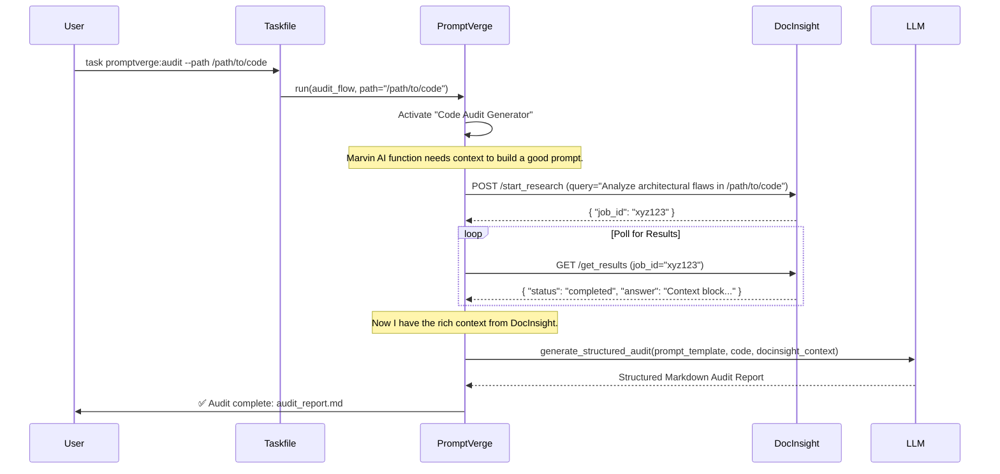

🧙🏾‍♂️: This is an excellent and crucial question. You're asking about the strategic fit between the **PromptVerge** system we just designed and the existing, much larger **Holistic Performance Enhancement (Cultivation)** repository. It's a question of identity, scope, and integration.

A direct merge would be a mistake. **PromptVerge is not the Cultivation repo; it is a powerful, self-contained engine that is a *perfectly fitting component* to be integrated *within* the Cultivation ecosystem.**

Let's break down the analysis.

---

🤖: ### **1. Comparative Analysis: PromptVerge vs. Cultivation**

To see why a simple merge is ill-advised but an integration is ideal, we need to compare the two projects across several key dimensions.

| Dimension | **PromptVerge** | **Holistic Performance Enhancement (Cultivation)** | **Analysis of Fit** |
| :--- | :--- | :--- | :--- |
| **Core Mission & Philosophy** | To **converge unstructured inputs** (code, papers) into **typed, auditable documents** (PRDs, audits, tasks, quizzes) with guaranteed structure and observable quality. | To **systematically enhance personal performance** across multiple life domains (Running, Biology, Software, etc.) by integrating data, modeling synergy, and optimizing a daily schedule. | 🎯 **Complementary.** PromptVerge *produces* high-quality knowledge artifacts. Cultivation *consumes* them to measure performance and guide future action. |
| **Scope & Scale** | **Focused & Tool-like.** A single, linear pipeline for document generation. It does one family of things exceptionally well. | **Expansive & Ecosystem-like.** A sprawling, interconnected system encompassing data ETLs, analytics, predictive models, schedulers, and formal methods across many domains. | 🧩 **Component Fit.** PromptVerge is a well-defined subsystem that fits neatly into several of Cultivation's larger domains without creating architectural conflicts. |
| **Primary User / Persona** | **General Knowledge Worker:** Software engineers, researchers, product managers. | **N=1 System Architect:** A highly technical individual ("Miguel") who is both the developer and the subject of a comprehensive self-optimization system. | 👤 **Perfect Alignment.** The "System Architect" persona of Cultivation is the ideal power user and beneficiary of the structured, auditable outputs produced by PromptVerge. |
| **Key Inputs & Outputs** | **Inputs:** Code files, scientific articles, user stories.<br>**Outputs:** Markdown PRDs, Code Audits, JSON Deep Work Tasks, JSON Quizzes. | **Inputs:** *Everything*. GPX files, Git logs, HabitDash API data, strength logs, learning curricula, lab notes.<br>**Outputs:** Performance metrics, `synergy_score.parquet`, `potential_snapshot.parquet`, `daily_plan.json`, alerts. | 🔗 **Direct Integration Points.** PromptVerge's outputs are high-value *inputs* for Cultivation's HIL (Holistic Integration Layer). A generated Deep Work Task is an input for the Scheduler. A Quiz is an input for the Knowledge/Cognitive domain. |
| **Technical Stack** | Python, Fabric, Marvin, Prefect, zShot, LanceDB, UV, Gitleaks, Arize Phoenix. | A superset of PromptVerge. Includes everything above plus `Taskfile`, `MkDocs`, PyTorch Lightning, `Pandera`, extensive data science/analytics libraries, and more. | ✅ **Highly Compatible.** The tech stack is not just compatible; it's synergistic. PromptVerge uses tools and patterns (UV, structured typing via Marvin) that would improve the overall quality of the Cultivation repo. |
| **Architectural Pattern** | **Linear Pipeline:** A clear, triggerable flow: `Unstructured Input -> LLM Processing -> Structured Output`. | **Cyclical Feedback Loop:** A complex control system: `Data -> Analysis -> Synergy/Potential -> Schedule -> Action -> New Data`. | ⚙️ **Engine for the Flywheel.** PromptVerge acts as a high-torque "engine" that can be plugged into the larger Cultivation "flywheel" to accelerate specific knowledge-work loops. |

---

### **2. The Verdict: Integration, Not Replacement**

Merging PromptVerge *into* the Cultivation repository is a **strategically excellent idea**. Treating it as a distinct, self-contained system *within* the larger project preserves modularity while unlocking powerful new capabilities.

**Why this is the right approach:**
*   **Keeps Concerns Separate:** Cultivation's core HIL (Synergy, Potential) is about meta-level analysis and scheduling. PromptVerge is about ground-level structured data generation. Mixing them at the top level would create a "God project" that is hard to maintain.
*   **Enhances Existing Domains:** PromptVerge provides a massive upgrade to several of Cultivation's existing domains:
    *   **Software Engineering:** The `Code Audit -> PRD -> Deep Work Task` flow is a perfect implementation of the workflow described in your "Running Data Pipeline V2.0" PRD and the "Refactor Running Data Pipeline" deep work task. It turns a manual epic into an automated process.
    *   **Knowledge Acquisition:** The `Article -> KG -> Quiz` flow is a huge enhancement to the existing `Literature Pipeline`, providing a direct path from reading to measurable knowledge retention.
*   **Provides New Data for HIL:** The structured outputs of PromptVerge are perfect for the Synergy and Potential engines.
    *   **Code Audit Severity:** Can be a new metric for the Software domain's health.
    *   **Quiz Scores:** Can be a direct, quantitative input for the `C(t)` (Cognitive) component of the Potential Engine (Π).
    *   **Deep Work Task Completion:** Can be tracked by the scheduler to close the loop on productivity.

---

### **3. The Golden Path: How to Integrate PromptVerge into Cultivation**

Here is a concrete plan to integrate PromptVerge as a new core system within the `cultivation` directory.

1.  **Create a Dedicated Home:**
    *   Create a new top-level directory: `cultivation/systems/promptverge/`.
    *   All the code we designed for PromptVerge (the `marvin_flows`, `schemas`, `templates`, etc.) would live here, making it a self-contained Python package.

2.  **Unify the Environment:**
    *   The dependencies from PromptVerge's `pyproject.toml` (Fabric, Marvin, zShot, LanceDB, etc.) would be added to the main `requirements.txt` of the Cultivation repo.
    *   The `uv sync` command (run via `task setup`) would ensure a single, consistent development environment for the entire project.

3.  **Expose Flows via Task Runner:**
    *   Add new targets to `Taskfile.yml` to make PromptVerge's capabilities accessible from the project root.
    ```yml
    # In Taskfile.yml
    tasks:
      # ... existing tasks ...
      promptverge:
        desc: "Lists all PromptVerge commands."
        cmds:
          - task --list-all | grep '^promptverge:'
      
      promptverge:audit:
        desc: "Run a comprehensive code audit on a file or directory."
        cmds:
          # Assumes promptverge has a CLI entrypoint
          - "{{.PYTHON_INTERPRETER}} -m cultivation.systems.promptverge.cli audit {{.path}}"
      
      promptverge:create-prd:
        desc: "Generate a PRD from a code audit and user story."
        cmds:
          - "{{.PYTHON_INTERPRETER}} -m cultivation.systems.promptverge.cli create-prd --audit-file {{.audit}} --story '{{.story}}'"

      promptverge:kg-quiz:
        desc: "Extract a knowledge graph and generate a quiz from a scientific article."
        cmds:
          - "{{.PYTHON_INTERPRETER}} -m cultivation.systems.promptverge.cli kg-quiz --pdf {{.pdf}}"
    ```

4.  **Integrate with the HIL & Data Stores:**
    *   **Deep Work Tasks:** The `Deep Work Task Generator` flow will now write its structured JSON outputs directly to `cultivation/outputs/deep_work_candidates/task_plans/`, making them immediately available to your existing scheduling and task management systems.
    *   **Quizzes & KG:** The `KG & Quiz Generator` will save quizzes to a new directory like `cultivation/docs/5_domain_knowledge_and_curricula/[Topic]/Quizzes_and_Assessments/` and KG data to a dedicated graph store instance.
    *   **Metrics for Π:** A new ETL script, `ETL_PromptVerge`, will be created to parse the outputs (e.g., quiz scores, audit severities) and produce a `promptverge_metrics.parquet` file for the Potential Engine.

5.  **Update Core Documentation:**
    *   The main `README.md` and `cultivation/docs/3_design_and_architecture/architecture_overview.md` must be updated. PromptVerge should be added as a new core component in the system architecture diagram, showing its connections to the Software and Knowledge domains and the HIL.

---

### **Conclusion**

**PromptVerge is not just a good fit; it's a missing piece of the puzzle for Cultivation.** It provides the structured, high-quality "fuel" (audits, PRDs, task plans, validated knowledge) that the Cultivation project's analytical "engine" (Synergy, Potential) is designed to run on.

By integrating it as a distinct, powerful subsystem, you dramatically accelerate your progress towards your ultimate goals without sacrificing the architectural integrity of the main project.

**Next Step:** I recommend we proceed with the integration plan. Shall we begin by defining the exact directory structure and `Taskfile.yml` commands for the new `cultivation/systems/promptverge/` component?

🧙🏾‍♂️: An excellent question. You've correctly identified that both **PromptVerge** and **DocInsight** are key AI-driven systems in your ecosystem. It's crucial to define their relationship precisely to avoid redundancy and ensure they work together synergistically.

They are **not competing systems**. Instead, they form a powerful, symbiotic pair: **PromptVerge is the application layer that generates structured documents, and DocInsight is the specialized knowledge retrieval service that provides the deep context PromptVerge needs to do its job well.**

---

🤖: ### **1. Redefining Roles: The Application vs. The Library**

Let's clarify the distinct purpose of each system. Think of them as an Application and its specialized Library.

| System | Role | Core Function | Primary Input | Primary Output | Analogy |
| :--- | :--- | :--- | :--- | :--- | :--- |
| **PromptVerge** | **The Application** | **Generative & Structuring:** Takes a high-level task and uses orchestrated LLM calls to *create* a new, structured document artefact. | A task or goal (e.g., "Audit this codebase," "Write a PRD for this feature," "Create a quiz for this paper"). | A finished, schema-compliant document (`audit.md`, `prd.md`, `deep_work.json`, `quiz.json`). | **The Factory:** It takes raw materials and a blueprint (prompt) to manufacture a specific, finished product. |
| **DocInsight** | **The Library / API** | **Retrieval & Synthesis:** Takes a specific query and uses RAG (Retrieval-Augmented Generation) to search a knowledge corpus and *provide* relevant, synthesized context. | A focused query (e.g., "What are the security implications of this function?", "Summarize the key findings of this paper," "What is the novelty of this claim?"). | A block of contextual information (e.g., relevant code snippets, text summaries, novelty scores, related facts). | **The Research Library:** You don't ask it to write your paper, you ask it for the books and articles you need *to write* your paper. |

---

### **2. The Synergy in Action: How They Work Together**

The true power emerges when PromptVerge uses DocInsight as its backend for context-heavy tasks. A typical workflow would be orchestrated by Prefect and look like this:



In this flow:
1.  **PromptVerge** receives the high-level task (`audit this code`).
2.  Its internal logic determines it needs deep context. It formulates a specific query and sends it to **DocInsight**.
3.  **DocInsight** does the heavy lifting of RAG—searching its indexed knowledge base (which could include the codebase itself, best practice documents, etc.) and returning a rich, synthesized context block.
4.  **PromptVerge** takes this high-quality context, injects it into its master prompt template, and makes a final, powerful call to the LLM to generate the structured document.

This separation of concerns is highly efficient. PromptVerge focuses on workflow and structure, while DocInsight specializes in deep knowledge retrieval.

---

### **3. Architectural Integration within "Cultivation"**

Both systems should be integrated as distinct, modular components within the `cultivation/systems/` directory.

```
cultivation/
└── systems/
    ├── promptverge/
    │   ├── cli.py
    │   ├── flows/
    │   │   ├── audit_flow.py
    │   │   └── kg_quiz_flow.py
    │   ├── schemas/
    │   └── templates/
    │
    ├── docinsight/
    │   ├── app_main.py         # The Quart/FastAPI server
    │   ├── common/             # Core logic (RAG, query processing)
    │   ├── raptor/             # RAPTOR implementation
    │   └── research_app.py     # Streamlit UI for direct interaction
    │
    └── ... other systems like arc_reactor, etc.
```

*   **Communication:** `PromptVerge`'s `audit_flow.py` would use the `docinsight_client.py` to make HTTP requests to the DocInsight service.
*   **Configuration:** The URL for the DocInsight API would be managed in the central `cultivation/settings.py` and loaded from the `.env` file, allowing you to run DocInsight locally or point to a deployed version.

---

### **4. Impact on the Development Roadmap**

This clarified relationship has a critical impact on our development plan. **A functional DocInsight API is now a prerequisite for the advanced features of PromptVerge.**

The roadmap should be adjusted:

| Phase | Old Focus | **New, Refined Focus** | Rationale |
| :--- | :--- | :--- | :--- |
| **Phase 1** | Build Audit → PRD → DW chain. | **1a. Build DocInsight MVP:** Implement the core RAG pipeline and expose it via a stable API. **1b. Build Simple PromptVerge Flows:** Implement document generators that *do not* require deep context (e.g., a simple linter-based audit, a basic PRD from a user story). | We need the "Library" before the "Application" can fully use it. This de-risks the project. |
| **Phase 2** | Build KG & Quiz flow. | **Integrate PromptVerge with DocInsight:** Refactor the `Code Audit` and `KG & Quiz` flows to call the DocInsight API for rich context, dramatically improving their output quality. | Now we connect the two systems to unlock the synergy. |
| **Phase 3** | Observability & Hardening. | **Enhance Both Systems:** Add advanced features to DocInsight (e.g., better novelty scoring, cross-domain analogy search). Add more document types to PromptVerge. Integrate observability across the entire stack. | With the core integration working, we can now enhance and scale both components. |

---

### **Conclusion**

**PromptVerge** is the "what" – the system that *creates* the final documents. **DocInsight** is the "how" – the specialized engine that provides the deep knowledge to make those documents insightful and accurate.

They are two sides of the same coin, designed to be developed as two distinct but tightly integrated microservices or systems within the larger Cultivation project.

**Next Step:** Does this distinction make sense? If so, shall we proceed with updating the roadmap to prioritize building the DocInsight MVP API first, followed by the simpler PromptVerge flows?


