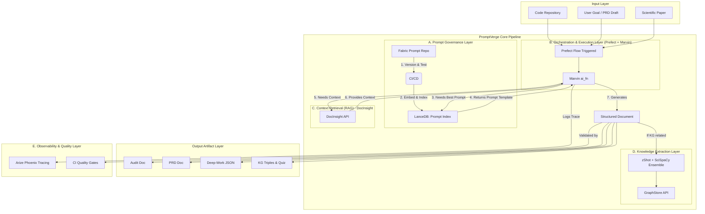
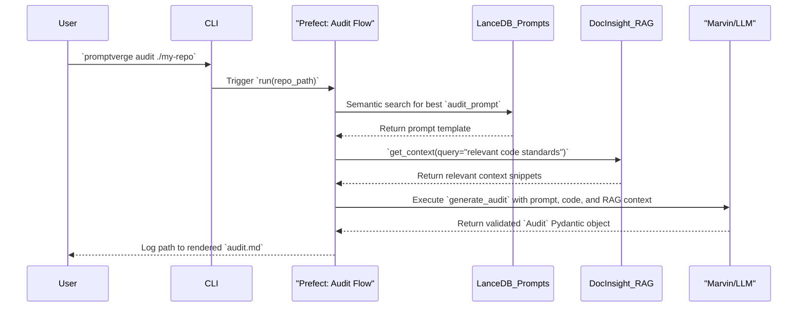

# **Architectural Blueprint: PromptVerge**

**Document Version:** 2.0 (Definitive)  
**Date:** 2025-06-21  
**Status:** Approved for Implementation  
**Owner:** The Primary Developer/Architect

---

## **1. Executive Summary & Vision**

### **1.1. Purpose & Problem Statement**
This document serves as the canonical technical blueprint for the PromptVerge system. It details the precise responsibilities of each technology component, defines the boundaries and contracts between them, and illustrates the end-to-end data flows. Its primary purpose is to guide development and prevent architectural drift by providing a single source of truth.

**Problem:** Software engineers and researcher-developers waste hours sifting through code, specs, and papers because existing LLM workflows return unstructured, unverifiable text. PromptVerge is a repeatable pipeline that transforms raw artefacts into **typed, auditable documents** (code audits, PRDs, task plans, and knowledge graphs), with **observable feedback loops** that maintain ≥ 0.80 precision and keep prompt drift under 5% week-over-week.

### **1.2. High-Level Goals**
The system is designed to produce six distinct, schema-validated artefacts:
1.  **Comprehensive Code Audit:** A multi-faceted analysis of a codebase for architectural, logical, performance, and security flaws.
2.  **Product Requirements Document (PRD):** A formal specification for a feature or refactor.
3.  **Deep-Work Task:** A structured, hierarchical JSON epic ready for a task management system.
4.  **Knowledge Graph (KG) Triples:** Raw `(head, relation, tail)` data extracted from scientific literature.
5.  **KG Coverage Report:** A meta-document quantifying the performance of the KG extraction process.
6.  **Self-Assessment Quiz:** A multi-format quiz auto-generated from KG triples.

### **1.3. Guiding Design Principles**
| Principle | Design Consequence & Implementation |
| :--- | :--- |
| **Single Source of Truth** | A prompt or fact lives in one canonical location (e.g., **Fabric**), then is projected into the forms each step needs. Every artefact has a traceable lineage. |
| **Typed Contracts Everywhere** | Each AI call is a **Marvin `ai_fn`** with Pydantic schemas. Every generated artifact is validated against a JSON Schema in the CI pipeline. |
| **Observable Feedback Loops** | Workflows emit metrics (precision, latency, cost) via **Arize Phoenix**, which flow back into prompt ranking and quality monitoring. |
| **Composable, Test-First Flows** | Small, independently testable **Prefect** tasks compose to create complex outcomes. Unit tests and a full end-to-end integration test are mandatory. |
| **Human-in-the-Loop by Default** | The system surfaces uncertainty for human review, such as disagreements between the **zShot/SciSpaCy** ensemble, rather than burying it. |
| **Local-First, Cloud-Optional** | The entire stack runs on a laptop using **uv** and serverless **LanceDB**, with clear, incremental paths to scale to cloud services. |
| **Security from Day Zero** | Security scans (**gitleaks**, **Semgrep**) are integrated into the CI pipeline from the first commit, not as an afterthought. |

---

## **2. System Architecture**

### **2.1. High-Level Data Flow Diagram**
PromptVerge operates as a modular system where governed prompts are used to orchestrate the generation of a chain of interconnected documents. The diagram below illustrates the overall flow of data and control.

### **2.2. Technology Stack with Trade-offs**
| Layer | Technology | Rationale & Key Trade-offs |
| :--- | :--- | :--- |
| **Env/Package Mgmt** | **uv** | **Rationale**: All-in-one, Rust-based tool for Python versioning and dependency management. **Chosen over Docker** for a simpler, faster, local-first developer experience. **Trade-off**: Less tenured than Docker for complex multi-service orchestration, but ideal for this single-repo, Python-centric project. |
| **Prompt Management** | **Fabric** | **Rationale**: Provides a Git-backed, version-controlled repository for managing, testing, and ranking prompts. **Trade-off**: A relatively new tool; ecosystem is smaller than established platforms like LangChain Hub. |
| **Semantic Indexing** | **LanceDB** | **Rationale**: A serverless, Arrow-native vector database for high-speed semantic search. Its local-first design and performance are ideal for our RAG needs. **Trade-off**: As an embedded DB, it requires a separate backup strategy for production durability. |
| **AI Orchestration** | **Marvin + Prefect 2** | **Rationale**: Marvin provides strongly-typed AI functions (`ai_fn`). Prefect offers a robust, modern workflow engine for chaining tasks and observability. **Trade-off**: A tightly integrated stack; less modular than composing separate tools like LangChain and Airflow. |
| **Knowledge Extraction**| **zShot + SciSpaCy** | **Rationale**: An ensemble approach combining zShot's zero-shot flexibility with SciSpaCy's high, domain-tuned accuracy. **Trade-off**: Increases computational overhead compared to a single-extractor model. |
| **Graph Storage** | **Pluggable Interface** | **Rationale**: Defers final vendor choice pending benchmarks. Prevents lock-in. **Trade-off**: Adds a layer of abstraction that requires maintenance. |
| **Observability** | **Arize Phoenix** | **Rationale**: An open-source, lightweight tool specifically for LLM tracing and evaluation. **Trade-off**: Less feature-rich for general application monitoring than enterprise APM solutions. |
| **CI Security** | **gitleaks, Semgrep**| **Rationale**: Provides a multi-layer defense against secrets leakage and code vulnerabilities directly within the CI pipeline. **Trade-off**: Can introduce false positives that require tuning of rulesets. |

---

## **3. Component Deep Dive**

### **3.1. Prompt Governance Layer**
*   **Component**: Fabric Prompt Repository
    *   **Responsibility**: The canonical, version-controlled store for all human-readable prompt templates.
    *   **Implementation**: A Git repository (`/fabric_prompts`) containing `.md.jinja` files. Each file has YAML front-matter defining its `id`, `version`, `task_type`, and test fixtures.
    *   **Interfaces**: Git; Fabric CLI.
*   **Component**: LanceDB Prompt Index
    *   **Responsibility**: To index prompt embeddings for fast, semantic retrieval.
    *   **Implementation**: A local LanceDB database (`/lancedb/prompts.lance`).
    *   **Interfaces**: Python API: `lancedb.connect()`, `table.search(query_embedding).limit(k)`.

### **3.2. Orchestration & Execution Layer**
*   **Component**: Prefect Flows
    *   **Responsibility**: Defines and executes the DAG of tasks for each workflow (e.g., `audit_flow`). Manages dependencies, retries, and state.
    *   **Implementation**: Python modules in `/cultivation/flows/` decorated with `@flow`.
    *   **Interfaces**: Triggered via a user-facing CLI or the Prefect API/UI.
*   **Component**: Marvin AI Functions
    *   **Responsibility**: Encapsulates all LLM interactions, enforcing typed inputs and outputs.
    *   **Implementation**: Python functions in flow modules decorated with `@ai_fn`.
    *   **Interfaces**: Pydantic models defined in `/cultivation/schemas/`.

### **3.3. Knowledge Extraction Layer**
*   **Component**: KGE Ensemble
    *   **Responsibility**: A Prefect task group that runs `zShot` and `SciSpaCy` in parallel to extract triples from text.
    *   **Implementation**: A Prefect task that orchestrates two spaCy pipelines.
    *   **Interfaces**: `extract_triples(text: str) -> ExtractionResult`. The `ExtractionResult` Pydantic model contains triple lists and disagreements.

### **3.4. DocInsight (RAG) Service**
This is the internal name for the system's Retrieval-Augmented Generation capability. It is a core service, not an external one.
*   **Responsibility**: To retrieve relevant context from indexed documents (code, articles, prior audits) to enrich the information sent to the LLM at runtime.
*   **Implementation**: A Python module (`/cultivation/rag/client.py`) that queries a dedicated LanceDB context index (`/lancedb/context.lance`).
*   **Interfaces**: `get_context(query: str, top_k: int = 5) -> list[ContextSnippet]`. The `ContextSnippet` is a Pydantic model containing the source, content, and relevance score of a retrieved chunk.

---

## **4. Interaction & Data Flow**

### **4.1. End-to-End Synchronous Flow: Code Audit to PRD**
This sequence diagram illustrates the synchronous path for generating engineering documents.

### **4.2. Data Ownership, Idempotency & Error Handling**
*   **Ownership**: Each generated artefact is owned by the Prefect flow run that created it. The `run_id` is embedded in the artefact's metadata.
*   **Idempotency**: Flows are designed to be idempotent. Re-running a flow with the same inputs (e.g., same commit hash) will overwrite the previous artefact, not create duplicates.
*   **Error Handling**:
    *   **Task Level**: Prefect's built-in retry mechanism with exponential backoff is applied to all tasks involving external API calls.
    *   **Flow Level**: A Prefect `on_failure` hook creates a GitHub Issue with the flow run's context and logs.
    *   **Batch Processing**: In scenarios processing multiple files, a failure in one file's sub-flow is logged, but it will not terminate the entire batch process.

---

## **5. Cross-Cutting Concerns**

*   **Security**:
    *   **Secrets Management**: `gitleaks` is integrated into a pre-commit hook and a CI job. A `secrets.example.toml` template guides local setup.
    *   **SAST**: `Semgrep` and `Bandit` are run in CI to detect vulnerabilities in the Python codebase.
    *   **Threat Model**: A `SECURITY.md` file is maintained to outline threats (e.g., prompt injection) and mitigation strategies.
*   **Observability**:
    *   **Tracing**: All Marvin `ai_fn` calls are instrumented to emit traces to `Arize Phoenix`, capturing latency, token counts, cost, and raw prompts/responses.
    *   **Drift Detection**: A weekly CI job re-runs a suite of "golden" prompts. It alerts if the output quality degrades by >5%.
*   **Resilience & Scalability**:
    *   **Backups**: A nightly GitHub Actions job syncs the `/lancedb` directory and graph store data to a versioned S3 bucket.
    *   **Rate Limiting**: Prefect task concurrency limits are used to avoid overwhelming external APIs.
    *   **Scaling**: The system scales by running Prefect agents on more powerful cloud instances and tiering LanceDB storage to S3.

---

## **6. Deployment & Environment Strategy**

*   **Environments**:
    *   **Local (`dev`):** A developer's machine, managed by `uv`. A `.devcontainer` configuration is provided.
    *   **CI (`test`):** A GitHub Actions runner, bootstrapped on-the-fly using `astral-sh/setup-uv` and the `uv.lock` file.
    *   **Production (`prod`):** A long-lived Prefect agent running on a dedicated VM or cloud instance.
*   **CI/CD Pipeline (`.github/workflows/ci.yml`):**
    1.  Secrets Scan (`gitleaks`)
    2.  Lint & Format Check (`ruff`)
    3.  Static Analysis (`Semgrep`, `Bandit`)
    4.  Unit & Integration Tests (`pytest`)
    5.  End-to-End Flow Test (`pytest -m slow`) with mocked APIs.
    6.  Build & Publish package on tagged releases.

---

## **7. Risks, Constraints & KPIs**

### **7.1. Assumptions & Constraints**
*   **Assumption:** LLM APIs provide mechanisms for pinning model versions.
*   **Constraint:** The system must run on a standard developer laptop without requiring Docker.
*   **Constraint:** The technology stack must prioritize open-source and local-first tools.

### **7.2. Risks & Mitigations**
| Risk | Mitigation Strategy |
| :--- | :--- |
| **Prompt Drift** | Weekly automated regression testing against a golden dataset, continuous monitoring with Arize Phoenix, and model version pinning. |
| **Secret Leakage** | `gitleaks` scanner in both pre-commit hooks and the CI pipeline provides a two-layer automated defense. |
| **Regression** | A comprehensive end-to-end integration test validates the full artifact generation chain, catching interface drift between components. |

### **7.3. Success Metrics & KPIs**
| Category | KPI | Target |
| :--- | :--- | :--- |
| **Quality** | KG Extraction F1-score | ≥ 0.80 on a benchmark dataset. |
| **Quality** | SME Acceptance Score | ≥ 4/5 for generated audits and PRDs. |
| **Reliability** | Prompt Drift | ≤ 5% degradation week-over-week. |
| **DevEx** | Onboarding Time | ≤ 15 minutes from `git clone` to first generated artefact. |
| **Performance** | Semantic Search Latency | p95 < 200 ms for a 10,000-vector index. |
| **Recovery** | RPO / RTO | 24 hours / 1 hour (from S3 backups). |
| **Cost** | Monthly LLM API Spend | < $100/month (initial phase). |

---

## **8. Appendices**

### **8.1. Glossary**
*   **Prompt Drift**: The phenomenon where a prompt's performance degrades over time due to unannounced model updates or changes in the data context.
*   **Typed Contracts**: The principle of using strict, code-defined schemas (e.g., Pydantic models) to validate the inputs and outputs of AI functions.
*   **RAG**: Retrieval-Augmented Generation. A technique where an LLM is provided with relevant context from an external knowledge base.

### **8.2. Future-Proofing Notes**
*   **Pluggable GraphStore**: The GraphStore API is designed to allow easy migration to different graph databases.
*   **Model Agnosticism**: The use of Marvin provides a layer of abstraction over the specific LLM provider, allowing for future integration of open-source models.

### **8.3. Change Control**
Major changes to this architecture, particularly to the Technology Stack (Section 2.2) or the component boundaries (Section 3), must be proposed and approved via an Architecture Decision Record (ADR).

