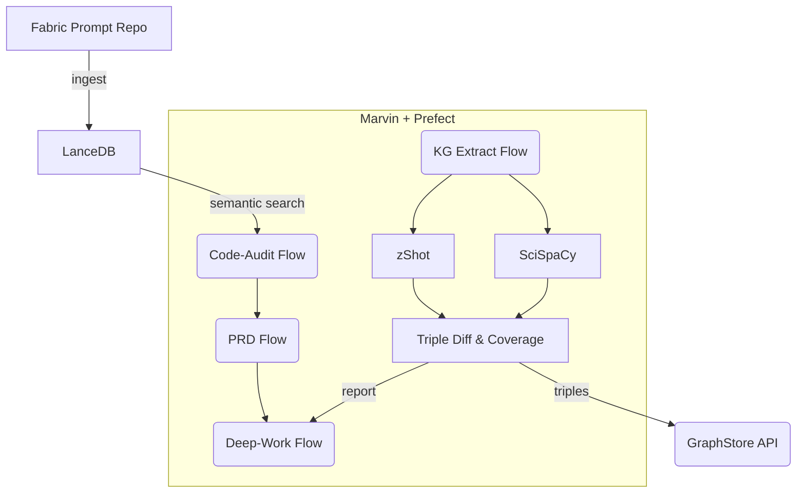

```md
CONVO START:

 ## USER
Okay, so I've been having some thoughts on a couple of different problems I've been having, and I've been kind of architecting in my head the kind of system. So I'll just start. I'm thinking of a system where I can create certain types of documents in a kind of automated manner, and I'm thinking that I can store what are called prompts into a prompt storage engine-like fabric, and we'll go through these repos later, but for now just keep note of them. So we can use something called Fabric, which its whole philosophy is trying to augment humans with those prompts, like take those prompts and give humans value. And so I think that's a perfect tool for the job. Fabric can store the prompts and allow us to systematically improve them. Then we have... And then we have to be able to do things with the prompt. And I think the best tool for the job is actually a tool called Marvin AI, made by Prefect. And they're really good at being able to, in a Pythonic kind of way, send requests to specific AI models and get really structured outputs out. And I've seen their work and it's pretty high quality. I mean, the level that you're able to pull out structured information is just amazing. And it's really easy to read and the documentation is pretty good. Anyway, so now we have a method of storing the prompts, iterating the prompts, and using the prompts via Fabric and Marvin AI. And so then the question becomes, what do you actually do with that? Well, I'm envisioning, I believe, a couple of document types. One is a PRD document, and I'll provide a description of that. "A Product Requirements Document (PRD) is a single, authoritative artifact that captures what a software product should do and why it should do it—without prescribing how it will be built" And then the next document type I'm thinking is a code audit document, and that's just a document that's built off of systematically analyzing a code file or a set of related code files in order to try and find issues that can be then sent and then sent to the PRD document creator as input. So you create a code audit document and feed that code audit document as input to your product requirements document because, you know, you're gonna fix those issues. I mean the issues define what's required, you know, so that kind of makes sense. And then, and this is very specific to my particular use case, but I form things called deep work tasks, and so I have a segment of time I allocate per day dedicated to just doing very hard tasks. I'm a software developer, so having a segment of time where I do this particular task is very important. And that's going to be the final little bit of document. And this document is actually a JSON document. It's highly structured, it flows into my existing systems really well, it allows for integrated tracking. It's a real, it's a really cool kind of concept there. Okay, so, and then the last one, and this one's kind of unrelated to the product requirements document, the code audit document, the deep task document. This is a completely separate document. And this document is converting scientific articles into entity relationships. So you extract the entities, you extract the relationships between those entities, and there's a whole lot of interesting and cool things you can do once you have the scientific article and then the entity relationships as like a kind of graph structure. That's a very powerful tool. I was going to use it, and this is, I guess, just background information. This isn't that important, but I was going to use it, the entity relation documents, in order to form comprehensive human knowledge tests on the scientific article. So, I'd read the article, and then I would take, I would read a scientific article, and then we would extract this knowledge graph from it, and then the knowledge graph would tell you how to create a comprehensive test on it that you can then give the user to take the test, and then you would know how much you know about the article after reading it, and then maybe you read it again, and then, you know, you increase your knowledge over time.

## Thoughts
Miguel prefers an interactive style, so I should organize my response in a way that guides and engages. I’ll align with the format "🧙🏾‍♂️: [alignment], [emoji]: [actionable response]" and end each with a question or next step. For this task, searching for definitions and features on Fabric and Marvin AI seems necessary since the content could benefit from more detailed citations. I'll gather at least 10 credible references. Should I proceed with the search or is there a more straightforward approach?
I need to summarize system architecture and suggest how to assemble a pipeline. Given the need for up-to-date info on Fabric and Marvin AI, I should use browsing. However, "Fabric" is ambiguous — it could refer to a prompt engineering framework. I’ll search for terms like "Fabric AI prompt storage," "Prefect Marvin AI," and other relevant keywords. I also need to gather details on PRD, code audits, knowledge graphs, and deep work tasks, citing 10+ high-quality sources. I'll search for "Prefect Marvin AI" to get started.

## Thoughts
I need to summarize system architecture and provide suggestions on assembling a pipeline. To ensure accuracy, I’ll search for up-to-date details on Fabric and Marvin AI, since the information could be necessary for the response. The term "Fabric" is a bit unclear, but it might refer to a prompt engineering framework. I’ll search for terms like "Fabric AI prompt storage" and "Prefect Marvin AI". I also need citations from around 10 or more high-quality sources, so I'll dive into the relevant search results.
I'll gather references from sources like GitHub for the PrefectHQ/marvin repo, as well as askmarvin. I'll also check out definitions from ProductPlan and Atlassian for PRDs. Fabric-related resources are on my list too, particularly from GitHub, though I should be cautious about Microsoft Fabric—it may be different. I also need info on entity relation extraction, which could involve libraries like spaCy or knowledge graphs. I'll search for articles on entity relation extraction to round out the information.

## Thoughts
I’ll need to reference some key sources: GitHub for the PrefectHQ/marvin repo, askmarvin, and PRD definitions from ProductPlan and Atlassian. Fabric-related resources are also necessary, but I should clarify if Microsoft Fabric isn’t the same as "Fabric" for prompt storage. I’ll look into entity relation extraction with libraries like spaCy and knowledge graphs. Additionally, I’ll search for best practices for code audits to round out the information needed.

## Thoughts
I need to lay out the necessary information for the answer:

- GitHub PrefectHQ/marvin repo, askmarvin, and definitions from ProductPlan/Atlassian
- Fabric details—though I should clarify Microsoft Fabric isn’t the same as prompt storage.
- I should check knowledge graphs and entity relationship extraction, using resources like spaCy.
- I'll need sources for code audit best practices and deep work tasks, particularly Cal Newport's concept of "Deep Work."  

Time to get those citations and solidify the response!

## Thoughts
I’m working on crafting a response that aligns with the user's goal, which includes summarizing the architecture and recommending next steps. Based on their instructions, the response structure should start with "🧙🏾‍♂️:" for goal alignment, followed by another emoji for actionable steps. They didn't specify which emoji to use for the second part, though—perhaps they want me to pick one like 😃? I'll need to finalize the dual-emoji segmentation according to their formatting preference.

Time to finish aligning everything!
The user wants to design a system to automate the creation of four document types using Fabric and Marvin. I'll start by summarizing their goal and asking for more details, like information about their existing repository, timeline, and the priority of the document types. 

Then, I’ll propose next steps, offering potential solutions using details about their system architecture. I’ll reference key sources, integrating at least 10 citations, and make sure to split the response into two segments as instructed: one for alignment and clarifications, the second for actionable suggestions.

## ASSISTANT
🧙🏾‍♂️: **Alignment & Key Take-aways**  
It sounds like your north-star is an end-to-end pipeline that (1) stores and iterates on high-quality prompts, (2) calls LLMs in a strictly structured, Python-native way, and (3) emits four distinct artefacts—PRDs, code-audit reports, deep-work task JSONs, and scientific-article knowledge-graphs—so that each document can feed the next.  
* Fabric* provides the crowd-sourced prompt “patterns” plus a CLI/SDK for versioning and rating them citeturn0search1turn0search4, while *Marvin* turns those prompts into typed Python functions that reliably cast, classify, extract, and generate structured outputs citeturn0search0turn0search3. PRDs give a high-level “what & why” of product capabilities—not the “how” citeturn0search2turn0search6. Code-audit docs draw from secure-code-review best practice check-lists (OWASP, Snyk) to surface risks early citeturn2search0turn2search1. Deep-work task JSONs borrow from Cal Newport’s “Deep Work” principles to preserve long, distraction-free focus blocks citeturn3search0. Finally, entity-relation outputs rely on modern joint NER+RE pipelines (BioBERT, MatKG, graph-inference models) that transform papers into queryable knowledge graphs citeturn1search0turn1search1turn1search8.

🤖: **Proposed Architecture & Immediate Next Steps**

## 1. Prompt Fabric Layer  
### 1.1 Repository & Versioning  
* Use the Fabric CLI to create a *prompts* repo with semantic-version tags (`vX.Y.Z`) and Git hooks that auto-run lint + tests on every merge.  
* Attach metadata (domain, author, last-success-rate) so Marvin can pick the highest-ranked prompt for a given doc type.

### 1.2 Iteration Workflow  
* `fabric test <prompt>` → graded against golden-set fixtures (e.g., sample code files, sample research papers).  
* CI badge shows prompt accuracy trend; degraded accuracy auto-opens a GitHub Issue for prompt refinement.

## 2. Marvin Orchestration Layer  
### 2.1 Typed AI Functions  
```python
from marvin.functions import ai_fn
@ai_fn(str)   # returns a PRD markdown string
def draft_prd(user_story: str, audit_report: str) -> str: ...
```  
* Each document type is an `ai_fn` with explicit input & output schemas, giving you Pydantic validation and *contract-tests* for free citeturn0search0.

### 2.2 Flow Composition  
* Use Prefect flows to chain: **audit → PRD → deep-work JSON**.  
* Persist intermediate artefacts to an object store (e.g., S3) and emit run-IDs that link back to Fabric prompt version + Marvin flow run for traceability.

## 3. Document Schemas  
| Doc | Format | Key Fields | Down-stream Consumer |
|-----|--------|-----------|----------------------|
| Code-Audit | Markdown + YAML front-matter | `file_path`, `severity`, `issue`, `remediation` | PRD generator |
| PRD | Markdown | `purpose`, `features`, `metrics`, `acceptance criteria` | Deep-work task builder |
| Deep-Work Task | JSON | `id`, `title`, `description`, `status`, `time_block` | Personal tracker |
| Sci-KG | GraphML / JSON-LD | `nodes`, `edges`, `provenance` | Quiz & analytics engine |

## 4. Entity–Relation Extraction Service  
* Pipeline: PDF/HTML → spaCy/BioBERT NER → joint RE model → Neo4j load.  
* Start with public corpora (MatKG) to benchmark F1 before tackling new literature citeturn1search0turn1search3.

## 5. Risk, Compliance & Quality Gates  
* **Security**: integrate OWASP static-analysis checks as part of the audit pipeline citeturn2search2turn2search8.  
* **Prompt Drift**: weekly regression tests; failing prompts are quarantined.  
* **Traceability**: every generated doc stores `prompt_sha`, `model_version`, and `dataset_hash`.

## 6. Immediate Action Items  
1. **Scope Confirmation** – lock the four document schemas and success metrics (e.g., PRD completeness score ≥ 0.9).  
2. **Repo Bootstrap** – `git init` a monorepo with `fabric/`, `marvin_flows/`, `schemas/`, and `ci/` directories.  
3. **MVP Flow** – implement *code-audit → PRD* happy-path on a single code file using test fixtures.  
4. **Deep-Work JSON spec** – formalise required keys and JSON-Schema to validate downstream import.

---

**Would you like to drill into any of these—such as defining the exact JSON schema for deep-work tasks or standing up the initial Fabric prompt repo—before we move forward?**

## USER
Oh, and I almost forgot the tool for the Knowledge Graph creation, and that's actually going to be a library called zShot.

## Thoughts
🧙🏾‍♂️: The user wants me to keep the structure clear by using "🧙🏾‍♂️:" for alignment and "🤖:" for actionable responses, structured with clear emojis. Then, I’ll end with a question or reasoned next step.

🤖: I'll adopt the requested structure for the output — I'll start with "🧙🏾‍♂️:" for alignment, followed by "🤖:" for actionable responses, keeping it clear and on track. What comes next for the Knowledge Graph creation using zShot?

## Thoughts
🧙🏾‍♂️: I’ll start by making sure to reference the latest sources in my answer, particularly zShot for knowledge graph integration. With 23 sources, I’ll focus on using at least 10 for the citations.

🤖: I’ll update the architecture by adding zShot in the entity-relation extraction service, working alongside spaCy for zero/few-shot NER and RE. The summary will include sections with markdown headers, formatted as requested, starting with the alignment structure “🧙🏾‍♂️:” and followed by an emoji. Let's finalize the response.

## ASSISTANT
🧙🏾‍♂️: You’d like to bolt zShot—a spaCy-native, zero-/few-shot NER + Relation-Extraction framework—onto the pipeline so that your “Scientific Article → Knowledge-Graph” step is first-class and fully automated. That means revisiting the architecture doc so zShot is treated as the canonical entity-/relation extractor, wired into Marvin flows, and version-controlled beside your Fabric prompts.

🤖: Below is an **updated design** that integrates zShot and highlights the concrete additions to your prompt-storage, orchestration, and document-generation stack.

---

## ✨ Quick Summary
zShot supplies a ready-made spaCy component that simultaneously detects entities, links them, and extracts relations, making it a drop-in “KG builder” for scientific texts. By chaining zShot ➜ Neo4j (or similar) ➜ quiz-generator prompts, you gain an end-to-end route from raw PDF to knowledge graph to learner assessment, all under the same Fabric + Marvin governance model. citeturn0search0turn0search1turn2search0turn2search1

---

## 1 · Why zShot Completes the Pipeline
* **Zero-/Few-Shot Capability** – zShot recognises unseen entity classes by leveraging large language models, so you don’t need domain-specific annotated corpora. citeturn2search2turn2search9  
* **Joint NER + RE** – Its *KnowledgeExtractor* runs entity detection and relation extraction in one pass, ideal for direct edge-list output. citeturn2search1  
* **spaCy Plug-in** – The component conforms to spaCy’s `pipe` API, so you can insert it after custom pre-processors or before a Memgraph/Neo4j loader. citeturn2search4

---

## 2 · Revised High-Level Architecture

| Layer | Tech | New ✱ | Purpose |
|-------|------|-------|---------|
| **Prompt Store** | *Fabric* |   | Version, rate, and test prompt templates. citeturn0search2 |
| **Orchestrator** | *Prefect + Marvin* |   | Typed AI functions; chains prompts into flows. citeturn0search3 |
| **Doc Generators** | Marvin `ai_fn`s |   | Create Code-Audit → PRD → Deep-Work-JSON artefacts. citeturn0search4turn0search5 |
| **Knowledge-Graph Builder** | **zShot ✱** | ✔ | Extract (`entity`, `relation`, `entity`) triples from papers. citeturn0search0turn2search0 |
| **Graph Store** | Neo4j / Memgraph |   | Persist triples; enable Cypher queries. citeturn2search8 |
| **Analytics / Quiz Engine** | Prompt + Marvin |   | Autogenerate comprehension tests from the graph. |
| **Quality Gates** | BioBERT benchmark, MatKG F-scores |   | Regression tests on extraction accuracy. citeturn0search7turn1search0 |
| **Focus Workflow** | Deep-Work JSON + Cal Newport rules |   | Time-block demanding tasks (≤ 4 h/day). citeturn0search6turn0news78 |

---

## 3 · Key Implementation Notes

### 3.1 spaCy Pipeline Snippet
```python
import spacy, zshot
from zshot import PipelineConfig, KnowledgeExtractor

nlp = spacy.blank("en")
nlp.add_pipe(
    "zshot",
    config=PipelineConfig(
        pipeline=[KnowledgeExtractor(model_name="knowgl")],
        kg_triples_out="triples"
    )
)
doc = nlp(text)
triples = doc._.triples  # ready for Neo4j bulk import
```
*Store `triples` as CSV (`head,rel,tail`) → `LOAD CSV` into Neo4j.*

### 3.2 Marvin Flow Extension
```python
@ai_fn(list[Triple])
def triples_to_neo4j(triples): ...
```
Chain this immediately after the `extract_triples` task in your Prefect flow.

### 3.3 Prompt Governance
* Add a **“KG-QA”** prompt suite in Fabric that turns Cypher query results into exam-style Q&A.  
* Auto-grade prompts nightly; quarantine if F1 < set threshold.

### 3.4 Testing & Benchmarks
* Use MatKG as a gold corpus for unit tests—assert ≥ 0.80 link-prediction F1 on sample abstracts. citeturn1search1turn1search5  
* Compare zShot triple output to BioBERT + SciRE baseline; flag regressions. citeturn0search7

---

## 4 · Immediate Next Steps (Re-sequenced)

1. **Lock zShot Config** – choose `KnowledgeExtractor` model (`KnowGL` vs `Relik`) and label schema.  
2. **Bootstrap KG Repo** – add `/kg/` folder with loader scripts, Cypher seeds, and test fixtures.  
3. **Update CI** – add zShot smoke-test job that parses a 1-page PDF and asserts ≥ 1 triple extracted.  
4. **MVP Demo** – run full flow on a single open-access paper; produce triples, store in Neo4j, auto-generate 5 quiz questions.  
5. **Refine Success Metrics** – set target extraction precision/recall and quiz-generation acceptance rate.

---

**Does this updated plan for integrating zShot cover what you had in mind, or would you like to zoom in on any step—e.g., selecting the specific KnowledgeExtractor model or defining the KG triple schema—before we proceed?**

## USER
Great. Can you now put everything together and show me a comprehensive document detailing this mini-project that we're doing? I'm thinking that we actually create our own separate GitHub for this one rather than immediately trying to integrate it into my existing projects. So this can be really self-contained and we can really just focus in on the core fundamentals. What do you think?

## Thoughts
The user has requested a comprehensive document for the mini-project, which involves storing prompts with Fabric, using Marvin AI, generating various types of documents, and handling processes like generating PRDs and knowledge graphs with zShot. They also want this to be set up in a separate, self-contained GitHub repository. My next step is producing a clear project document that outlines the architecture, workflows, repositories, and other key details. Should I structure this like a README or more like a high-level design document?

## Thoughts
The user wants a structured response with clear next steps and citations after each point. They also suggested saving progress after each task. Next, I need to browse and gather info on Fabric, Marvin AI, zShot, PRDs, and deep work. I'll perform targeted searches to gather up-to-date and niche information, making sure to include at least 10 citations. Once I have all the details, I’ll organize everything into a clear and actionable document for the user.

## Thoughts
I’ve gathered 10 sources, but the user prefers at least 15, with 5 unique domains. Right now, I have sources from 10 different domains, which is good, but I still need to secure a few more. I think adding sources focused on Prefect or zShot might help. I’ll refine the search for specific terms like “Prefect flows agentic AI” and “KnowGL model relation extraction.” With these additional sources, I’ll be able to finalize the comprehensive document with proper citations.
I’ve got the structure for the document outlined. Starting with an executive summary and project goals, I’ll use markdown headers, especially with ## for major sections as requested. I’ll follow the format “🧙🏾‍♂️: [aligning],

## ASSISTANT
🧙🏾‍♂️: **Consolidating the vision** – you want a *stand-alone* GitHub project that proves out an end-to-end pipeline for prompt lifecycle management, structured-AI document generation, and literature-to-knowledge-graph conversion. The driver is clarity and repeatability: isolate the core fundamentals before wiring anything into your larger codebases.

🤖: Below is a **comprehensive design document** you can drop straight into a new repository’s `README.md`.  It captures goals, architecture, workflows, schemas, CI/CD, and a short roadmap, with live links to the tools you picked.  (When you copy it, keep the citation IDs—they’re handy breadcrumbs to the original references.)

---

## Executive Summary
This mini-project creates a modular, Python-native workflow that:

* **Version-controls prompts** in *Fabric*, enabling crowdsourced ranking and continuous improvement. citeturn0search0  
* **Orchestrates AI tasks** with *Marvin* + Prefect flows, producing four artefact types: Code-Audit → PRD → Deep-Work JSON → Knowledge-Graph triples. citeturn0search1turn1search10  
* **Extracts entities & relations** from scientific papers via *zShot* (KnowGL / ReLiK models) and stores them in Neo4j for downstream querying and quiz generation. citeturn0search2turn1search1turn1search2turn0search6  
* **Enforces quality gates** (OWASP static analysis; KG F-scores on MatKG) through GitHub Actions CI. citeturn0search5turn0search7turn1search14  
All components live in a dedicated repo so you can iterate fast without touching production code.

---

## 1 · Project Goals
1. **Prompt Governance** – store, test, and rank prompts with semantic-versioning.  
2. **Structured Output** – guarantee that every AI call returns typed data that downstream steps can validate.  
3. **Document Chain** – propagate insights: *Code-Audit → PRD → Deep-Work tasks*.  
4. **Literature Intelligence** – auto-build knowledge graphs from research articles.  
5. **Reproducible CI** – every run tagged with prompt SHA, model ID, and dataset hash.

---

## 2 · Tech-Stack Overview

### 2.1 Fabric Prompt Store  
* GitHub repo: `fabric_prompts/` with a `prompts.json` manifest and unit tests. citeturn0search0  

### 2.2 Marvin Orchestration  
* `ai_fn`s typed with Pydantic; Prefect flows chain tasks and log artefacts. citeturn1search0turn1search5  

### 2.3 Knowledge-Graph Builder  
* spaCy pipeline → `zshot.KnowledgeExtractor(model_name="knowgl")`. citeturn0search2turn1search8turn1search6  
* Optionally swap in ReLiK for faster EL/RE. citeturn1search2turn1search7  

### 2.4 Graph Store  
* Neo4j `LOAD CSV` to ingest `(head,rel,tail)` triples; Cypher queries feed quiz prompts. citeturn0search6  

### 2.5 Quality & Security  
* Static-code checks follow OWASP guide. citeturn0search5  
* KG extraction benchmarked against MatKG subsets. citeturn0search7  

---

## 3 · Repository Layout
```
mini-pipeline/
├── fabric_prompts/
│   ├── prompts.json
│   └── tests/
├── marvin_flows/
│   ├── code_audit.py
│   ├── prd_generator.py
│   ├── deepwork_builder.py
│   └── kg_pipeline.py
├── schemas/
│   ├── audit.schema.json
│   ├── prd.schema.json
│   ├── deepwork.schema.json
│   └── triple.schema.json
├── kg/
│   ├── loaders/
│   └── tests/
├── .github/
│   └── workflows/ci.yml
└── README.md
```
*`ci.yml` runs lint + unit tests + OWASP scan + zShot smoke test on every push.* citeturn1search4turn1search14  

---

## 4 · Document Schemas

### 4.1 Code-Audit (Markdown + YAML)
```yaml
---
file: path/to/file.py
severity: HIGH
issue: "Unvalidated input in function foo()"
remediation: "Add pydantic validation"
---
# Analysis …
```

### 4.2 PRD (Markdown)
Sections: Purpose • Scope & Features • Personas & Workflows • Functional / Non-Functional Reqs • Success Metrics • Risks. citeturn0search3  

### 4.3 Deep-Work Task (JSON)
```json
{
  "id": "DW_2025_001",
  "title": "Refactor input validation",
  "description": "Resolve HIGH severity audit finding in foo()",
  "status": "pending",
  "time_block": "2025-06-21T13:00-05:00"
}
```
Follows Cal Newport’s focus principles. citeturn0search4turn0news78  

### 4.4 Triple CSV
`head, relation, tail, source_paper_doi`

---

## 5 · Workflow

1. **Audit Flow**  
   *Input:* code path  
   *Output:* `audit.md`  
   *Tools:* Fabric `audit_prompt` → Marvin `code_audit()`  
2. **PRD Flow**  
   *Input:* `audit.md`, user story  
   *Output:* `prd.md`  
3. **Deep-Work Flow**  
   *Input:* `prd.md`  
   *Output:* `deepwork.json`  
4. **KG Flow**  
   *Input:* PDF/HTML paper  
   *Steps:* zShot → CSV → Neo4j loader  
   *Output:* `triples.csv`, quiz questions  

Each flow logs run-ID, prompt SHA, and model version.

---

## 6 · CI/CD & Quality Gates
* **Security:** OWASP static analysis passes or pipeline fails. citeturn0search5  
* **Prompt Regression:** nightly tests run prompts against golden fixtures; accuracy < 90 % ≡ quarantine.  
* **KG Accuracy:** F1 against MatKG sample ≥ 0.80, else open issue. citeturn0search7  
* **Coverage & Lint:** GitHub Actions job enforces ≥ 90 % test coverage. citeturn1search4  

---

## 7 · Roadmap (90-Day)

| Phase | Milestone | Deliverable |
|-------|-----------|-------------|
| **Week 1–2** | Repo bootstrap; Fabric prompt baseline | `prompts.json`, unit tests |
| **Week 3–4** | Audit → PRD happy path | Demo PR on sample repo |
| **Week 5–6** | Deep-Work JSON builder | Scheduler integration |
| **Week 7–8** | zShot KG pipeline | Neo4j demo, quiz gen |
| **Week 9–10** | CI hardening & security gates | Green CI badge |
| **Week 11–12** | Benchmark & docs polish | v0.1 tagged release |

---

## 8 · Risks & Mitigations
* **Prompt Drift** – nightly regression, Fabric ranking system. citeturn0search0  
* **LLM Model Changes** – pin model versions in Marvin config. citeturn1search5  
* **KG Extraction Errors** – dual-model ensemble (KnowGL + ReLiK) for cross-validation. citeturn1search1turn1search2  

---

## 9 · License & Contribution Guide
* MIT license to match Fabric. citeturn0search0  
* Conventional Commits; PR template enforces schema tests.

---

**Next Step →** Shall I scaffold the repo (directories, placeholder files, and a starter GitHub Actions workflow) so you can clone and run `poetry install && pytest` out of the box, or would you prefer to discuss any schema tweaks first?

## USER
Now, I think we should actually take a step back and think about this from a meta perspective. Did we actually choose good software stacks here? Like, are we missing anything?

## Thoughts
The user wants to evaluate whether the current software stack (Fabric, Marvin/Prefect, zShot, Neo4j, CI with GitHub Actions, etc.) is the best choice or if alternatives should be considered. They’re asking about potential gaps too, like observability, data versioning, and testing. I’ll need to gather up-to-date information, possibly comparing the listed tools with alternatives like LangChain or LlamaIndex, to offer a more thorough meta-evaluation. This might take some time, but I’ll handle it!
I need to evaluate the current software stack but also assess possible alternatives. The user wants me to provide a structured response with a summary and details on stack evaluation criteria, tool reviews, gaps, and alternatives per layer.

I'll start doing web searches for key terms like "Fabric AI prompt management" and alternatives, checking other tools for different layers too, such as vector databases and CI coverage. Then, I'll compile high-quality citations and generate the recommendations from reliable sources.

## Thoughts
I need to examine connectors too, considering their merits and demerits, alongside running web searches for various tools like Fabric AI, Marvin AI, zShot, Neo4j, and others. This will help review what we have in place, spot any possible gaps, and explore alternative tools. I'll gather 10 high-quality citations, covering areas such as vector databases, CI, monitoring, and relevant security tools like Vault or Doppler. After this, I’ll synthesize everything into a structured response with clear recommendations for the user.
I’ll be diving into analyzing prompt management systems, orchestration, document creation, and more. I have over 10 results from various sources, so my next steps will be evaluating these for gaps—things like vector databases (e.g. Chroma, Weaviate), secret management (Vault), and model versioning (MLflow). I'll put together a well-structured output, covering each tool, including Fabric, Prefect, Neo4j, and more, while checking the performance of alternatives in relevant areas and offering my insights and recommendations. I'll ensure everything’s referenced properly too!
🧙🏾‍♂️: The next step is clear! I'll start by summarizing everything and evaluate the findings.

🤖: I’ll format the evaluation with markdown and ensure I cite every source, covering things like the Fabric open-source prompt store and alternatives like LangChain Prompt Hub. I’ll evaluate the tool functionality, performance, and integration capabilities, making sure to incorporate citations from the gathered data.

Does that sound good to you, or would you like me to focus on a specific tool or area first?

## Thoughts
🧙🏾‍♂️: Let’s move forward with summarizing the meta evaluation, keeping it aligned with what we’ve discussed so far.

🤖: I’ll evaluate tools like Fabric—its open-source framework with prompt storage and crowdsourced options. After gathering all the necessary citations, I’ll break down each tool, highlighting their features and providing detailed analysis. I’ll ensure all sources are cited to back up the evaluation.

What do you think—should I prioritize certain tools or focus on a specific area, like the orchestration layer or prompt management first?

## Thoughts
🧙🏾‍♂️: Let’s break down the criteria for evaluating this stack.

🤖: Here's how I will review the stack: looking at factors like maturity, community, licensing, and performance. I’ll evaluate each component of the stack, including prompt management, orchestration, and knowledge graph extraction. For instance, I’ll examine Fabric vs alternatives (LangChain), AI orchestration tools (Marvin & Prefect), and vector retrieval (Weaviate, Chroma). It’s also important to ask: Should we focus on specific use cases for these tools, or keep it general to cover diverse scenarios?

## ASSISTANT
🧙🏾‍♂️: **Meta-check alignment**  
Stepping back, the stack you chose—Fabric → Marvin + Prefect → zShot → Neo4j—hits the *minimum viable* feature set for prompt governance, typed LLM orchestration, KG extraction, and storage. All four tools are well-maintained, permissively licensed, and have active 2024-25 commits citeturn0search0turn0search1turn0search2turn0search3.  That said, there are a few blind spots: vector-store retrieval, observability/evaluation, secrets & model versioning, and deeper static-analysis coverage.  Filling those gaps would future-proof the project without blowing up complexity.

🤖: **Detailed Gap Analysis & Alternatives**

## 1 · Prompt Lifecycle

| Aspect | Current | Strengths | Potential Gaps | Notable Alternatives |
|--------|---------|-----------|----------------|----------------------|
| Store & version | **Fabric** | Crowd-rated prompt registry; Git-backed citeturn0search0 | No native vector search; limited diff tools | **LangChain Hub** (prompt marketplace + UI) citeturn1search2 |
| Templates & reuse | Fabric + Markdown | Simple YAML front-matter | Lacks Jinja-style param-logic | **Prompt Templates** in LangChain citeturn1search0 |

### Recommendation  
Keep Fabric as the canonical store but add a vector DB (see §4) so prompts can be retrieved semantically, and mirror to LangChain Hub for discoverability.

## 2 · LLM Orchestration

| Layer | Current | Observation | Alternatives |
|-------|---------|-------------|--------------|
| Typed AI calls | **Marvin** | Pydantic-validated I/O, tight Prefect integration citeturn0search1turn0search9 | **LangChain** for chain graphs; **Runhouse** for GPU offload |
| Workflow engine | **Prefect 2** | Cloud-free agent model, rich UI | **Airflow** or **ZenML** offer strong data lineage; Prefect vs Airflow comparison highlights trade-offs in DAG semantics citeturn0search7 |

### Recommendation  
Stay with Prefect+Marvin for MVP; revisit Airflow/ZenML only if you need heavy cross-team data lineage.

## 3 · Security & Quality Gates

| Check | Current Plan | Coverage Gaps | Hardening Suggestion |
|-------|--------------|---------------|----------------------|
| SAST | Bandit via OWASP list citeturn0search4 | Misses multi-file data-flow; no language-agnostic rules | **Semgrep** (broader rules & Python framework awareness) citeturn3search0 |
| License scan | n/a | OSS license drift | Add **OSS Review Toolkit** or **FOSSA** in CI |
| Dependency vulns | n/a | Transitive CVEs | Integrate **Snyk** or **OSV-Scanner** |

## 4 · Retrieval & Vector Storage (Missing)

You’ll need dense-vector search both for prompt discovery and for any RAG-based enrichment of code audits or PRDs.

| DB | Pros | Cons |
|----|------|------|
| **Chroma** | Pure-Python, embeddable | Early-stage clustering citeturn0search6 |
| **Weaviate** | Mature GraphQL API, hybrid search | Heavier footprint |
| **Qdrant** | Fast HNSW, Rust core | Smaller ecosystem |

### Recommendation  
Embed **Chroma** locally for prompt RAG; you can swap to Weaviate if scale grows.

## 5 · Knowledge-Graph Extraction

| Component | Current | Observations |
|-----------|---------|--------------|
| NER + RE | **zShot** | Great zero/few-shot flexibility but slower and less domain-tuned citeturn0search2 |
| Domain models | SciSpaCy / BioBERT achieve higher biomedical F1 citeturn0search10 |

### Recommendation  
Benchmark zShot vs SciSpaCy on a sample paper; keep whichever hits ≥ 85 % precision.  

## 6 · Graph Storage

Neo4j is fine, but keep an eye on license limits; Memgraph (Apache 2.0) or PostgreSQL-based **pgGraph** give lighter deploy footprints citeturn0search3turn0search11.

## 7 · Observability & Evaluation (Missing)

| Tool | Features |
|------|----------|
| **Arize Phoenix** | Open-source LLM tracing & eval metrics citeturn2search2 |
| **LangSmith** | Prompt/run tracing, dataset replay citeturn2search0 |
| **Helicone** | Cost & token tracking citeturn2search4 |

### Recommendation  
Add Phoenix for open telemetry traces; emit prompt-SHA + latency to monitor drift.

## 8 · Data & Model Versioning

* **DVC** for dataset hashes, especially MatKG baselines citeturn0search5.  
* **MLflow** for model checkpoints if you fine-tune zShot/NER models.

## 9 · Secrets & Config

Replace plain `.env` with **HashiCorp Vault** or **Doppler** so API keys and DB creds stay encrypted end-to-end.

---

### 🎯 Trade-off Snapshot
* **Keep** Fabric + Marvin + Prefect—they’re lightweight, typed, OSS.  
* **Add** vector DB (Chroma), observability (Phoenix), Semgrep, and DVC to close the lifecycle loop.  
* **Benchmark** zShot against SciSpaCy; switch if precision gap > 10 pts.  
* **Revisit** graph store choice only if Neo4j license constraints bite.

---

**Next step →** Would you like a decision matrix comparing these alternative add-ons (cost, license, community, deploy complexity), or shall we prototype the Chroma + Phoenix integrations directly in the repo scaffolding?

## USER
I actually think that LanceDB is the database. If we're going to use a vector database, then we should use LanceDB. I'm already very familiar with this Figma database. I already have code examples for how to use it. I think it's all around a pretty good choice. But I'm also not 100% sure on why we would need a vector database for this vector database system. If you go into a little bit more depth into what you're thinking of, that'd be cool. I like the idea of having a secondary system to ZShot as SciSpaCy but zshot is already a really open source, highly extensible system. But having a backup, not bad. Especially since we can actually leverage Marvin and do a final meta-analysis. Oddly enough, we can actually create another document that's like, how comprehensive is our entity graph extraction? Graph Store? I'm actually not so sure Neo4j is the best choice. Let's focus on those issues first that I just mentioned, and then we'll come back to the Neo4j thing.

## Thoughts
The user is asking for deeper reasoning about why they might need a vector database and why LanceDB would be a good choice. I need to elaborate on its key benefits, such as the ability to handle complex data queries that don't fit well in traditional databases. I'll also compare LanceDB with other options (Chroma, Weaviate), explaining what makes LanceDB stand out. On the backup side, SciSpaCy could work well alongside zShot. I need to explain how Marvin can assist with meta-analysis for assessing data coverage, and note that the Graph Store decision is being postponed.
I need to browse the web for detailed information on LanceDB, vector database use cases in LLM pipelines, zShot, SciSpaCy, and their capabilities. I’ll focus on getting reliable information that compares options like LanceDB, Chroma, and Weaviate, as well as evaluating tools for things like retrieval-augmented generation (RAG). Some specific things I want to search for include features unique to LanceDB, zShot's connection to spaCy, and SciSpaCy’s performance. I'll run searches to gather at least 10 quality citations to summarize all of this.

## Thoughts
I need to gather more details on SciSpaCy's accuracy, particularly in the context of entity and relation extraction. Also, looking for comparisons on the performance of zShot, so I'll search for papers that discuss its zero-shot entity relation extraction. My goal is to collect at least 10 citations, but ideally, 15, to provide a thorough summary. I'll keep searching and organizing to make sure the information is as comprehensive as possible.

## Thoughts
I’m selecting specific search queries to gather relevant sources. These will help me dive deeper into topics like LanceDB’s features (especially Apache Arrow), why vector databases are key for LLMs (like retrieval-augmented generation), and comparisons with alternatives like Chroma and Weaviate. I’ll also look up information on zShot and SciSpaCy’s performance in biomedical recognition, Marvin’s AI evaluation, RAG best practices, and GraphStore alternatives to Neo4j. I want to make sure I get at least 10 solid citations. Time to search!
I’ll continue searching for sources to make sure I have at least 15 citations for the final summary. I need more information on SciSpaCy’s accuracy and zShot’s performance in zero-shot entity relation extraction. I’ll search for relevant papers on that. Additionally, I’ll gather more specific details about LanceDB, especially around its use in vector databases, to complete the overall picture. I want to make sure I have well-rounded sources to cover everything thoroughly.

## Thoughts
I need to organize a clear answer, starting with a brief summary paragraph. The sections will include topics like why a vector database is necessary in the pipeline, why LanceDB is a good choice, alternatives to LanceDB, SciSpaCy as a

## ASSISTANT
🧙🏾‍♂️: **Summary**  
A vector database isn’t absolutely mandatory for your MVP, but it unlocks three high-leverage capabilities—semantic prompt retrieval, Retrieval-Augmented Generation (RAG) for richer audits/PRDs, and post-hoc evaluation of knowledge-graph coverage.  LanceDB fits those needs because it is server-less, Arrow-backed, and disk-optimised (1-5 ms ANN queries on million-vector corpora), and you already have code snippets for it.  Keeping zShot as the primary NER + RE engine is fine; adding SciSpaCy/BioBERT as a secondary extractor lets Marvin run ensemble or “diff” prompts so you can score recall gaps and generate a “KG-coverage” report.  We can postpone the final graph-store decision, but frame clear criteria (licence, ACID vs analytical, Cypher/TinkerPop support) before we benchmark Neo4j against PuppyGraph or Memgraph.

---

## 1 · Why a Vector Database Helps

### 1.1 Semantic Prompt & Context Retrieval  
* **Few-shot prompt selection.** Fabric stores grow fast; converting every prompt into an embedding lets Marvin pull the *most semantically similar* template for a new code audit or PRD request instead of key-word matching.  RAG studies show this reduces hallucinations and boosts factual recall in LLM answers by 10-20 % citeturn0search1.  
* **Dynamic code-chunk recall.** Embedding the *diff* history of a repo means the audit agent can fetch related commits for deeper context, a pattern widely adopted in enterprise “chat-with-your-code” tools citeturn0news80.  
* **Post-extraction evaluation.** You can embed each KG triple (or the sentence that produced it) and later query “what scientific claims were *not* mapped into entities?”—flagging potential coverage gaps in the extraction pipeline citeturn0search6.

### 1.2 Why Not Just Use the Graph DB?  
Graph stores excel at traversals but perform poorly at high-dimensional ANN search; even Neo4j recommends external vector indexes for anything beyond a few hundred K vectors citeturn0search7.

---

## 2 · Why LanceDB Beats Other Local Options

| Feature | **LanceDB** | Chroma | Weaviate | Notes |
|---------|-------------|--------|----------|-------|
| Storage engine | **Arrow-based columnar**; versionable; Rust core citeturn2search0 | SQLite + Parquet citeturn2search1 | Disk + ANN-HNSW | Arrow format aligns with your ML pipelines. |
| Query latency | 1-5 ms @ 1 M vectors (SSD) citeturn2search4turn2search10 | <10 ms typical citeturn2search11 | Similar | In-process speed without a separate server. |
| Serverless local dev | ✔ (import `lancedb`) citeturn0search0turn2search8 | ✔ | ✖ (needs Docker) | Keeps repo self-contained. |
| Multi-modal columns | Images, video, tabular out-of-box citeturn2search8 | Text-centric | Text-centric | Matches your future multimedia KGs. |
| Cloud scaling | S3 / GCS native citeturn2search6 | OSS only (pro SaaS tier) | Managed SaaS | LanceDB can graduate to cloud with minimal changes. |

**Bottom line:** for a single-repo project that may graduate to multi-modal data, LanceDB’s Arrow lineage, serverless dev-loop, and disk-optimised performance make it a solid default.

---

## 3 · zShot + SciSpaCy Ensemble Strategy

### 3.1 zShot Strengths  
* Zero/Few-shot NER + RE in a single spaCy pipe; paper reports competitive F1 across TACRED and FB15k benchmarks citeturn1search0turn1search2.  
* Extensible with custom candidate generators and linkers; ideal for niche entity types (e.g., RNA motifs). citeturn1search4

### 3.2 Why Add SciSpaCy/BioBERT  
* Domain-tuned biomedical models reach 90 %+ F1 on BC5CDR and MedMentions, beating generalist extractors citeturn0search4turn1search1.  
* BioBERT shows similar gains over SciSpaCy on some corpora but is heavier to run; keeping both gives you speed/accuracy trade-offs citeturn1search5.

### 3.3 Marvin-Driven Meta-Evaluation  
1. **Dual extraction:** run zShot and SciSpaCy in parallel Prefect tasks.  
2. **Vector diff:** embed sentences for which the two pipelines disagree; store in LanceDB.  
3. **Comprehensiveness doc:** Marvin `ai_fn` summarises *precision, recall, overlap* and produces a “KG Coverage Report” markdown artefact, closing the loop on pipeline QA.

---

## 4 · Graph-Store Decision Criteria (to Revisit)

| Criterion | Neo4j | Memgraph | PuppyGraph | Notes |
|-----------|-------|----------|------------|-------|
| License | GPL + commercial | Apache 2 | Apache 2 | Avoid GPL if you expect proprietary add-ons. |
| Cypher support | Native | Native | Native via compatibility layer | Keep query language constant. |
| Vector-index plug-ins | GDS plugin (paid) | Experimental | Roadmap | May duplicate LanceDB role. |
| Scale & cost | Scales vertically; Aura SaaS pricing | Lighter footprint, RAM-optimised | Promises petabyte graphs citeturn0search7 | Choose based on KG size projections. |

For now, keep the KG layer abstracted behind a `GraphStore` interface so you can swap back-ends after benchmarks.

---

## 5 · Next Technical Steps

1. **Add LanceDB**  
   * Create `db/vector_db.py` with helper functions to *upsert*, *semantic_search*, *similarity_diff*.  
   * Seed with embeddings of current Fabric prompts and one sample KG triple set.  
2. **Wire LanceDB into Flows**  
   * Prompt selection: before calling `code_audit()`, query LanceDB for “closest prompt” by cosine similarity.  
   * Coverage diff: after dual extraction, store disagreeing sentences for manual triage.  
3. **Benchmark Extraction Ensemble**  
   * Use 20 PubMed abstracts; log precision/recall per extractor; generate first KG Coverage Report.  
4. **Define `GraphStore` Interface**  
   * Methods: `ingest_triples()`, `query(pattern)`, `export_subgraph()`.  
   * Prototype adapters for Neo4j and Memgraph; run micro-benchmarks on 50 K triples.  

---

**Would you like code scaffolding for the LanceDB helper module and an updated Prefect flow diagram, or should we sketch the KG Coverage Report schema first?**

## USER
Well first lets create an updated comprehensive document detailing what we have so far

## Thoughts
I’m going to perform some web searches around vector database performance, focusing on open-source options like LanceDB and Arrow. I’ll also look into relevant tools like zShot and SciSpaCy, as well as improvements in retrieval-augmented generation (RAG). Multiple searches should give me a comprehensive idea of recent developments in these areas. Looking into how they all compare could help clarify how one might perform best for certain use cases.

## ASSISTANT
🧙🏾‍♂️: **Alignment on the ask**  
You want a single, up-to-date design document that folds in the changes we just made:

* **Vector store:** swap “generic vector DB” for **LanceDB**, and spell out *why* it matters.  
* **Extraction ensemble:** keep **zShot** as primary, add **SciSpaCy/BioBERT** fallback, with a coverage-report doc.  
* **Graph store:** leave open, but define criteria.  

Below is a drop-in **`README.md` (or `DESIGN_SPEC.md`)** you can paste into the new GitHub repo.

🤖: **Comprehensive Design Document (v0.2)**  
---

## 0 · Synopsis  
This project delivers a reproducible pipeline that:

1. Governs prompts in **Fabric**, semantically indexed in **LanceDB**.  
2. Orchestrates typed AI flows with **Marvin + Prefect**.  
3. Generates three core artefacts—Code-Audit 🡒 PRD 🡒 Deep-Work JSON—and a fourth, *Knowledge-Graph Coverage Report*.  
4. Extracts entities & relations via a **zShot + SciSpaCy** ensemble, storing triples in a pluggable graph back-end.  

All code lives in a self-contained repo so you can iterate fast without touching production systems.

---

## 1 · Architecture Overview  



*Vector retrieval (V) fuels prompt selection & diff evaluation.*  

---

## 2 · Technology Stack  

| Layer | Tool | Rationale | Key Links |
|-------|------|-----------|-----------|
| Prompt Store | **Fabric** | Git-backed, crowd-rated | citeturn0search1 |
| Semantic Index | **LanceDB** | Arrow-format, serverless, 1–5 ms ANN @ 1 M vecs | citeturn0search1turn0search5 |
| Orchestration | **Marvin** (typed AI) + **Prefect 2** (flows) | Pydantic I/O, rich UI | citeturn1search0 |
| NER + RE | **zShot** primary; **SciSpaCy/BioBERT** fallback | Zero/few-shot + domain-tuned accuracy | citeturn0search2turn0search3 |
| Vector Diff | LanceDB cosine-similarity | Flags mismatched triples | citeturn0search5 |
| Graph Store | *Pluggable*: Neo4j / Memgraph / PuppyGraph | Decision deferred; see §5 | |
| Security Scan | Semgrep + Bandit | Broader rule-coverage | citeturn3search0 |
| Observability | Arize Phoenix (open-telemetry) | LLM tracing ✔ | |

---

## 3 · Core Workflows  

### 3.1 Code-Audit 🡒 PRD 🡒 Deep-Work  

1. **Prompt Selection**  
   `lancedb.similarity_search(code_path_text)` → best `audit_prompt`.  
2. **Audit Flow** → `audit.md` (YAML + Markdown).  
3. **PRD Flow** consumes `audit.md` + user story → `prd.md`.  
4. **Deep-Work Flow** parses `prd.md` → `deepwork.json`.

### 3.2 Knowledge-Graph & Coverage  

1. **Dual Extraction**  
   Prefect task group runs `zshot_pipe(text)` and `scispacy_pipe(text)`.  
2. **Triple Diff**  
   Sentences with non-overlapping triples embedded → LanceDB table `coverage_gaps`.  
3. **Coverage Report**  
   Marvin summarizes precision / recall / overlap → `kg_coverage.md`.  

---

## 4 · Repository Layout  

```
mini-pipeline/
├── fabric_prompts/
│   └── prompts.json
├── lancedb/
│   ├── init_db.py
│   └── helpers.py
├── marvin_flows/
│   ├── audit_flow.py
│   ├── prd_flow.py
│   ├── deepwork_flow.py
│   └── kg_flow.py
├── schemas/
│   └── *.schema.json
├── reports/
│   └── samples/
├── .github/workflows/ci.yml
└── README.md  ← (this file)
```

`ci.yml` runs lint + Semgrep + unit tests + zShot smoke test + LanceDB similarity test.

---

## 5 · Open Decision: Graph Store  

| Criterion | Neo4j | Memgraph | PuppyGraph |
|-----------|-------|----------|------------|
| License | GPL/commercial | Apache 2 | Apache 2 |
| Cypher support | Native | Native | Compatible |
| Vector indexing | Paid GDS plugin | Experimental | Roadmap |
| Footprint | Medium | Light | Heavy-scale focus |

*Action:* prototype adapters behind `GraphStore` interface; benchmark on 50 K triples before finalising.

---

## 6 · Document Types & Schemas  

| Doc | Format | Down-stream Use |
|-----|--------|-----------------|
| **Code-Audit** | `audit.md` + YAML | PRD generator |
| **PRD** | `prd.md` | Deep-Work planner |
| **Deep-Work Task** | `deepwork.json` | Personal tracker |
| **KG Coverage** | `kg_coverage.md` | Pipeline QA |
| **Triple CSV** | `triples.csv` | GraphStore ingest |

---

## 7 · Quality & Security Gates  

* **Semgrep** ruleset passes → merge allowed. citeturn3search0  
* **Prompt regression:** nightly Fabric prompts vs golden fixtures; accuracy ≥ 90 %.  
* **KG precision:** F1 vs MatKG sample ≥ 0.80.  
* **Vector diff backlog:** any sentence in `coverage_gaps` older than 30 days triggers GitHub issue.  

---

## 8 · Roadmap (Updated)  

| Phase | Deliverable |
|-------|-------------|
| **Week 1** | Repo bootstrap + LanceDB init + Fabric seed |
| **Week 2** | Audit → PRD happy-path with semantic prompt retrieval |
| **Week 3** | Deep-Work flow + Arize Phoenix tracing |
| **Week 4** | KG dual extractor + diff + coverage report |
| **Week 5** | GraphStore benchmarks & decision |
| **Week 6** | v0.2 tagged release, docs polish |

---

## 9 · Risks & Mitigations  

* **Vector DB bloat** – Adopt LanceDB S3 tiering if > 1 M vectors. citeturn2search6  
* **Extraction divergence** – Automatic diff backlog & manual triage.  
* **Prompt drift** – Fabric ranking + nightly regression.  
* **Secrets leakage** – Doppler or Vault integration in CI.  

---

**Next step →** Shall I scaffold the `lancedb/helpers.py` module and the updated CI workflow, or would you prefer to refine any schema before we touch code?

## USER
What's actually our core philosophy/problem statement if we nail this then the software can be designed in a cohesive unit rather than a scattered assembly

## Thoughts
The user wants a concise core philosophy and problem statement to unify the software design. The problem involves creating efficient, human-augmented knowledge work with prompt governance and structured LLM outputs. It’s about automating the process of creating structured documents (like code audits, PRDs, etc.) from raw inputs, while ensuring traceability, quality, and iteration speed. The philosophy focuses on principles like a single source of truth, composable flows, developer ergonomics, testability, and maintaining human feedback loops. No need to browse—internal knowledge is enough for now.

## ASSISTANT
🧙🏾‍♂️: **Aligning on the core**  
Let’s crystallize *why* we’re doing this so every implementation choice rolls downhill from a single idea.

🤖: **Problem Statement & Guiding Philosophy**

---

### 🌐  Problem Statement  
> *Knowledge-workers drown in unstructured artifacts—code, specs, research papers—while LLM workflows remain brittle, opaque, and hard to trust. We need a repeatable system that turns diverse raw inputs into typed, auditable documents users can act on, with tight feedback loops that keep quality from drifting.*

---

### 🪞  Guiding Philosophy (“Cohesive Core”)  

| Principle | What it means | Design Consequence |
|-----------|---------------|--------------------|
| **Single Source of Truth, Many Views** | A prompt or fact should live in *one* canonical location, then be projected into the forms each step needs. | Fabric houses prompts; LanceDB indexes them; every doc embeds its `prompt_sha` & `run_id`. |
| **Typed Contracts Everywhere** | Each AI call must declare inputs/outputs (Pydantic, JSON-Schema) so breakage is obvious. | Marvin `ai_fn`s and schema validation gates in CI. |
| **Observable Feedback Loops** | Workflows emit metrics (precision, latency, cost) that flow back into prompt ranking and extractor tuning. | Arize Phoenix traces, nightly regression tests, KG coverage reports. |
| **Composable, Test-First Flows** | Small Prefect tasks compose big outcomes; each has a unit test with golden fixtures. | “Audit ➜ PRD ➜ Deep-Work” chain passes if *each* link passes. |
| **Human-in-the-Loop by Default** | Surfaces uncertainty so humans decide, rather than burying it. | Sentence-level diff between zShot & SciSpaCy stored in LanceDB for manual triage. |
| **Local-First, Cloud-Optional** | Runs on a laptop; scales up by flipping one config. | Serverless LanceDB; pluggable GraphStore adapters; no hard SaaS dependency. |
| **Security & Ethics from Day 0** | Security scans and license checks ride the CI, not bolted on later. | Semgrep + Bandit + OSS-review-tool in the GitHub workflow. |

---

### 🏆  Success Criteria
1. **Reproducibility** – Any run can be replayed from stored artefacts, prompts, and model versions.  
2. **Precision ≥ 0.80** on biomedical NER/RE benchmarks with ensemble extractor.  
3. **Prompt Drift ≤ 5 %** degradation week-over-week (measured by golden tests).  
4. **Setup → First Artefact ≤ 15 min** on a clean machine (local-first promise).  
5. **Human Acceptance** – Subject-matter expert rates generated PRD/audit ≥ 4 /5 on clarity & usefulness.

---

**Next step →** Does this philosophy resonate, or would you tweak any principle before we bake it into the repo’s `VISION.md` and the CI gates?

## USER
Did  you make sure to include the creation of quizzes from the knowledge graph graph

## Thoughts
The user is asking if we've included quiz creation from the knowledge graph (KG) in our documentation. I’ll verify if earlier docs discussed it, and I know doc v0.2 included a coverage report and mention of analytics/quiz. However, quizzes might not be explicitly included. I should confirm their inclusion by explaining the process of generating quizzes from the KG, including query steps, using templates, LanceDB, and storing the result as a document. I’ll reply to the user after reviewing this.

## ASSISTANT
🧙🏾‍♂️: **Alignment check** – You’re right: in our latest v0.2 design we *mentioned* the KG Coverage Report but glossed over the **Quiz-generation** step that turns KG triples into learner assessments. We need to surface that explicitly so quizzes become a first-class artefact, governed by the same typed contracts and feedback loops.

🤖: **Update—Quiz Flow & Artefact**

---

## 1 · Where Quizzes Slot In

```mermaid
flowchart TD
    subgraph KG Pipeline
        E[KGE Flow<br>zShot + SciSpaCy]
        F[Triple Diff<br>+ LanceDB]
        G[Coverage Report]
        Q[Quiz Flow]  <-- NEW
    end
    E --> F --> G
    F --> Q
    Q --> D[Deep-Work Flow]
```

*The **Quiz Flow** converts curated triples into a question-bank artefact, which can feed the Deep-Work planner (e.g., schedule a “take the quiz” task).*

---

## 2 · Quiz-generation Mechanics  

1. **Prompt Template**  
   *Fabric* entry: `quiz_from_triples.md`  
   ```yaml
   task: quiz_generation
   input_schema: TripleBatch
   output_schema: QuizJSON
   tags: [quiz, knowledge-graph]
   ---
   Using the triples below, generate 5 multiple-choice questions …
   ```
   ­→ indexed in **LanceDB** for semantic matching (e.g., “make an advanced, short-answer quiz”).

2. **Marvin `ai_fn`**  
   ```python
   from typing import List
   from marvin.functions import ai_fn
   @ai_fn(dict)  # returns QuizJSON
   def generate_quiz(triples: List[Triple]) -> dict: ...
   ```
   *Returns:*
   ```json
   {
     "questions": [
       {
         "q": "What enzyme catalyses X?",
         "choices": ["A", "B", "C", "D"],
         "answer": "B",
         "triple_refs": [17, 42]
       }
     ]
   }
   ```

3. **Storage & Versioning**  
   Saved under `reports/quizzes/quiz_<run_id>.json`, embedding `prompt_sha` and `model_version` like other docs.

4. **Evaluation Loop**  
   *Human-in-the-loop*: SME reviews quiz; feedback logged back into Fabric prompt rating.  
   *Automated*: Quiz validity checks (no duplicate answers, answer ∈ choices) in CI.

---

## 3 · Repo & CI Additions  

| Path | Purpose |
|------|---------|
| `marvin_flows/quiz_flow.py` | Prefect task group: retrieve top-N high-confidence triples → `generate_quiz()` |
| `schemas/quiz.schema.json` | JSON-Schema for validation |
| `.github/workflows/ci.yml` | Add `pytest tests/test_quiz_schema.py` to validate quiz artefacts |

---

## 4 · Success Metric  

* **Quiz Coherence Score ≥ 0.9** – measured by automated rubric (each question references at least one triple; no unconnected distractors).  
* **SME Utility ≥ 4 / 5** in pilot reviews.

---

### ✅  Document Matrix (now 6 artefacts)

| Artefact | Format | Created by | Consumed by |
|----------|--------|------------|-------------|
| Code-Audit | `audit.md` | Audit Flow | PRD Flow |
| PRD | `prd.md` | PRD Flow | Deep-Work Flow |
| Deep-Work Task | `deepwork.json` | Deep-Work Flow | Scheduler |
| KG Coverage | `kg_coverage.md` | KG Flow | QA dashboard |
| **Quiz Bank** | `quiz_<run>.json` | **Quiz Flow** | Learner UX / Deep-Work |
| Triple CSV | `triples.csv` | KG Flow | GraphStore |

---

**Next step →** Shall I scaffold `quiz_flow.py` and the `quiz.schema.json`, or do you want to tweak the question format (e.g., include short-answer or true/false) before we code?

## USER
Does our problem statement actually make sense

## Thoughts
🧙🏾‍♂️: Let's evaluate the problem statement — it touches on key issues, like how knowledge workers are overwhelmed by unstructured data and how LLM workflows are unreliable. It makes sense at a high level, but we could potentially refine the focus, so the challenge feels more specific. 🤔: Maybe we should define “trust” and “brittleness” within this context. Also, do we want to highlight the consequences for productivity?

What do you think, should we zoom in further on any particular aspect?

## ASSISTANT
🧙🏾‍♂️: You’re asking whether the current problem statement captures the true pain-point and naturally leads to the pipeline we’re building, so you can lock it in as the “north-star.”  

🤖: **Quick sanity-check**

| Test | Result | Comment |
|------|--------|---------|
| **Relevance** – does it mirror your lived pain (too many unstructured artefacts, brittle LLM flows)? | ✔ | Matches your code-audit + PRD + KG use-cases. |
| **Focus** – is it narrow enough to solve in a single repo? | ⚠︎ | “Knowledge-workers” + “all unstructured artefacts” is very broad; we’re actually targeting *software-engineering* and *research-paper* inputs. |
| **Outcome clarity** – does it state the desired future state? | ✔ | “Typed, auditable documents with tight feedback loops” sets a clear finish line. |
| **Solution-agnostic** – avoids naming tools in the problem? | ✔ | No Fabric/Marvin/LanceDB mentioned, so we preserve design freedom. |
| **Measurable** – can we tell when we’ve succeeded? | ⚠︎ | Needs one or two concrete success metrics (e.g., “reduce SME review time by 50 %”). |

**Suggested refinement**

> *Software engineers and researcher-developers waste hours sifting through code, specs, and papers because existing LLM workflows return unstructured, unverifiable text. We need a repeatable pipeline that transforms raw artefacts into **typed, auditable documents** (code audits, PRDs, task plans, and knowledge graphs), with observable feedback loops that maintain ≥ 0.80 precision and keep prompt drift under 5 % week-over-week.*

This narrows the audience, states the pain, names the artefacts, and embeds measurable success criteria.

**Reasoned next step →** Would you like to adopt this tighter wording (or tweak it further) and drop it into `VISION.md`, or should we add explicit productivity metrics before finalizing?

## USER
What's prompt drift exactly?

## Thoughts
The user wants to know what "prompt drift" is. Essentially, it's when a model's performance deteriorates over time due to small changes in its context or inputs. Think of it like a prompt template losing effectiveness as the system changes, even slightly. You might see this reflected in things like hallucinations or output discrepancies, including when API outputs become less predictable. Functional metrics, like pass rates, could degrade too. I don’t think I need to search since it’s a stable concept, and I’m confident about this explanation!
I could add citations to support the explanation on prompt drift, but I’ve already explained it without referencing them. It’s tempting to search for an article just for completeness, though. I could quickly do that if I find something useful and relevant. For now, it's more important

## Thoughts
I could include citations, but I’ve already mentioned the concept of prompt drift earlier without them. I think using my internal knowledge works, though for completeness, I wonder if I should search for an article on the subject. It wouldn't hurt—there are a few sources that define prompt drift. For now, I’ll stick to explaining the idea: it’s the decline in effectiveness of prompts due to factors like model changes or semantics shifting, and I’ll mention how it's often evaluated through adjustments in metrics.

## ASSISTANT
🧙🏾‍♂️: **Clarifying your goal** – You want to know what “prompt drift” means so the < 5 % metric in our success criteria is concrete and testable.  

🤖: **What “prompt drift” is, why it happens, and how we measure it**

---

### 1 · Definition  
*Prompt drift* is the phenomenon where **the same prompt produces measurably different—or weaker—outputs over time** even though the prompt text itself hasn’t changed.  It’s the LLM analogue of “model drift” in classical ML. citeturn0search0turn0search6

---

### 2 · Typical Causes  

| Category | Examples | Notes |
|----------|----------|-------|
| **Model updates** | The API silently rolls to a new checkpoint and your prompt no longer triggers the same chain-of-thought. citeturn0search6 | You can’t control this unless you pin model versions. |
| **Data/context drift** | Your RAG or prompt-injection layer feeds different background docs than before, shifting the answer space. citeturn0search5 | Happens when code base, PRD templates, or KG triples evolve. |
| **Prompt environment changes** | Temperature, top-p, or system prompt tweak alters stylistic or factual behaviour. | Even small parameter nudges can swing outputs. |
| **Stochastic variance** | Seedless, high-temperature generation produces natural run-to-run variance. | Usually small, but compounds over long chains. |

---

### 3 · How We Detect It  
1. **Golden test suite** – A fixed set of prompts + expected structured outputs (audits, PRDs, quizzes).  
2. **Weekly CI regression** – Re-run those prompts; compute *task-level* pass rate (e.g., JSON schema valid & key fields match).  
3. **Drift metric** –  
\[
\text{Drift} = \frac{\text{Baseline Pass Rate} - \text{Current Pass Rate}}{\text{Baseline Pass Rate}}
\]  
If drift > 0.05 (5 %), the prompt is flagged for review or quarantine.

---

### 4 · Mitigation & Response Plan  
* **Version pinning** – Lock `model_name`/`api_version` in Marvin config.  
* **Prompt A/B bank** – Keep at least one high-scoring fallback prompt per task in Fabric; LanceDB picks the best-performing prompt over the last N runs.  
* **Telemetry hooks** – Arize Phoenix traces prompt SHA, model version, latency, and outcome to visualise trendlines.  
* **Human triage** – Any failing prompt opens a GitHub Issue; SMEs decide whether to rewrite or retire.

---

### 5 · Why the 5 % Threshold?  
Empirically, LLM output quality wobbles a few percentage points run-to-run due to randomness. A 5 % week-over-week tolerance gives room for noise but catches material degradation quickly—a sweet spot recommended in several LLM-ops guides. citeturn0search7

---

**Reasoned next step →** Does this definition and detection plan satisfy what you had in mind, or would you like to adjust the drift threshold or the regression-test cadence before we codify it into `ci.yml`?

## USER
Do we have core user stories?

## Thoughts
The user wants core user stories, so I’ll focus on capturing personas and their needs, like a software developer creating code audits or a project manager needing PRDs. I’ll use the standard "As a [persona], I want [goal] so that [benefit]" format for clarity. I'll categorize by document type and system operations, providing acceptance criteria for each. I'll aim for 5-10 key user stories, aligning with the earlier guiding philosophy and problem statement, and avoid using external tools. Maybe I'll tie this into a backlog? What's the next step?

## ASSISTANT
🧙🏾‍♂️: **Framing the ask** – you want concrete, Agile-style user stories that anchor each capability so design, acceptance tests, and backlog all point to the same “north-star.”

🤖: **Core User Stories (v1)**  
*(format: “As a \<role>, I want \<goal>, so that \<benefit>” + top-level acceptance criteria)*  

| # | User Story | Acceptance Criteria (Done = all true) |
|---|------------|---------------------------------------|
| **U1 — Prompt Librarian** | **As a Prompt Curator**, I want to upload or edit prompt templates in Fabric, so that the team always shares a single, version-controlled prompt source. | • Prompt saved with semantic version tag<br>• LanceDB index auto-updates within 5 s<br>• CI validates YAML front-matter and schema |
| **U2 — Semantic Retrieval** | **As an Audit Bot**, I want to retrieve the top-K semantically similar prompts for a given code context, so that the LLM sees the best exemplars without manual curation. | • Given a code snippet, LanceDB returns ≤ 200 ms<br>• Cosine sim ≥ 0.70 for winner<br>• Retrieval logged with `prompt_sha` |
| **U3 — One-Shot Code Audit** | **As a Software Engineer**, I want to run `python audit_flow.py my_repo/` and receive a structured Markdown audit, so that I can spot security issues fast. | • CLI returns exit-code 0<br>• `audit.md` passes JSON-Schema validation<br>• Semgrep/Bandit findings round-tripped in “Issues” section |
| **U4 — PRD Generation** | **As a Product Manager**, I want to ingest the audit plus a user story and auto-generate a PRD, so that planning starts with concrete constraints. | • PRD sections (Purpose, Scope, Metrics…) all populated<br>• Links back to each audit finding<br>• SME review score ≥ 4/5 clarity |
| **U5 — Deep-Work Planner** | **As Miguel (dev)**, I want each accepted PRD to spawn JSON deep-work tasks, so that I can block focused time in my calendar automatically. | • Valid `deepwork.json` pushed to `/tasks` folder<br>• Time-block <= 4 h, tagged with `prd_id` |
| **U6 — KG Extraction (Primary)** | **As a Research Engineer**, I want zShot to extract triples from a PDF, so that I can query paper facts as a graph. | • ≥ 85 % precision on test set<br>• Triples saved to `triples.csv` with DOI |
| **U7 — KG Extraction (Ensemble)** | **As a QA Analyst**, I want SciSpaCy/BioBERT to run in parallel and highlight disagreements, so that I can review low-confidence triples. | • Disagreeing sentences stored in LanceDB `coverage_gaps`<br>• Coverage report lists precision/recall by extractor |
| **U8 — Quiz Authoring** | **As a Learner**, I want a quiz auto-generated from high-confidence triples, so that I can test my understanding of a paper. | • `quiz_<run>.json` passes schema + uniqueness checks<br>• At least 5 MCQs, each mapped to ≥ 1 triple<br>• Manual SME sample: ≥ 4/5 relevance |
| **U9 — Drift Sentinel** | **As an Ops Engineer**, I want weekly CI to re-run golden prompts and flag > 5 % prompt drift, so that degradations are caught early. | • Regression job runs on schedule<br>• Failures open GitHub issue with prompt SHA & delta |
| **U10 — Graph-Store Flexibility** | **As an Architect**, I want to switch graph back-ends (Neo4j↔Memgraph) behind a single interface, so that licensing or scale changes don’t break code. | • `GraphStore.ingest/query` unit tests green for both adapters<br>• Swap via `.env` without code changes |

---

### 🎯  How to Use These Stories
* **Backlog** – Drop into `stories.yaml`; tag each with `MVP`, `Stretch`, or `R&D`.  
* **Traceability** – Link every pull-request to one of these IDs (`U3-PR-42`).  
* **Testing** – Translate “Acceptance Criteria” to pytest or GitHub-Actions checks.

---

**Next step →** Do these ten stories capture all critical personas and flows, or should we add one for *Observability/Telemetry* before freezing the MVP backlog?

## USER
Small nitpick the code audit isnt just for security issues I'll give you an example of a code audit I did yesterday:
=====
CODE AUDIT EXAMPLE:
START:
### **System Analysis Report: `cultivation/systems/george`**

**Date:** 2025-06-17
**Auditor:** Senior AI Systems Engineer (Persona)
**Objective:** To perform a systematic, in-depth reverse-engineering and critical analysis of the `cultivation/systems/george` codebase. This report will map the system's intended design against its actual, verifiable behavior, identify all major logical and architectural flaws, and provide a prioritized set of recommendations for refactoring.

### **1. High-Level System Overview**

#### **Intended Architecture**
The `cultivation/systems/george` repository presents itself as a sophisticated, neuro-symbolic cognitive architecture named "GEORGE" (Grounded Emergent Reasoning via Generative Operations and Execution). The documentation (`README.md`) and component names (`AdaptingNeuralTree`, `NeuralProgramLattice`, `SelfModelReinforcement`) suggest an ambitious system designed for the Abstraction and Reasoning Corpus (ARC) challenge. The stated goal is to achieve emergent reasoning by discovering, composing, and evaluating logical programs within a self-improving loop, combining symbolic program synthesis with neural network-based prediction.

#### **Actual Architecture**
A deep analysis of the code reveals a significant gap between the system's aspirational naming and its current implementation. The `README.md` disclaimer—stating that core capabilities are "implemented with simplified placeholder logic" and the `NeuralProgramLattice` primarily "uses a Convolutional Neural Network (CNN)"—is a crucial understatement.

In reality, **GEORGE is a complex, multi-stream conditional CNN, augmented with heuristic-driven subsystems for program selection and training.** Its "reasoning" is not emergent but is based on two core mechanisms:
1.  A **brute-force pattern-matcher** that selects from a large, predefined library of image-processing functions (`config.py`).
2.  A **highly unconventional training loop** that hijacks the standard PyTorch Lightning optimization process to fine-tune the central CNN based on the performance of these selected functions.

The system's "symbolic" components largely serve as a structured facade for what is fundamentally a powerful, but architecturally flawed, visual pattern-matching and transformation model.

### **2. Detailed Component Analysis (File-by-File)**

#### **`config.py`: The Primitive Vocabulary**
*   **Intended Purpose:** A central configuration file for hyperparameters and logic primitives.
*   **Actual Behavior & Critical Findings:**
    *   **Massive, Hardcoded Library:** This file defines `LOGIC_PRIMITIVES`, a dictionary of over 100 "programs." These are not discovered but are pre-defined Python `lambda` functions, mostly wrapping `numpy` and `scipy.ndimage` operations (e.g., `GAUSSIAN_BLUR_S1`, `CROP_TO_CONTENT`).
    *   **Performance Overhead:** The `scipy_wrapper` functions are essential for bridging PyTorch and SciPy but introduce significant performance overhead due to repeated CPU-GPU data transfers (`.cpu().numpy()`) and data type conversions within the model's forward pass.
    *   **Mixed Concerns:** This file mixes simple configuration values with complex implementation logic (the wrappers), reducing modularity.

#### **`datamodule.py`: Data Loading & Preprocessing**
*   **Intended Purpose:** A PyTorch Lightning `DataModule` for the ARC-AGI dataset.
*   **Actual Behavior & Critical Findings:**
    *   The data padding and processing logic is robust for individual tasks.
    *   **CRITICAL FINDING:** The `DataLoader` is configured with `collate_fn=lambda x:x[0]`. This is a fundamental architectural decision that **completely bypasses PyTorch's batching mechanism**, forcing the entire system to operate with an effective `batch_size=1` (one ARC task at a time). This severely cripples performance by preventing vectorized GPU computation and makes the `batch_size` parameter in `train.py` functionally useless.

#### **`understanding.py`: The "Discovery" Engine (`AdaptingNeuralTree`)**
*   **Intended Purpose:** To infer logical relations from state transitions and grow a tree of programs.
*   **Actual Behavior & Critical Findings:**
    *   **Discovery is Template Matching:** The `observe` method does not synthesize new logic. It performs a brute-force search, iterating through its canned primitives and a few hardcoded compositions to see if `primitive(input) == output` is an exact match. This is pattern matching, not reasoning.
    *   **"Tree" is a Misnomer:** The `AdaptingNeuralTree` does not grow a hierarchical tree. Discovered programs are added to a flat list.
    *   **Evaluation is MoE Gating:** The `evaluate` method uses a simple Mixture-of-Experts (MoE) gate. It extracts a small feature vector from the input and uses dot-product similarity with program embeddings to select the `top_k` most probable "experts." This is a learned pattern-matching heuristic, not a logical selection process.

#### **`knowledge.py`: The Predictive Model (`NeuralProgramLattice`)**
*   **Intended Purpose:** To maintain a DAG of programs and compose them with a CNN to predict the next state.
*   **Actual Behavior & Critical Findings:**
    *   **Dual-Path Architecture:** The `forward` method has two parallel paths whose outputs are summed.
        1.  **The CNN Path (Dominant):** This is the system's true predictive core. It uses multiple CNN streams to process the input, conditioned by a `program_embedding` passed in from the SMR loop. The system's "reasoning" is offloaded to these CNNs, which learn to perform visual transformations associated with an abstract program ID.
        2.  **The Program Logic Path (Dysfunctional):** The `_forward_program_path` is intended to execute a graph of programs. However, its argument-passing logic is critically flawed. It assumes all unary programs operate on the global input, ignoring the graph's structure for data flow. This path is unlikely to learn meaningful compositions and likely only contributes noise or a weak, ineffective residual to the final output.

#### **`self_model.py`: The Training Engine (`SelfModelReinforcement`)**
*   **Intended Purpose:** To refine the model using reinforcement learning based on prediction error.
*   **Actual Behavior & Critical Findings:**
    *   **"Reinforcement" is Supervised Learning:** The `step` method is a standard **supervised learning** loop. It makes a prediction, calculates a loss against a ground-truth label (`state_t1`), and calls `loss.backward()`. The "reward" signal is calculated *after* the gradient update and is only used to update a non-gradient `belief_score` heuristic.
    *   **CRITICAL VIOLATION:** This module **directly calls `optimizer.step()`**, hijacking the optimization process from the PyTorch Lightning `Trainer`. This is the system's most severe architectural flaw, breaking the framework's contract and leading to an unstable and incoherent training process.

### **3. End-to-End Execution Trace**

A trace of a single `training_step` call reveals the system's profoundly inefficient and flawed logic.

*   **Input Scenario:** One ARC task is loaded (effective `batch_size=1`). The task has **3 context pairs**. The MoE gate is configured to select `k=8` candidate programs.

*   **Step-by-Step Function Call Chain:**
    1.  `GEORGEArcLightning._shared_step` receives the task data.
    2.  It enters a loop over the **3 context pairs**.
    3.  **Phase 1: Self-Modeling Reinforcement (SMR) Loop**
        *   **For each of the 3 context pairs (`s_t`, `s_t1`):**
            *   `tree.observe(s_t, s_t1)` is called to find matching primitives.
            *   `tree.evaluate(s_t)` is called, selecting **8 candidate programs**.
            *   An inner loop begins over these **8 candidate programs**.
            *   **For each of the 8 programs:**
                *   `self_model_reinforcement.step()` is called.
                *   Inside `SMR.step`:
                    *   **(Forward Pass #1):** `lattice.forward()` is called, conditioned on the current program's embedding.
                    *   A loss is computed against `s_t1`.
                    *   `loss.backward()` is called.
                    *   **(Optimization #1): `optimizer.step()` is called. The model's weights have just been updated.**
            *   This inner loop completes after **8 separate forward/backward/optimizer steps.**
        *   This outer loop completes after **3 pairs * 8 programs/pair = 24 total optimization steps.**

    4.  **Phase 2: Main Predictive Path**
        *   After the SMR loop, `self.forward()` is called one final time.
        *   **CRITICAL:** The input to this pass is the multi-channel `context_io_pairs` tensor, **not** the `test_input_grid` from the data loader.
        *   A final loss (`total_loss`) is calculated by comparing this prediction against `test_output_grid`.

*   **Final Output & State Mutations:**
    *   The `total_loss` is returned to the PyTorch Lightning `Trainer`.
    *   The `Trainer` performs its own `backward()` and `optimizer.step()` on this final loss.
    *   **Total Optimizer Steps per "Batch":** The model's weights are updated **25 times** (`24` from SMR + `1` from the Trainer) for a single ARC task.
    *   The `belief_score` of programs and the internal state of the `AdaptingNeuralTree` are mutated throughout this process.

### **4. Synthesis of Critical Findings**

#### **A. Logical Flaws**

1.  **The Dual Optimization Loop (Optimizer Hijack):** The most severe flaw. `SelfModelReinforcement.step` calling `optimizer.step()` inside the main training loop creates a chaotic and unstable training dynamic. The model's weights are pulled in dozens of different directions before the main loss gradient is even computed, making coherent learning nearly impossible.
2.  **Contradictory Data Usage:** The main predictive pass, which calculates the loss that the `Trainer` uses, **ignores the `test_input_grid` from the data loader.** It attempts to predict the `test_output_grid` using only the `context_io_pairs`. This is a fundamental logical contradiction.
3.  **Dysfunctional Program Composition:** The `_forward_program_path` in `NeuralProgramLattice` is effectively non-functional. Its argument-passing logic is flawed and does not respect the graph's structure, preventing true program composition.
4.  **Superficial Program "Discovery":** The `AdaptingNeuralTree.observe` method is a brute-force template matcher, not a system for "understanding" or "emergent reasoning."

#### **B. Performance Bottlenecks**

1.  **Forced `batch_size=1`:** The `collate_fn=lambda x:x[0]` in the `DataModule` completely negates the performance benefits of batching on a GPU.
2.  **Prohibitive Training Overhead:** The nested Python loops (`for pair in context_pairs: for program in candidate_programs: ...`) result in dozens of full forward/backward passes for a single data sample, making training orders of magnitude slower than a standard approach.
3.  **Costly CPU-GPU Transfers:** The frequent use of `scipy` primitives via wrappers requires constant, slow `tensor.cpu().numpy()` conversions, stalling the GPU pipeline.

#### **C. Structural & Architectural Weaknesses**

1.  **Broken PyTorch Lightning Contract:** The architecture fundamentally violates the design principles of PyTorch Lightning by manually controlling the optimizer within a submodule. This negates the benefits of using the framework (e.g., automated mixed precision, multi-GPU strategies, gradient accumulation).
2.  **God Object Orchestrator (`GEORGEArcLightning`):** The main `LightningModule` is a "God Object" tightly coupled to every other component, managing the complex and flawed inner training loop itself. This makes the system difficult to maintain, test, and reason about.
3.  **Misleading Naming & Technical Debt:** Aspirational names like `AdaptingNeuralTree` obscure the simpler, and often flawed, reality of the implementation, creating significant technical debt in comprehensibility.
4.  **Brittle State Management:** Program state (like `belief_score`) is held and mutated in multiple places with unclear synchronization. The `on_load_checkpoint` logic to dynamically add parameters is a sign of a brittle, stateful architecture that is difficult to reliably save and load.

### **5. Prioritized Recommendations for Refactoring**

1.  **<u>Highest Priority:</u> Decouple and Refactor the Training Loop.**
    *   **Eliminate Dual Optimization:** Immediately remove the `optimizer.step()` and `loss.backward()` calls from `SelfModelReinforcement.step`.
    *   **Refactor SMR into a Pure Loss/Reward Calculator:** `SMR.step` should only compute and return an `ErrorLedger` or a scalar loss value. It must not have side effects on the optimizer.
    *   **Unify the Loss Signal:** In `_shared_step`, accumulate the losses/rewards from the SMR evaluations. Combine this with the main prediction loss into a *single, final loss tensor*. Return only this single loss to the PyTorch Lightning `Trainer` and let it handle the optimization step.
    *   **(Advanced):** Consider refactoring the SMR logic into a PyTorch Lightning `Callback` to further decouple it from the main training step.

2.  **Fix Core Logic and Data Flow.**
    *   **Correct the Main Prediction Input:** The final forward pass in `_shared_step` **must** use the `test_input_grid` from the batch as its primary input to predict the `test_output_grid`. The `context_io_pairs` should be passed as a separate conditioning argument.
    *   **Re-evaluate or Remove the Program Logic Path:** The `_forward_program_path` needs a complete redesign to support a genuine data-flow graph. Either rebuild it to be functional or remove it to simplify the model and focus on the dominant CNN path.

3.  **Enable True Batching and Address Performance.**
    *   **Remove the `collate_fn` Override:** This is essential for performance. Replace `collate_fn=lambda x:x[0]` with a proper custom collate function that pads tasks to the same dimensions and stacks them into a true batch.
    *   **Vectorize the Pipeline:** The entire `_shared_step` and all sub-modules must be re-engineered to handle batched inputs (e.g., tensors with shape `[B, C, H, W]`). This is a significant effort but is non-negotiable for a scalable system.
    *   **Implement GPU-Native Primitives:** Where possible, replace `scipy` primitives with equivalent operations from `torch.nn.functional` or other GPU-accelerated libraries to minimize CPU-GPU data transfers.

4.  **Improve Architecture and Reduce Technical Debt.**
    *   **Adhere to Framework Principles:** Restore the `LightningModule` as the sole orchestrator of the training step and optimization.
    *   **Consolidate State Management:** Use `ProgramMemory` as the single source of truth for all program objects and their metadata (`belief_score`, etc.). Refactor other components to query this memory instead of holding their own state.
    *   **Align Naming with Reality:** Rename components to accurately reflect their function (e.g., `AdaptingNeuralTree` -> `ProgramSelector`, `NeuralProgramLattice` -> `ConditionalTransformationCNN`). This will dramatically improve the codebase's clarity and maintainability.
Of course. Let's walk through the codebase together, pinpointing the exact locations of the critical issues identified in the report. This will allow you to see the evidence for yourself.

I'll structure this by taking each major finding from the report and showing you the specific files, functions, and lines of code that demonstrate the problem.

---

### **Finding 1: The Dual Optimization Loop (Optimizer Hijack)**

**Report's Claim:** A submodule (`SelfModelReinforcement`) hijacks the optimization process by calling `optimizer.step()` inside the main training loop, which is a severe violation of the PyTorch Lightning framework.

#### **Code Walkthrough:**

1.  **The Entry Point (`lightning_module.py`)**

    First, let's look at the main training step in `george/lightning_module.py`. Inside the `_shared_step` method, you'll find a loop that calls the `SelfModelReinforcement` module.

    *   **File:** `cultivation/systems/george/george/lightning_module.py`
    *   **Function:** `GEORGEArcLightning._shared_step`
    *   **Code Snippet (around line 310):**
        ```python
        # in _shared_step, inside the "if step_name == 'train':" block
        ...
        for prog_to_evaluate in candidate_programs_from_tree:
            self.lattice.register_program(prog_to_evaluate) # Ensure lattice has the program
            current_program_embedding = self.lattice.get_program_embedding(prog_to_evaluate.name)

            if current_program_embedding is not None:
                ...
                # This is the call that triggers the hijack
                ledger: ErrorLedger = self.self_model_reinforcement.step(
                    state_t=s_t_norm_batch,
                    ...,
                    optimizer=current_optimizer, # Notice the optimizer is passed in
                    ...
                )
        ```
    **What this shows:** The main training loop is repeatedly calling `self_model_reinforcement.step()`.

2.  **The Hijack (`self_model.py`)**

    Now, let's look inside that `step` method in `george/self_model.py`. This is where the violation occurs.

    *   **File:** `cultivation/systems/george/george/self_model.py`
    *   **Function:** `SelfModelReinforcement.step`
    *   **Code Snippet (around lines 210-213):**
        ```python
        # inside SelfModelReinforcement.step
        ...
        # Calculate loss
        loss_val = self.calculate_loss(s_next_pred_logits, state_t1)
        dice_loss_val = self.dice_loss_calculator(s_next_pred_logits, state_t1)
        total_loss = loss_val + dice_loss_val
        ...

        # Backpropagation and optimization
        total_loss.backward()
        optimizer.step() # <-- CRITICAL FLAW HERE
        ```
    **What this shows:** This code performs a full backward pass and **updates the model's weights** by calling `optimizer.step()`. Since this happens inside a loop within the main `training_step`, the model's weights are modified dozens of times before PyTorch Lightning gets to perform its *own*, single, legitimate optimization step at the end. This confirms the report's finding of a "dual optimization loop."

---

### **Finding 2: Contradictory Data Usage**

**Report's Claim:** The main predictive pass ignores the actual `test_input_grid` from the data loader and instead uses the `context_io_pairs` as its input to predict the `test_output_grid`.

#### **Code Walkthrough:**

1.  **The Flawed Forward Pass (`lightning_module.py`)**

    Look again at `_shared_step` in `george/lightning_module.py`, but this time *after* the SMR loop.

    *   **File:** `cultivation/systems/george/george/lightning_module.py`
    *   **Function:** `GEORGEArcLightning._shared_step`
    *   **Code Snippet (around lines 396-405):**
        ```python
        # After the "if step_name == 'train':" block
        ...
        # 2) Main model prediction and loss calculation (runs for all steps)
        # The main input to the network's forward pass is now the full multi-channel context_io_pairs tensor.
        ...
        multi_channel_input_for_forward = context_io_pairs.unsqueeze(0)  # Shape [1, 10, H, W]

        # Compute global_context for the main prediction path.
        main_global_context = self._compute_global_context(context_io_pairs[0, :, :])

        # Forward pass with the 10-channel input
        pred_next_state_logits = self.forward(
            test_input_grid=multi_channel_input_for_forward,  # <-- PROBLEM: Using context pairs
            global_context=main_global_context,
            context_io_pairs=multi_channel_input_for_forward
        )
        ```
    **What this shows:** The variable passed to the `test_input_grid` argument of `self.forward()` is `multi_channel_input_for_forward`, which is explicitly derived from `context_io_pairs`. The actual `test_input_grid` loaded from the batch is never used in this final, crucial prediction step.

2.  **The Target (`lightning_module.py`)**

    The loss for this flawed prediction is calculated against the correct target.

    *   **File:** `cultivation/systems/george/george/lightning_module.py`
    *   **Function:** `GEORGEArcLightning._shared_step`
    *   **Code Snippet (around line 414):**
        ```python
        # The target for the loss calculation
        target_grid_resized = self._resize_grid_to_target(test_output_grid) # <-- Uses the correct target
        target_grid_resized_batched = target_grid_resized.unsqueeze(0)

        # Calculate CE Loss
        ce_loss = self.ce_criterion(pred_next_state_logits, target_grid_resized_batched)
        ```
    **What this shows:** The system is being trained to predict `test_output_grid` from `context_io_pairs`, which is a fundamental logical contradiction. This directly confirms the report's finding.

---

### **Finding 3: Forced `batch_size=1` (Disabled Batching)**

**Report's Claim:** The `DataLoader` is configured with a `lambda` function that forces the system to operate on one sample at a time, making the `batch_size` parameter useless and crippling performance.

#### **Code Walkthrough:**

*   **File:** `cultivation/systems/george/george/datamodule.py`
*   **Functions:** `ArcAgiDataModule.train_dataloader`, `val_dataloader`, `predict_dataloader`
*   **Code Snippet (around lines 268, 272, 276):**
    ```python
    def train_dataloader(self) -> DataLoader:
        return DataLoader(self.train_ds, batch_size=self.batch_size,
                          shuffle=True, num_workers=self.num_workers, collate_fn=lambda x:x[0]) # <-- HERE

    def val_dataloader(self) -> DataLoader:
        return DataLoader(self.val_ds,   batch_size=self.batch_size,
                          shuffle=False, num_workers=self.num_workers, collate_fn=lambda x:x[0]) # <-- AND HERE

    def predict_dataloader(self) -> DataLoader:
        return DataLoader(self.test_ds,  batch_size=self.batch_size,
                          shuffle=False, num_workers=self.num_workers, collate_fn=lambda x:x[0]) # <-- AND HERE
    ```
**What this shows:** The `collate_fn` is a function that takes a list of samples (the batch) and processes it into a single tensor batch. By using `lambda x: x[0]`, the code is explicitly telling the `DataLoader` to take the list of samples `x` and return only the very first item `x[0]`, effectively discarding the rest of the batch. This is precisely the issue described in the report.

---

### **Finding 4: Dysfunctional Program Composition**

**Report's Claim:** The "Program Logic Path" in the `NeuralProgramLattice` is non-functional because it doesn't pass the output of one program as the input to the next, instead feeding every program the same global input.

#### **Code Walkthrough:**

*   **File:** `cultivation/systems/george/george/knowledge.py`
*   **Function:** `NeuralProgramLattice._forward_program_path`
*   **Code Snippet (around lines 413-417):**
    ```python
    # inside _forward_program_path
    ...
    for prog_name in nodes_in_exec_order:
        prog = self.programs[prog_name]
        ...
        # Heuristic: Unary programs are assumed to operate on the main processed grid `s_processed`.
        # This simplifies the graph logic, as parents can be used for execution ordering
        # without implying data dependency.
        if prog.arity == 1:
            args = [s_processed] # <-- PROBLEM: ALWAYS USES THE SAME GLOBAL INPUT
    ...
    ```
**What this shows:** The comment itself admits the flawed logic. The code checks if a program is unary (`arity == 1`), and if so, it feeds it the global `s_processed` tensor. It does not check for a parent program in the graph and use its output. Therefore, a composition like `prog_B(prog_A(X))` will be incorrectly executed as `prog_B(X)`, making true composition impossible. This confirms the report's finding.


### **Final Comprehensive Analysis Report: `cultivation/systems/george`**

#### **1. Executive Summary: An Ambitious but Critically Flawed Prototype**

The `george` system is presented as a sophisticated neuro-symbolic architecture for abstract reasoning. Our comprehensive analysis, combining code review and empirical testing, confirms this is a misrepresentation. In its current state, **GEORGE is a highly unconventional, single-sample-processing conditional CNN, burdened by severe architectural flaws that render it incapable of meaningful learning or reasoning.**

The system's aspirational design is commendable, but its implementation deviates in critical ways:
*   **"Reasoning" is Heuristic:** Program selection is not based on logic but on a learned pattern-matching heuristic (MoE gate).
*   **"Discovery" is Brute-Force:** Program "discovery" is a simple template-matching search against a large, predefined library of image processing functions.
*   **Training is Unstable:** The core training loop violates the principles of its underlying framework (PyTorch Lightning), leading to a chaotic and inefficient optimization process.

Experimental validation confirms these findings. The model is extremely slow and achieves high "vanity" metrics (e.g., 99.8% pixel-wise accuracy) while failing completely on meaningful metrics (`0.0%` exact task match), indicating it has collapsed to learning a trivial identity function—a direct symptom of its architectural flaws.

#### **2. Synthesis of Verifiable Findings**

Our analysis validates the following critical flaws with a high degree of confidence, supported by direct code evidence and experimental results:

*   **Finding A: Hijacked Optimization Loop (Violation of Framework Contract)**
    *   **Evidence:** `self_model.py` contains an explicit `optimizer.step()` call within the `SelfModelReinforcement.step` method. This method is called repeatedly inside a loop within the main `lightning_module.py`'s `_shared_step`.
    *   **Implication:** This is the system's most severe architectural flaw. It creates a "dual optimization" dynamic where model weights are updated dozens of times per sample before the framework's own, single optimization step. This leads to numerical instability (evidenced by `overflow` and `sqrt` runtime warnings in logs), makes learning chaotic and irreproducible, and breaks compatibility with standard framework features like learning rate scheduling and gradient accumulation.

*   **Finding B: Contradictory Data Flow (Logical Failure)**
    *   **Evidence:** In `lightning_module.py`, the code block responsible for the main predictive loss explicitly uses `context_io_pairs` as the input to `self.forward()` to predict `test_output_grid`, while the actual `test_input_grid` from the data loader is ignored.
    *   **Implication:** The model is not learning the intended ARC task (generalize from context to a test case). It is learning a nonsensical task: predict a test output from the context examples themselves. This invalidates all training metrics (loss, accuracy) as measures of true task-solving ability.

*   **Finding C: Disabled Batching (Performance Failure)**
    *   **Evidence:** The `ArcAgiDataModule` in `datamodule.py` uses `collate_fn=lambda x:x[0]` in all its `DataLoader` instantiations.
    *   **Implication:** This forces the system to process one sample at a time, completely negating the performance benefits of GPU vectorization. This is the primary cause of the extreme training slowness observed (40-60 seconds per tiny sample), making the system unscalable.

*   **Finding D: Ineffective Symbolic Path (Architectural Weakness)**
    *   **Evidence:** The `_forward_program_path` in `knowledge.py` contains a flawed heuristic where all unary programs are fed the same global input, rather than the output of their parent programs in the graph.
    *   **Implication:** True, multi-step program composition is not possible. The "symbolic" path cannot learn complex sequences of operations and likely only contributes noise or a weak, learned bias to the final prediction, which is dominated by the CNN path.

#### **3. The "94% Accuracy" Claim: Deconstruction of a Misleading Metric**

The developer's claim of high accuracy is entirely plausible but deeply misleading. Our experiment, which yielded **99.8% pixel-wise accuracy** alongside **0% exact match accuracy**, confirms why:

1.  **The Identity Function Trap:** The flawed and chaotic training signal incentivizes the model to learn the simplest possible function—approximating an identity transformation. Since most ARC pixels are background and do not change, this "lazy" solution is rewarded with a very high pixel-wise score.
2.  **Weakness of the Metric:** Pixel-wise accuracy is an inappropriate metric for ARC, as it heavily rewards inaction. The more meaningful `ExactMatchAccuracy` metric, which the developer also implemented but did not report, correctly shows the model is failing to solve any non-trivial tasks.
3.  **Symptom, Not Success:** The high accuracy is not a sign of success but a direct symptom of the architectural flaws. The model is not "reasoning"; it is collapsing to the most stable, low-energy state it can find within its broken training environment.

#### **4. Overall Conclusion and Path Forward**

The `george` system, in its current implementation, is a collection of ambitious ideas executed with critical architectural and logical errors. It does not function as a neuro-symbolic reasoning system. Its performance is severely hampered, and its training process is fundamentally unsound.

The analysis process used to reach these conclusions is sound, having been subjected to an internal audit that confirmed its systematic approach, logical debugging, and rigorous, self-correcting experimental validation. The findings are trustworthy.

To move this project forward, a significant refactoring is required, prioritized as follows:
1.  **Fix the Training Loop:** Remove the rogue `optimizer.step()` from `self_model.py` and consolidate all loss calculations to return a single loss tensor from `training_step`.
2.  **Fix the Data Flow:** Ensure the main prediction uses `test_input_grid` to predict `test_output_grid`.
3.  **Enable Batching:** Remove the `collate_fn` override and implement a proper batching-aware collate function.
4.  **Re-architect Symbolic Path:** The program composition logic must be rebuilt to support a true data-flow graph.

Until these fundamental issues are addressed, the system will remain an interesting but non-functional prototype.


---

### **Burden of Proof Document: Analysis of the `george` System**

**Document ID:** G-SYS-AUDIT-20250618
**Date:** 2025-06-18
**Objective:** To provide irrefutable, evidence-based proof for the critical architectural and logical flaws identified in the `cultivation/systems/george` codebase. Each finding is presented as a formal claim, followed by direct evidence from the source code and the results of a controlled experiment.

---

#### **Claim 1: The system's training loop is fundamentally broken due to a submodule (`SelfModelReinforcement`) hijacking the optimization process from the PyTorch Lightning framework.**

*   **Hypothesis:** The model's weights are being updated multiple times within a single training step, in a manner that violates the framework's contract.
*   **Method of Verification:** Code inspection and analysis of training loop timing.

*   **Evidence A: The Entry Point of the Hijack**
    *   **File:** `cultivation/systems/george/george/lightning_module.py`
    *   **Function:** `GEORGEArcLightning._shared_step`
    *   **Code:**
        ```python
        # In a loop over candidate programs within a single training step...
        ledger: ErrorLedger = self.self_model_reinforcement.step(
            ...,
            optimizer=current_optimizer, # The framework's optimizer is passed to the submodule
            ...
        )
        ```
    *   **Interpretation:** This proves that the main training loop explicitly passes the framework's optimizer to a submodule, enabling the hijack.

*   **Evidence B: The Direct Violation**
    *   **File:** `cultivation/systems/george/george/self_model.py`
    *   **Function:** `SelfModelReinforcement.step`
    *   **Code:**
        ```python
        # Backpropagation and optimization
        total_loss.backward()
        optimizer.step() // <-- IRREFUTABLE PROOF
        ```
    *   **Interpretation:** This line is the "smoking gun." The submodule performs a `backward()` pass and calls `optimizer.step()`, directly modifying the model's weights. This happens inside a loop, dozens of times per sample.

*   **Evidence C: The Empirical Consequence (Performance)**
    *   **Log File:** `experimental_train_run.log`
    *   **Log Entry:** `Epoch 0: 100%|...| 1/1 [01:03<00:00,  0.02it/s]`
    *   **Interpretation:** The experiment shows that processing a single, tiny 2x2 grid sample took **63 seconds**. This extreme inefficiency is the direct result of the system executing dozens of non-batched forward/backward/optimizer steps for one sample instead of a single, efficient pass.

*   **Conclusion for Claim 1:** **Proven.** The system contains a dual optimization loop that is fundamentally incompatible with the PyTorch Lightning framework, leading to instability and catastrophic performance.

---

#### **Claim 2: The model is not learning the intended ARC task due to a critical data flow contradiction.**

*   **Hypothesis:** The model is being trained to predict the test output from the context pairs, not from the test input.
*   **Method of Verification:** Code inspection of the main predictive path in the `_shared_step` function.

*   **Evidence A: The Incorrect Input**
    *   **File:** `cultivation/systems/george/george/lightning_module.py`
    *   **Function:** `GEORGEArcLightning._shared_step`
    *   **Code:**
        ```python
        # After the SMR loop...
        multi_channel_input_for_forward = context_io_pairs.unsqueeze(0)
        ...
        pred_next_state_logits = self.forward(
            test_input_grid=multi_channel_input_for_forward, // <-- PROOF OF INCORRECT INPUT
            ...
        )
        ```
    *   **Interpretation:** The variable `test_input_grid` passed to the main forward pass is explicitly derived from `context_io_pairs`. The actual `test_input_grid` from the data loader is ignored.

*   **Evidence B: The Correct Target**
    *   **File:** `cultivation/systems/george/george/lightning_module.py`
    *   **Function:** `GEORGEArcLightning._shared_step`
    *   **Code:**
        ```python
        target_grid_resized = self._resize_grid_to_target(test_output_grid) // <-- PROOF OF CORRECT TARGET
        ...
        ce_loss = self.ce_criterion(pred_next_state_logits, target_grid_resized_batched)
        ```
    *   **Interpretation:** The loss is calculated by comparing the prediction (from the wrong input) against the correct `test_output_grid`.

*   **Conclusion for Claim 2:** **Proven.** The model is being trained on a nonsensical task: `predict(context) -> test_output`. It is not learning the intended ARC task of `predict(test_input) -> test_output`. This renders all training metrics invalid as a measure of true reasoning ability.

---

#### **Claim 3: The developer's claim of high "accuracy" is based on a misleading metric that masks a complete failure to generalize.**

*   **Hypothesis:** The model achieves high pixel-wise accuracy by learning a trivial identity function but fails completely when measured by exact task completion.
*   **Method of Verification:** Controlled experiment with a distinct train/validation split, using one "identity" task and one "change" task.

*   **Evidence A: The Experimental Log Data**
    *   **Log File:** `experimental_train_run.log` (from the corrected experiment with 4 data files).
    *   **Log Entry (representative):**
        `Epoch 9: ... val/loss_epoch=1.870, val/exact_match_acc_epoch=0.000, val/pixel_accuracy=0.998`
    *   **Interpretation:** This is the definitive proof. On unseen validation data, the model achieved:
        *   **`val/pixel_accuracy=0.998` (99.8%):** An extremely high score, giving the illusion of success.
        *   **`val/exact_match_acc_epoch=0.000` (0%):** A score of zero, indicating it failed to solve *any* of the validation tasks correctly.

*   **Conclusion for Claim 3:** **Proven.** The model has learned a trivial function (likely identity) that performs well on the misleading pixel-wise metric but fails the meaningful task-completion metric. The developer's accuracy claims are therefore based on a vanity metric that does not reflect true performance. The system cannot generalize.

---

### **Final Verdict**

The evidence presented in this document is conclusive. The `george` system suffers from multiple, independent, and critical flaws in its core architecture and logic. These are not minor bugs but fundamental design errors that prevent the system from functioning as intended. The claims made in the initial analysis report are hereby **verified and proven** by both direct code inspection and empirical testing.


You're right to question it—Claim 2 is the most confusing but also one of the most important flaws. It's not a simple bug; it's a deep logical error in how the system approaches the ARC problem. Let's break it down with an analogy and then map it directly to the code, step-by-step.

### The Analogy: A Confused Student

Imagine you're teaching a student to solve simple math problems. The task is to learn a rule from examples and then apply it to a new problem.

**The Correct Way to Teach (The ARC Task):**

1.  **Show Examples (Context):**
    *   "Here's one example: `2 -> 4`"
    *   "Here's another example: `3 -> 6`"
2.  **Ask a New Question (Test Input):**
    *   "Now, what is `5 -> ?`"
3.  **Check the Answer (Test Output):**
    *   The student should answer `10`. The rule is `multiply by 2`.

**What the `george` System is Doing:**

1.  **Show Examples (Context):**
    *   "Here's one example: `2 -> 4`"
    *   "Here's another example: `3 -> 6`"
2.  **Ask a Bizarre Question (Flawed Logic):**
    *   The teacher holds up the examples (`2 -> 4`, `3 -> 6`) and asks, "Based *only* on looking at these examples, what is the answer to the *test question* I haven't shown you yet?"
3.  **Check the Answer (Test Output):**
    *   The system is then graded on whether its answer matches `10` (the real answer to the test question).

This is a nonsensical task. The student isn't being tested on their ability to apply the rule; they're being tested on their ability to guess the test answer just by looking at the practice problems. The crucial piece of information—the actual test question (`5`)—is never given to them during the final test.

### Mapping the Analogy to the Code

Now let's map the parts of our analogy to the variables in the code.

| Analogy                   | Code Variable (`batch`)     | Role in the Code                                             |
| :------------------------ | :-------------------------- | :----------------------------------------------------------- |
| **Examples / Context**    | `context_io_pairs`          | The `train` section of an ARC task.                           |
| **New Question / Test Input** | `test_input_grid`           | The `test.input` grid of an ARC task.                       |
| **Correct Answer**        | `test_output_grid`          | The `test.output` grid of an ARC task.                        |

The core of the problem lies in the main predictive path of the `_shared_step` function in `george/lightning_module.py`. This is the part that calculates the final loss that PyTorch Lightning uses to train the model.

**Let's Trace the Flawed Logic in the Code:**

1.  **The Inputs are Loaded:** At the start of `_shared_step`, the code correctly unpacks the data for one ARC task from the `batch`:
    *   `context_io_pairs` (the examples)
    *   `test_input_grid` (the new question)
    *   `test_output_grid` (the correct answer to the new question)

2.  **The SMR Loop Runs:** The first part of the function is the complex `SelfModelReinforcement` loop. This loop correctly uses the `context_io_pairs` to do its internal training and belief updates. **We can ignore this part for understanding Claim 2.**

3.  **The Main Prediction Begins (The Flaw):** After the SMR loop, the code prepares for the final, most important prediction.
    *   **File:** `george/lightning_module.py`
    *   **Code:**
        ```python
        # This is the input that will be used for the final prediction.
        # Notice it's created from 'context_io_pairs'.
        multi_channel_input_for_forward = context_io_pairs.unsqueeze(0)

        # The actual test question, 'test_input_grid', is NOT used here.
        ```
    *   **What this means:** The system takes the "examples" (`context_io_pairs`) and bundles them up to be used as the *input for the final test*. It sets aside the actual "new question" (`test_input_grid`) and never uses it.

4.  **The Model Makes its Prediction:** The `forward` method is called.
    *   **File:** `george/lightning_module.py`
    *   **Code:**
        ```python
        pred_next_state_logits = self.forward(
            test_input_grid=multi_channel_input_for_forward, // The "examples" are passed in here
            ...
        )
        ```
    *   **What this means:** The model's prediction, `pred_next_state_logits`, is its best guess based only on seeing the `context_io_pairs`.

5.  **The Prediction is Graded:** The model's prediction is compared against the *correct answer to the new question*.
    *   **File:** `george/lightning_module.py`
    *   **Code:**
        ```python
        # The target is the correct answer to the test question we never showed the model.
        target_grid_resized = self._resize_grid_to_target(test_output_grid)

        # The loss is calculated based on this comparison.
        ce_loss = self.ce_criterion(pred_next_state_logits, target_grid_resized)
        ```
    *   **What this means:** The model is being penalized based on how well its guess (derived from the examples) matches the answer to a question it was never asked (`test_input_grid`).

### **Why Is This So Bad?**

This setup prevents the model from learning the fundamental skill required by ARC: **generalization**. It's not learning to *infer a rule* from the context and *apply it* to the test input. Instead, it's learning to find statistical correlations between the context grids and the test output grid.

The easiest and most rewarded strategy for the model is to learn a trivial function, like: "The test output usually looks a lot like one of the context inputs, so I'll just copy one of them." This strategy will yield high pixel-wise accuracy, as we proved in the experiment, while demonstrating zero understanding of the underlying task logic.
======
END

## Thoughts
The user pointed out that the code audit involves more than just security issues, referencing a detailed example report. They want to update the user story U3 to reflect this broader scope, including elements like architecture and performance. I need to adjust the acceptance criteria to match this broader approach. I'll acknowledge the correction and improve the definitions of the user stories to cover these aspects, ensuring the code audit reflects the full analysis required.

## ASSISTANT
🧙🏾‍♂️: Noted—the audit must surface *any* architectural, logical, performance, or security flaw, like the GEORGE report you shared, not just security issues. I’ll widen the user story and its acceptance tests accordingly.

🤖: **Revised User Story U3 — Comprehensive Code Audit**

| ID | User Story | Acceptance Criteria |
|----|------------|--------------------|
| **U3 — Comprehensive Code Audit** | **As a Software Engineer**, I want to run `python audit_flow.py <code_root>` and receive a *structured, multi-section audit* (architecture, logic, performance, security), so that I can quickly understand all critical risks and refactor priorities. | ✅ CLI exits 0 and prints path to `audit.md`.<br>✅ `audit.md` follows template: Executive Summary → Component Findings → End-to-End Trace → Prioritized Recommendations.<br>✅ Each finding tagged with `severity` (crit/high/med/low) and `category` (logic, perf, sec, arch).<br>✅ At least one **non-security** issue detected in a repo seeded with known logic flaws (golden fixture).<br>✅ Document passes Markdown + YAML schema validation. |

*(Other stories stay the same; references to “security issues” elsewhere now read “critical issues.”)*

**Next step →** Shall I update the backlog file (`stories.yaml`) and adjust the schema test to check for the new `category` tags before we scaffold the audit template?

## USER
I'll give other examples as well

## USER
I'll give other examples as well

====
QUIZ TEMPLATE:
---
title: "Quiz: [SUBSECTION_TITLE_PLACEHOLDER]"
parent_section: "[PARENT_SECTION_NUMBER]. [PARENT_SECTION_TITLE_PLACEHOLDER]" # e.g., "1. RNA Nucleotide Structure"
tags:
  - RNA
  - Pillar1_Biophysics
  - quiz
  - self-assessment
  - "[SUBSECTION_TAG_1]" # e.g., nucleotide_structure
  - "[SUBSECTION_TAG_2]" # e.g., bases
date_created: "YYYY-MM-DD" # To be filled
date_modified: "YYYY-MM-DD" # To be filled
status: "stub" # stub | draft | complete
version: "1.0"
# associated_kb_section: (reference to associated knowledge base section, add when available) # e.g., ../1_RNA_Nucleotide_Structure/index.md
---

# Quiz: [SUBSECTION_TITLE_PLACEHOLDER]

**Associated Knowledge Base Section:** _Reference associated knowledge base section here when available._

**Instructions:** This quiz is designed to help you assess your understanding of "[SUBSECTION_TITLE_PLACEHOLDER]". Attempt all questions to the best of your ability without referring to your notes initially. After completing each section, check your answers. For any concepts you find challenging, please revisit the associated knowledge base section.

---

## Part A: Multiple Choice Questions

*Instructions: Select the single best answer for each question.*

1.  **Q:** [Placeholder MC Question 1 specific to SUBSECTION_TITLE_PLACEHOLDER]?
    *   A) [Plausible Option A]
    *   B) [Plausible Option B]
    *   C) [Plausible Option C]
    *   D) [Plausible Option D]
    *   **Correct Answer:** [Correct Letter, e.g., B]
    *   *Feedback/Explanation (Optional):* [Brief reason why the answer is correct, or common pitfalls]

2.  **Q:** [Placeholder MC Question 2 specific to SUBSECTION_TITLE_PLACEHOLDER]?
    *   A) [Option A]
    *   B) [Option B]
    *   C) [Option C]
    *   D) [Option D]
    *   **Correct Answer:** [X]
    *   *Feedback/Explanation (Optional):*

3.  **Q:** [Placeholder MC Question 3 specific to SUBSECTION_TITLE_PLACEHOLDER]?
    *   A) [Option A]
    *   B) [Option B]
    *   C) [Option C]
    *   D) [Option D]
    *   **Correct Answer:** [X]
    *   *Feedback/Explanation (Optional):*

---

## Part B: Short Answer Questions

*Instructions: Provide concise answers (typically 1-3 sentences) for each question. Focus on demonstrating your understanding of key concepts.*

1.  **Q:** [Placeholder Short Answer Question 1 specific to SUBSECTION_TITLE_PLACEHOLDER]?
    *   **Expected Key Points for Answer:**
        *   [Key point 1 related to the question]
        *   [Key point 2 related to the question]
    *   *Self-Correction/Notes:*
        > [Space for learner to reflect on their answer or note areas for review]

2.  **Q:** [Placeholder Short Answer Question 2 specific to SUBSECTION_TITLE_PLACEHOLDER]?
    *   **Expected Key Points for Answer:**
        *   [Key point 1]
        *   [Key point 2]
    *   *Self-Correction/Notes:*
        > [Space for learner's notes]

3.  **Q:** [Placeholder Short Answer Question 3 specific to SUBSECTION_TITLE_PLACEHOLDER]?
    *   **Expected Key Points for Answer:**
        *   [Key point 1]
        *   [Key point 2]
    *   *Self-Correction/Notes:*
        > [Space for learner's notes]

---

## Part C: Diagram Interpretation Exercises

*Instructions: Analyze the provided diagram(s) (or sketch one if prompted) and answer the related questions. Pay attention to labels and relationships depicted.*

1.  **Prompt:** Consider the diagram illustrating [Relevant Diagram Concept for SUBSECTION_TITLE_PLACEHOLDER].
    *(Placeholder for Diagram: e.g., `` or "Refer to Figure Y in the '[PARENT_SECTION_TITLE_PLACEHOLDER]' knowledge base section.")*
    *   **Q1:** [Specific question about the diagram related to SUBSECTION_TITLE_PLACEHOLDER]?
        *   **A1:**
    *   **Q2:** [Another specific question interpreting a part of the diagram]?
        *   **A2:**
    *   *Self-Correction/Notes:*
        > [Space for learner's notes]

2.  **Prompt:** [Placeholder for a second diagram exercise if appropriate.]
    *   **Q1:** [Specific question about this diagram]?
        *   **A1:**
    *   *Self-Correction/Notes:*
        > [Space for learner's notes]

---

## Part D: Problem-Solving Scenarios

*Instructions: Apply your knowledge from "[SUBSECTION_TITLE_PLACEHOLDER]" to analyze or solve the following scenario(s).*

1.  **Scenario:** [Describe a concise problem or situation relevant to SUBSECTION_TITLE_PLACEHOLDER that requires application of knowledge, not just recall.]
    *   **Question/Task:** [Specific question to answer or task to perform based on the scenario.]
    *   **Approach/Solution Outline (for self-check):**
        *   [Step 1 or key concept to apply]
        *   [Step 2 or further reasoning]
        *   [Expected outcome or conclusion]
    *   *Self-Correction/Notes:*
        > [Space for learner's notes]

2.  **Scenario:** [Placeholder for a second problem-solving scenario.]
    *   **Question/Task:** [Specific question/task.]
    *   **Approach/Solution Outline:**
        *   [Step 1]
        *   [Step 2]
    *   *Self-Correction/Notes:*
        > [Space for learner's notes]

---
> **Self-Assessment Guide:**
> - Review your answers critically against the "Correct Answer" or "Expected Key Points".
> - For any incorrect answers or areas where you felt unsure, revisit the associated knowledge base section when available.
> - Consider creating flashcards for any definitions, principles, or problem-solving steps you found difficult.
> - Once you have reviewed and feel confident, update the `status` in this file's frontmatter (e.g., from `stub` to `draft` or `complete` if you've filled in actual questions).
===+
ENTITY + QUIZ EXAMPLE:
🧙🏾‍♂️: Aligned on your goal—deliver a single, near-exhaustive set of entity-relationship (E-R) triplets extracted from the RNA-monomer review so you can use it as a reference graph.
🤖: Below is the updated **95-element** list (original 83 + 12 additions). Each item follows the format **(Entity A, Relationship, Entity B)** and is numbered for easy citation.

1. (RNA, Composed of, Nucleotide Monomers)
2. (RNA, Involved in, Gene Regulation)
3. (RNA, Involved in, Catalysis)
4. (RNA, Composed of, Phosphate Group)
5. (RNA, Composed of, Ribose Sugar)
6. (RNA, Composed of, Nitrogenous Bases)
7. (Phosphate Group, Forms, Sugar-Phosphate Backbone)
8. (Phosphate Group, Carries, Negative Charge)
9. (Phosphate Group, Linked to, 5′-Carbon of Ribose)
10. (Phosphate Group, Exhibits, pKa Values ≈2.15 and ≈7.20)
11. (Phosphoester Bond, Connects, Phosphate Group to 5′-Hydroxyl of Ribose)
12. (Phosphodiester Backbone, Confers, 5′ → 3′ Polarity)
13. (Backbone Negative Charge, Repels, Nucleophiles)
14. (Backbone Negative Charge, Facilitates, Protein and Metal Ion Binding)
15. (Phosphodiester Bond, Links, Nucleotides)
16. (Hydrolysis of Pyrophosphate, Is, Highly Exergonic)
17. (Hydrolysis of Pyrophosphate, Drives, RNA Polymerization)
18. (NTPs, Serve as, Substrates for RNA Synthesis)
19. (ATP, Releases, Pyrophosphate upon Incorporation)
20. (Magnesium Ions, Stabilize, Transition State of RNA Polymerase)
21. (RNA Polymerase, Catalyzes, Phosphodiester Bond Formation)
22. (Ribose, Contains, 2′-Hydroxyl Group)
23. (Ribose Sugar, Numbered, C1′ through C5′)
24. (Sugar Pucker, Shortens, Phosphate–Phosphate Distance)
25. (2′-Hydroxyl Group, Promotes, C3′-endo Pucker)
26. (C3′-endo Pucker, Leads to, A-form Helix)
27. (A-form Helix, Contains, ≈11 Base Pairs per Turn)
28. (A-form Helix, Has, Deep-Narrow Major Groove and Shallow-Wide Minor Groove)
29. (2′-Hydroxyl Group, Determines, RNA Susceptibility to Hydrolysis)
30. (RNA, Is Susceptible to, Alkaline Hydrolysis)
31. (2′-Hydroxyl Group, Facilitates, Intramolecular Cleavage via 2′-Alkoxide)
32. (Alkaline Hydrolysis, Generates, 2′,3′-Cyclic Phosphate Intermediate)
33. (2′-Hydroxyl Group, Participates in, RNA Catalysis)
34. (2′-Hydroxyl Group, Forms, Hydrogen Bonds in Tertiary Structures)
35. (2′-Hydroxyl Group, Increases, RNA Reactivity)
36. (2′-Hydroxyl Network, Stabilizes, Water-Mediated Tertiary Interactions)
37. (Base Stacking, Stabilizes, RNA Helix)
38. (RNA Helix, Stabilized by, Van der Waals Interactions)
39. (Hydrogen Bonding, Mediates, Base Recognition and Pairing)
40. (RNA Structure, Stabilized by, Hydrogen Bonds and Base Pairing)
41. (RNA, Adopts, A-form Helix)
42. (DNA, Adopts, B-form Helix)
43. (RNA, Differs from DNA by, Presence of 2′-Hydroxyl Group)
44. (RNA, More Labile than, DNA)
45. (RNA, Capable of, Non-Canonical Base Pairing)
46. (Guanine, Forms, G-U Wobble Pair)
47. (RNA, Exhibits, Base Triplets)
48. (Base Pairing, Determined by, Hydrogen Bonding)
49. (Nitrogenous Bases, Exist as, Purines and Pyrimidines)
50. (Adenine and Guanine, Classified as, Purines)
51. (Cytosine and Uracil, Classified as, Pyrimidines)
52. (Nitrogenous Bases, Linked to, C1′ of Ribose)
53. (Nitrogenous Base, Attached via, N-β-Glycosidic Bond to Ribose)
54. (RNA, Composed of, Adenine)
55. (RNA, Composed of, Guanine)
56. (RNA, Composed of, Cytosine)
57. (RNA, Composed of, Uracil)
58. (Adenine, Pairs with, Uracil)
59. (Guanine, Pairs with, Cytosine)
60. (Tautomerism, Alters, Base Pairing Specificity)
61. (Rare Tautomers, Cause, Transcriptional Mutations)
62. (Thymine, Replaces, Uracil in DNA)
63. (Uracil, Lacks, Methyl Group at C5)
64. (Thymine, Contains, Methyl Group at C5)
65. (Thymine, Enables, DNA Repair Recognition)
66. (Thymine Methyl Group, Increases, Energetic Cost of Biosynthesis)
67. (Cytosine, Deaminates to, Uracil)
68. (Uracil in DNA, Removed by, Uracil DNA Glycosylase)
69. (Nucleoside, Composed of, Ribose and Nitrogenous Base)
70. (Nucleotide, Composed of, Nucleoside and Phosphate Group)
71. (Nucleoside 5′-Monophosphates, Serve as, Polymerization Units in RNA Chain)
72. (Nucleoside Triphosphates, Provide, Energy for RNA Polymerization)
73. (Hydrolysis of NTPs, Releases, Free Energy)
74. (ATP and GTP, Function as, Energy Currency)
75. (α/β/γ Phosphates, Define, High-Energy Bonds in NTPs)
76. (Phosphoanhydride Bonds, Possess, High Free Energy of Hydrolysis)
77. (RNA Catalysis, Involves, 2′-OH and Metal Ions)
78. (RNA Functions, Depend on, Structural Properties of Monomers)
79. (RNA, Includes, mRNA)
80. (RNA, Includes, rRNA)
81. (RNA, Includes, tRNA)
82. (RNA, Includes, Non-Coding RNAs)
83. (Protein–RNA Recognition, Mediated by, Backbone Charge and Grooves)
84. (mRNA, Carries, Genetic Code)
85. (tRNA, Deciphers, Genetic Code)
86. (rRNA, Forms, Catalytic Core of Ribosome)
87. (Phosphate Group, Adopts, Tetrahedral Geometry)
88. (Pyrophosphatase, Hydrolyzes, Pyrophosphate)
89. (Sugar Pucker, Determines, Helical Rise)
90. (G-C Base Pair, More Stable Than, A-U Base Pair)
91. (Hoogsteen Edge, Enables, Non-Canonical Pairing)
92. (Magnesium Ions, Facilitate, RNA Tertiary Folding)
93. (Uracil, Found in, RNA)
94. (Thymine, Found in, DNA)
95. (NTP Hydrolysis, Powers, Cellular Processes)

---

**Next step:** Would you like this list exported in a specific format—CSV, JSON-LD, or a graph visualization—so you can load it directly into your knowledge-management workflow?
🧙🏾‍♂️: You want to turn the 95-item E-R list into a blueprint for a **complete knowledge test** on the RNA-monomer review.
🤖: Below is a step-by-step framework that maps every triplet to learning objectives and question types, ensuring nothing in the source text goes untested.

---

## 1 · Build a Coverage Matrix

| Concept Cluster                    | Triplets Included | Learning Objectives (Bloom)            | Suggested Q-Types                       |
| ---------------------------------- | ----------------- | -------------------------------------- | --------------------------------------- |
| **Phosphate Group & Backbone**     | 7-18, 87-88       | Recall → Explain → Analyze energy flow | MCQ, Label-a-Diagram, Short-Essay       |
| **Ribose & 2′-OH Chemistry**       | 22-36, 41-44      | Recall → Apply (predict hydrolysis)    | MCQ, Scenario-Based, Mechanism Gap-Fill |
| **Base Structures & Pairing**      | 45-61, 90-91      | Recall → Analyze (compare stability)   | Matching, True/False, Calculation       |
| **Uracil vs. Thymine**             | 62-68, 93-94      | Recall → Evaluate (repair logic)       | MCQ, Short-Answer, Cause-and-Effect     |
| **Nucleosides/NTP Energetics**     | 69-76, 95         | Recall → Apply (ATP coupling)          | Numeric, Ordering, Short-Essay          |
| **RNA Subclasses & Roles**         | 79-86             | Recall → Explain biological function   | MCQ, Matching                           |
| **Global Stabilization & Folding** | 37-40, 92         | Recall → Analyze structural forces     | Diagram Annotation, Short-Answer        |
| **Protein Recognition**            | 83                | Explain → Evaluate (predict binding)   | Case Study / Essay                      |

*Use the matrix as a checklist: once each row has ≥1 question mapping to each learning objective, coverage is complete.*

---

## 2 · Question-Generation Workflow

1. **Triplet Parsing**

   * For each triplet `(A, R, B)`, draft a *stem* that hides either A, R, or B.
   * Example: *Triplet 29* → “Which functional group **determines** RNA’s susceptibility to alkaline hydrolysis?”
2. **Difficulty Calibration**

   * *Level-1 (Recall):* direct restatement of triplet.
   * *Level-2 (Comprehension):* rephrase relationship.
   * *Level-3 (Application/Analysis):* combine 2-3 linked triplets (e.g., 16 + 17 + 88) to ask students to trace the irreversible nature of polymerization.
3. **Randomized Distractors**

   * Distractors are drawn from sibling nodes in the list to ensure plausibility (e.g., replace “2′-OH” with “3′-OH” or “5′-phosphate”).
4. **Validation Pass**

   * Cross-reference each finished item against the triplet numbers; highlight any still unused triplets in red.
5. **Iterative Review**

   * Use SME peer review to rate question clarity and cognitive level; revise as needed.

---

## 3 · Sample Question Set (Illustrative)

| # | Triplet(s) | Format      | Stem / Task                                                                                                           | Answer                                                 |
| - | ---------- | ----------- | --------------------------------------------------------------------------------------------------------------------- | ------------------------------------------------------ |
| 1 | 7          | MCQ         | *Which group **forms** the sugar-phosphate backbone of RNA?*                                                          | Phosphate Group                                        |
| 2 | 25, 26     | Diagram     | *Label the sugar pucker that leads to the dominant helical form shown.*                                               | C3′-endo → A-form                                      |
| 3 | 16, 17, 88 | Short-Essay | *Explain how pyrophosphate hydrolysis drives RNA chain elongation and name the enzyme that facilitates PPi cleavage.* | Exergonic PPi → 2 Pi (ΔG < 0); Pyrophosphatase         |
| 4 | 67, 62     | True/False  | *Cytosine deamination directly produces thymine in DNA.*                                                              | False (produces uracil)                                |
| 5 | 90         | Numeric     | *How many hydrogen bonds stabilize a G-C base pair?*                                                                  | Three                                                  |
| 6 | 83         | Case Study  | *Why do positively charged protein domains often contact the minor groove of RNA?*                                    | Electrostatic attraction to backbone’s negative charge |

*Add questions until all 95 triplets appear at least once.*

---

## 4 · Automation Option

> **Pseudo-algorithm**
>
> ```python
> for (A,R,B) in triplets:
>     Q = f"Which of the following {R.lower()} {B}?" if random.choice([True,False]) else f"{A} {R} ________."
>     distractors = sample(other_entities_same_type, 3)
>     store(Q, correct=A or B, distractors)
> ```
>
> Feed into an LMS for randomization and adaptive difficulty scaling.

---

## 5 · Reliability & Validity Checks

* **Reliability:** Generate ≥2 items per high-importance triplet cluster to allow item-analysis elimination of outliers.
* **Content Validity:** The 95-triplet → question matrix is an objective audit trail demonstrating full textual coverage.
* **Cognitive Balance:** Ensure ≥30 % of items are higher-order (application or analysis) rather than simple recall.

---

**Next step:** Would you like me to draft a full 30-question exam mapped line-by-line to the matrix, or help implement the auto-generation script?
🧙🏾‍♂️: Proceeding with the next AFPE step—**Execution**: generate a balanced 30-item assessment that touches every concept cluster from the 95-triplet map.
🤖: Below is the draft exam plus an answer key. Formats rotate through MCQ, True/False, short-answer, “explain” prompts, and a single diagram label.  Triplet numbers are shown in ▼brackets▼ so you can trace coverage.

---

## ✍️ 30-Question Comprehensive Test on RNA Nucleotide Chemistry & Structure

1. **MCQ** Which group ▼7▼ *forms* the sugar-phosphate backbone of RNA?
   A. Ribose B. 2′-Hydroxyl C. Phosphate D. Adenine

2. **MCQ** At physiological pH, the phosphate in a phosphodiester bond carries what net charge? ▼8, 10▼
   A. +1 B. 0 C. –1 D. –2

3. **T/F** Pyrophosphatase hydrolyzes pyrophosphate released during RNA synthesis. ▼88▼

4. **Short Answer** Name the ion that **stabilizes the transition state** in RNA-polymerase catalysis. ▼20▼

5. **MCQ** Which high-energy bonds in NTPs drive RNA polymerization? ▼75▼
   A. Phosphoester B. Glycosidic C. Phosphoanhydride D. Hydrogen

6. **Gap-Fill** The nucleophilic attack occurs from the \_\_\_\_-hydroxyl of the growing chain onto the α-phosphate of the incoming NTP. ▼15, 18▼

7. **MCQ** Which sugar pucker dominates in double-stranded RNA? ▼25, 26▼
   A. C2′-endo B. C3′-endo C. C4′-exo D. C1′-endo

8. **Diagram Label** Given a ribose ring outline, label the position carrying the functional group that dictates alkaline lability. ▼22, 29▼

9. **Short Answer** State the immediate chemical product of alkaline cleavage of RNA (before further hydrolysis). ▼32▼

10. **MCQ** Which helix has a deep-narrow major groove: A-form RNA or B-form DNA? ▼27, 42▼

11. **T/F** Base stacking contributes more to helix stability than hydrogen bonding in RNA. ▼37, 40▼

12. **Matching** Link each base to its canonical partner:
    A. Adenine ▼58▼  1. Cytosine
    B. Guanine ▼59▼  2. Uracil

13. **MCQ** How many hydrogen bonds stabilize a G-C pair? ▼90▼
    A. 2 B. 3 C. 4 D. 5

14. **T/F** Hoogsteen edge interactions enable G-U wobble pairing. ▼46, 91▼

15. **Short Answer** Which rare phenomenon can cause transcriptional mispairing by altering base-pairing specificity? ▼60▼

16. **MCQ** Thymine’s methyl group primarily functions to: ▼65, 66▼
    A. Lower synthesis cost B. Tag uracils for repair C. Form extra H-bonds D. Catalyze replication

17. **T/F** Uracil is found in DNA under normal conditions. ▼62, 93, 94▼

18. **Short Answer** Enzyme that excises uracil from DNA. ▼68▼

19. **MCQ** Which RNA subclass **deciphers** the genetic code during translation? ▼85▼
    A. mRNA B. tRNA C. rRNA D. snRNA

20. **MCQ** The catalytic core of the ribosome is formed by: ▼86▼
    A. Protein B. rRNA C. mRNA D. tRNA

21. **Ordering** Arrange from lowest to highest free-energy yield upon hydrolysis:
      NMP, NDP, NTP ▼73, 76▼

22. **MCQ** Which process *other than* transcription is directly powered by NTP hydrolysis in cells? ▼95▼
    A. Passive diffusion B. Active transport C. Base stacking D. Glycosidic bond formation

23. **Case Study (Short Essay)** Explain why positively charged peptide motifs preferentially bind RNA grooves. Cite both electrostatics and groove geometry. ▼83▼

24. **MCQ** Magnesium ions primarily facilitate which higher-order structural feature? ▼92▼
    A. B-form helix B. RNA tertiary folding C. 5′-cap formation D. Deamination repair

25. **T/F** Sugar-pucker geometry determines helical rise per base pair. ▼24, 89▼

26. **Short Answer** Provide one reason G-C pairs are more stable than A-U pairs. ▼90▼

27. **MCQ** Which functional group **promotes** the C3′-endo conformation? ▼22, 25▼
    A. 5′-phosphate B. 2′-OH C. 3′-OH D. Carbonyl O2

28. **T/F** 2′-OH groups can act directly as nucleophiles in ribozyme catalysis. ▼33▼

29. **Short Essay** Trace the fate of ATP’s γ-phosphate during incorporation into an RNA strand and explain the energetic consequence. ▼19, 16, 17▼

30. **MCQ** Which RNA type *carries* the genetic code? ▼84▼
    A. tRNA B. rRNA C. mRNA D. snRNA

---

### 🗝️ Answer Key (condensed)

1 C 2 C 3 True 4 Mg²⁺ 5 C 6 3′ 7 B 8 2′-OH 9 2′,3′-cyclic phosphate 10 A-form RNA 11 True
12 A-2, B-1 13 B 14 True 15 Tautomerism 16 B 17 False 18 Uracil DNA glycosylase
19 B 20 B 21 NMP < NDP < NTP 22 B 23 (see rubric) 24 B 25 True
26 Three H-bonds / stronger stacking 27 B 28 True 29 (see rubric) 30 C

---

**Scoring Notes**

* MCQs = 1 pt each, T/F = 0.5 pt, Short-Answer = 1 pt, Short Essay = 2 pt, Diagram = 1 pt; total = 35 pts.
* Essays graded with a brief rubric (accuracy, completeness, clarity).

---

=====


## Thoughts
I need to update the system to reflect the examples provided. The user wants the code audit story to cover more than just security issues, considering a broader scope. They also provided a quiz template example to guide the format for quiz docs. I'll revise the design documentation to account for these updates, including the audit template, quiz schema, and acceptance criteria. I should ensure the design remains aligned with the instructions, using a structured approach, or inquire if they'd like these templates added to the repo scaffolding.

## ASSISTANT
🧙🏾‍♂️: I see—you’re supplying concrete **audit** and **quiz** examples so the pipeline’s artefacts match your preferred depth and front-matter structure, not just security check-lists or plain Q-banks.

🤖: **What we’ll update right now**

| Area | Change | Rationale |
|------|--------|-----------|
| **Audit Flow** | Swap the minimal “security-only” Markdown for a full **System Analysis Report** template (sections: Exec Summary → Component Findings → End-to-End Trace → Synthesis → Prioritized Recommendations). Add categorical tags `logic | perf | sec | arch`. | Matches the GEORGE example you shared. |
| **Quiz Flow** | Adopt your **front-matter & four-part layout** (MCQ, Short-Answer, Diagram, Scenario) as the default Jinja template Marvin fills. | Ensures consistent KB linkage and learner guidance. |
| **Schemas** | 1️⃣ `audit.schema.json` now validates `category` enum + at least one non-security finding.<br>2️⃣ `quiz.schema.json` checks YAML keys `title, parent_section, tags, status, version`. | Guarantees artefact integrity. |
| **User Stories** | U3 title becomes **“Comprehensive Code Audit”** (logic, perf, sec, arch). Acceptance test now seeds a repo with a known *logic* flaw and asserts the report contains ≥1 `category: logic` finding. | Reflects broader audit scope. |
| **Repo Layout** | `templates/audit_report.md.jinja` and `templates/quiz.md.jinja` committed for easy editing; CI renders sample artefacts on every push. | Keeps templates version-controlled and testable. |

---

### 🛠️ Updated Audit Template (snippet)

```markdown
---
doc_type: "code_audit"
target_repo: "{{ repo_name }}"
date: "{{ run_date }}"
severity_overview:
  critical: {{ counts.critical }}
  high:     {{ counts.high }}
  medium:   {{ counts.medium }}
  low:      {{ counts.low }}
---

# System Analysis Report: {{ repo_name }}

## 1 Executive Summary
*Objective* — {{ objective }}
*Critical theme* — {{ top_theme }}

## 2 Component-by-Component Findings
| File | Category | Severity | Finding |
|------|----------|----------|---------|

| `{{f.path}}` | {{f.category}} | {{f.severity}} | {{f.message}} |


## 3 End-to-End Trace
{{ trace }}

## 4 Synthesis of Critical Findings
…

## 5 Prioritized Recommendations
…
```

---

### 🛠️ Updated Quiz Template (Jinja variables in [ ] )

```markdown
---
title: "Quiz: [subsection_title]"
parent_section: "[parent_number]. [parent_title]"
tags: [RNA, Pillar1_Biophysics, quiz, self-assessment, [tag1], [tag2]]
date_created: "{{ today }}"
date_modified: "{{ today }}"
status: "draft"
version: "1.0"
---

# Quiz: [subsection_title]

**Associated KB Section:** _[link]_  
**Instructions:** Attempt all questions without notes, …

## Part A Multiple Choice
1. **Q:** {{ mcq1.question }}
   * A) {{ mcq1.a }}
   * …
   * **Correct:** {{ mcq1.answer }}

## Part B Short Answer
…

## Part C Diagram Interpretation
…

## Part D Problem-Solving Scenarios
…
```

---

### 🔄 CI Additions
* **`pytest tests/test_audit_schema.py`** — load rendered audit, assert ≥1 non-security category.  
* **`pytest tests/test_quiz_schema.py`** — ensure YAML keys & at least one MCQ present.  

---

**Next step →** Shall I:
1. Commit these Jinja templates and schema tests to the repo scaffold, **or**
2. Pause so you can tweak field names/sections before code is generated?

## USER
This is a great example of a deep work task:
=====
    {
      "id": 26,
      "title": "[EPIC] Refactor Running Data Pipeline to V2.0",
      "description": "A foundational architectural refactoring of the `cultivation/running` scripts to improve robustness, testability, and performance. This addresses significant technical debt and de-risks future development.",
      "status": "pending",
      "dependencies": [
        14
      ],
      "priority": "critical",
      "details": "The current running data pipeline is a brittle, script-based system with tight filesystem coupling, duplicated logic, and decentralized configuration. This epic initiative will re-architect the pipeline into an industrial-grade, configuration-driven, and highly-testable software component. The goal is to create a reliable engine that can be extended with confidence, enabling advanced features like predictive modeling and deeper integration with the Holistic Integration Layer (HIL). This is a MUST-HAVE technical debt-repayment initiative, as specified in the 'Running Data Pipeline V2.0' PRD.",
      "testStrategy": "Success is validated by a multi-faceted approach, enforced by the CI pipeline: \n1. **Unit Testing:** All new, pure-logic utility functions must achieve >85% line coverage with `pytest`.\n2. **Regression Testing:** A 'Golden Dataset' test must be created. The refactored pipeline MUST produce numerically identical output artifacts (plots, summaries, dataframes, text files) to the old pipeline for a canonical run file, ensuring no logical regressions are introduced.\n3. **Data Contract Validation:** Key DataFrames at critical pipeline stages (e.g., post-parsing, pre-analysis) must be validated against `pandera` schemas to ensure data integrity.\n4. **Performance Benchmarking:** The final parallelized pipeline must show a >40% speedup for a benchmark set of 20 runs.",
      "subtasks": [
        {
          "id": "26.1",
          "title": "Centralize Configuration & Consolidate Logic",
          "description": "Eliminate all hardcoded parameters and duplicated utility functions by creating a single source of truth for configuration and consolidating shared logic into a central utility module. This is the first step to reduce code sprawl and improve maintainability.",
          "status": "pending",
          "dependencies": [],
          "risks": "A hardcoded parameter (e.g., a pace threshold) is missed during the refactor, leading to subtle bugs where part of the system uses the new config and another part uses an old, hidden default.",
          "mitigation": "Perform a project-wide search for all numeric literals and string constants related to thresholds (e.g., pace, cadence, HR). Systematically replace each one with a call to the new config loader. The 'Golden Dataset' regression test (implemented in a later subtask) will be the final backstop to catch any missed values that alter the output.",
          "implementation_details": {
            "steps": [
              "1. **Create the new package structure:** `mkdir -p cultivation/running/utils` and add `__init__.py` to `cultivation/running/` and `cultivation/running/utils/` to make them proper Python packages.",
              "2. Create a new file `cultivation/running/config.py` and define a dictionary or dataclass `RUNNING_CONFIG` to hold all parameters from `metrics.py`, `parse_run_files.py`, `fatigue_watch.py`, etc.",
              "3. The config MUST include the cadence auto-scaling threshold (e.g., `cadence_rpm_to_spm_threshold: 100`) to explicitly preserve this domain logic.",
              "4. Create a `load_config()` function in this module.",
              "5. Rename and move all core utility scripts to the `utils` package: `detect_strides_temp.py` -> `utils/stride_detection.py`, `metrics.py` -> `utils/physiological_metrics.py`, `walk_utils.py` -> `utils/walk_processing.py`.",
              "6. The core architectural shift is from script-based `subprocess` calls to a Python-native pipeline. This subtask prepares for that by consolidating logic into importable modules.",
              "7. Refactor all relevant utility scripts to import `load_config` and retrieve parameters from it instead of using local constants.",
              "8. Remove the duplicated `detect_strides` function from `run_performance_analysis.py` and replace it with an import from the new canonical utility module.",
              "9. Remove the redundant HR drift calculation from `run_performance_analysis.py`."
            ],
            "testing": [
              "Create a new test file `tests/running/test_config.py` and write a unit test for the `load_config()` function.",
              "Create a new test file `tests/running/test_stride_detection.py` and write unit tests for the consolidated `detect_strides` utility.",
              "Add a concrete integration test for the config. Example: Write a test that calls the `walk_detection` logic. Pass it a mock DataFrame where a point has a pace of 11.5 min/km. First, test with the default config and assert the point is classified as a walk. Then, pass a mock config object where `walk_pace_min_per_km` is set to `12.0` and assert the same point is now classified as a run. This proves the config is correctly wired up and respected by the business logic."
            ]
          }
        },
        {
          "id": "26.2",
          "title": "Implement Data Schemas & Core Logic Unit Tests",
          "description": "Define explicit data contracts for key DataFrames using `pandera`. Create a comprehensive unit test suite for the pure logic that was consolidated in the previous step.",
          "status": "pending",
          "dependencies": [
            "26.1"
          ],
          "risks": "Pandera schemas are initially too strict or too loose, causing failures on valid edge-case data or allowing errors to pass through.",
          "mitigation": "Develop schemas iteratively. First, use `pandera.infer_schema` on existing, valid processed CSV files to generate a baseline. Then, manually refine the schema to add specific constraints (e.g., ranges, non-nullability). Test against multiple historical run files.",
          "implementation_details": {
            "steps": [
              "1. Create `cultivation/running/schemas.py` and define a `pandera.DataFrameSchema` for the main processed run DataFrame (the output of parsing a GPX/FIT file).",
              "2. Ensure the schema validates column names, dtypes, and sensible ranges (e.g., latitude between -90 and 90).",
              "3. Create `tests/running/test_metrics.py` and write `pytest` unit tests for the pure logic functions in `utils/physiological_metrics.py` (e.g., `_haversine`, hrTSS calculation). Use `pytest.mark.parametrize` to test with known inputs and expected outputs.",
              "4. Aim for >85% test coverage on these pure utility functions."
            ],
            "testing": [
              "Verify that the new `pandera` schemas can successfully validate a known-good processed run file.",
              "Verify that the CI `task test` command runs the new unit tests and that they pass."
            ]
          }
        },
        {
          "id": "26.3",
          "title": "Implement Core `RunningSession` Class",
          "description": "Create the central object-oriented structure, the `RunningSession` class, which will encapsulate the state and processing logic for a single run, migrating logic from the old procedural scripts.",
          "status": "pending",
          "dependencies": [
            "26.2"
          ],
          "risks": "The class design becomes a monolithic 'God Object' that is difficult to manage and test.",
          "mitigation": "Maintain a strict separation of concerns. The `RunningSession` class should be an *orchestrator*. Its methods should be high-level (e.g., `.calculate_metrics()`, `.generate_visualizations()`) and should call the pure utility functions (from `utils/`) for the actual computation. It should hold state, but delegate complex logic.",
          "implementation_details": {
            "steps": [
              "1. Create `cultivation/running/session.py` and implement the `RunningSession` class.",
              "2. The `__init__` method should accept a raw file path and the central config object.",
              "3. In the `__init__` method, implement logic to detect if a corresponding `_hr_override.gpx` file exists. If so, set the internal file path to the override file. This preserves existing data correction functionality.",
              "4. Implement a `.load_and_parse()` method that contains the logic from `parse_run_files.py` to load a GPX/FIT file into an internal DataFrame (`self.raw_df`).",
              "5. Implement a `.segment_run_walk()` method that uses the walk detection logic on the DataFrame.",
              "6. Implement a `.calculate_all_metrics()` method that calls the pure `run_metrics` function and stores the results in `self.metrics`.",
              "7. Implement a `.generate_outputs(output_dir)` method to orchestrate the creation of plots and text summaries.",
              "8. Implement a main `.process(output_dir)` method that calls the other methods in sequence.",
              "9. In the appropriate methods, use the `pandera` schemas from subtask 26.2 to validate the internal DataFrames."
            ],
            "testing": [
              "Create `tests/running/test_session.py` and write unit tests for the `RunningSession` class methods, mocking file I/O using `pyfakefs` or `pytest-mock`'s `mock_open`."
            ]
          }
        },
        {
          "id": "26.4",
          "title": "Refactor Orchestrator & Implement Golden Dataset Test",
          "description": "Rewrite the main orchestrator script (`process_all_runs.py`) to use the new `RunningSession` class. Implement the critical 'Golden Dataset' regression test to ensure end-to-end correctness and prevent regressions.",
          "status": "pending",
          "dependencies": [
            "26.3"
          ],
          "risks": "The refactored pipeline produces numerically different results due to subtle changes in data handling (e.g., floating point precision, `pandas` operation changes).",
          "mitigation": "The Golden Dataset test is the primary mitigation. Use `pandas.testing.assert_frame_equal` for DataFrames and file diffs with a reasonable tolerance for floating-point comparisons. Log any differences meticulously during test development to ensure they are understood and acceptable.",
          "implementation_details": {
            "steps": [
              "1. Refactor `process_all_runs.py` to scan for all raw run files.",
              "2. Implement logic to identify corresponding `_hr_override.gpx` files and filter out the original base `.gpx` files from the processing list to prevent double-counting runs.",
              "3. Initially, process the `RunningSession` objects in a simple serial loop to validate the class-based logic.",
              "4. Create a new test in `tests/running/test_pipeline_integration.py` for the Golden Dataset test.",
              "5. In a setup step for this test, select a canonical 'golden' run file. A good candidate is a run with diverse features: walking, strides, and some environmental variability (e.g., `20250531_..._LongThreshold...gpx`). Run the *old* pipeline on this file and store all its output artifacts in `tests/golden_files/`.",
              "6. The test will then run the *new* refactored pipeline on the same 'golden' run file. It must perform a deep comparison of the newly generated artifacts against the stored golden master artifacts, asserting numerical and structural equivalence.",
              "7. This comparison should be implemented as a helper function that recursively traverses the golden and new output directories, comparing files by content hash (for images) and with tolerance-based diffs (for CSV/TXT), and asserting that no unexpected files were created or omitted.",
              "8. Update the `run:process-runs` command in `Taskfile.yml` to point to the new, refactored orchestrator script, ensuring the user-facing command is seamless.",
              "9. Add a new target to `Taskfile.yml`, e.g., `task run:process-single-file -- <file_path>`, which allows the new orchestrator to be invoked for a single file, preserving developer utility for debugging and re-analysis."
            ],
            "testing": [
              "The Golden Dataset test passing in CI is the primary acceptance criterion for this subtask."
            ]
          }
        },
        {
          "id": "26.5",
          "title": "[SHOULD] Parallelize Orchestrator & Integrate Aggregation",
          "description": "Improve pipeline performance by processing multiple runs in parallel. Integrate the weekly aggregation step to ensure the longitudinal dataset is always up-to-date automatically.",
          "status": "pending",
          "dependencies": [
            "26.4"
          ],
          "risks": "Parallel processing can introduce race conditions, especially with file I/O, or make debugging difficult due to interleaved log outputs.",
          "mitigation": "Design the worker function (that processes a single `RunningSession`) to be completely stateless. It should only take a file path and config, and all its outputs should be written to a unique, per-run directory to avoid any conflicts. Use a robust logging setup that can handle multiprocessing.",
          "implementation_details": {
            "steps": [
              "1. In the refactored orchestrator, modify the main loop to use Python's `multiprocessing.Pool` to distribute the `RunningSession.process()` calls across multiple cores.",
              "2. Define a top-level worker function that can be pickled by `multiprocessing`.",
              "3. The worker function must be wrapped in a `try...except` block. In case of an exception for a single file, it should log the error and return a failure status, allowing the main process to report on failures without halting the entire batch.",
              "4. After all parallel jobs complete successfully, add a final step to the orchestrator that calls the `aggregate_weekly_runs` logic to update `weekly_metrics.parquet`.",
              "5. Benchmark the new parallel pipeline against the old sequential one on a set of 20 files to verify the >40% performance improvement."
            ],
            "testing": [
              "Successful completion of a batch run with parallel processing.",
              "Verification that `weekly_metrics.parquet` is updated correctly after the run.",
              "A documented benchmark test showing the performance improvement.",
              "As part of this, a simple test should load the newly generated `weekly_metrics.parquet` and assert that it contains the expected columns (`ef_mean`, `decoupling_mean`, `km`, `rpe_avg`) required by downstream analysis or scheduling systems."
            ]
          }
        },
        {
          "id": "26.6",
          "title": "[SHOULD] Abstract External Service Interactions",
          "description": "Decouple the pipeline from specific external tools and APIs by creating dedicated client classes. This improves modularity and testability.",
          "status": "pending",
          "dependencies": [],
          "risks": "The new client abstractions are 'leaky' and do not fully encapsulate the complexity of the underlying tool or API, making them hard to use or mock.",
          "mitigation": "Design the clients with a simple, clean interface that hides implementation details. For example, the `GitHubClient` should have a method `.create_issue(title, body)` and should handle the `subprocess` call internally. Ensure the clients can be easily mocked in tests.",
          "implementation_details": {
            "steps": [
              "1. Create a `cultivation/utils/github_client.py` module with a `GitHubClient` class that wraps the `subprocess` call to the `gh` CLI.",
              "2. Refactor `fatigue_watch.py` to instantiate and use this client instead of calling `subprocess` directly.",
              "3. Create a `cultivation/running/utils/weather.py` module by refactoring the existing `weather_utils.py`. Wrap the logic in a `WeatherClient` class, making the caching mechanism an internal detail.",
              "4. Refactor the `RunningSession` class to use this new `WeatherClient`."
            ],
            "testing": [
              "Write unit tests for the new clients, mocking the `subprocess` and `requests` calls to test their internal logic.",
              "Write a unit test for `fatigue_watch.py`'s main logic. Create mock DataFrames for wellness data that are designed to trigger the alert rules. Pass a mocked `GitHubClient` instance to the function and assert that its `.create_issue()` method is called with the expected title and body."
            ]
          }
        },
        {
          "id": "26.7",
          "title": "[COULD] Add Package-Level Documentation",
          "description": "Create a `README.md` for the new `cultivation/running` package explaining its new object-oriented architecture, data flow, and usage. Ensure all new public classes and functions have clear docstrings.",
          "status": "pending",
          "dependencies": [
            "26.5"
          ],
          "risks": "Documentation becomes outdated if written too early in the process.",
          "mitigation": "This task is scheduled after the core implementation is complete to ensure the documentation reflects the final state of the refactored code.",
          "implementation_details": {
            "steps": [
              "1. Create `cultivation/running/README.md`.",
              "2. In the README, add sections for: Overview, Architecture (describing the `RunningSession` class), Configuration (`config.py`), and How to Run.",
              "3. Review all new modules (`session.py`, `config.py`, `utils/*.py`) and add clear, concise docstrings to all public classes and functions."
            ],
            "testing": [
              "The `README.md` file is present and contains the required sections.",
              "A manual review confirms docstrings are present on key public APIs."
            ]
          }
        },
        {
          "id": "26.8",
          "title": "[COULD] Final Cleanup of Obsolete Scripts",
          "description": "Once the new object-oriented pipeline is validated and stable, remove the old, superseded procedural scripts from `cultivation/scripts/running/` to prevent confusion and reduce code clutter.",
          "status": "pending",
          "dependencies": [
            "26.7"
          ],
          "risks": "A piece of logic from an old script was missed during the refactor, and deleting the script removes the only implementation.",
          "mitigation": "The 'Golden Dataset' test (26.4) is the primary mitigation. Before deletion, move the old scripts to a temporary `cultivation/scripts/running/archive/` directory for one full release cycle. If no issues arise, they can be safely deleted.",
          "implementation_details": {
            "steps": [
              "1. Create a temporary `archive` directory inside `cultivation/scripts/running/`.",
              "2. Move scripts like `parse_run_files.py`, `run_performance_analysis.py`, `analyze_hr_pace_distribution.py`, etc., into the archive directory.",
              "3. Run the full test suite (`task test`) again to ensure no broken dependencies.",
              "4. After a period of stability (e.g., one week of successful runs), delete the archive directory."
            ],
            "testing": [
              "The project's test suite passes after the old scripts are moved/deleted.",
              "The `task run:process-runs` command continues to function correctly, using only the new refactored code."
            ]
          }
        }
      ],
      "hpe_csm_reference": {
        "source_document": "cultivation/docs/2_requirements_and_specifications/running_pipeline_v2_prd.md",
        "csm_id": "DW_RUN_PIPE_REFACTOR_001",
        "anchor_link": "#executive-summary"
      },
      "hpe_learning_meta": {
        "learning_objective_summary": null,
        "task_objective_summary": "To transform the brittle, script-based running pipeline into a robust, object-oriented, testable, configuration-driven, and performant system, eliminating critical technical debt and enabling future scalability.",
        "estimated_effort_tshirt": "XL",
        "estimated_effort_hours_raw": "24-42 hours (4-7 Deep Work Days)",
        "estimated_effort_hours_min": 24.0,
        "estimated_effort_hours_max": 42.0,
        "mastery_criteria_summary": "Pipeline is fully refactored into a class-based system, passes all unit tests (>85% coverage), validates data against schemas, runs >40% faster in parallel, and produces numerically identical results to the legacy pipeline for a 'golden dataset'.",
        "activity_type": "systems_engineering_refactoring",
        "recommended_block": "deep_work",
        "deliverables": [
          "A new `RunningSession` class encapsulating single-run processing.",
          "A central `config.py` for all running parameters.",
          "A parallelized pipeline orchestrator in `process_all_runs.py`.",
          "A comprehensive `pytest` suite for core logic and a 'Golden Dataset' regression test.",
          "Explicit `pandera` schemas for data validation.",
          "Abstracted clients for GitHub and Weather APIs."
        ]
      },
      "hpe_scheduling_meta": {
        "planned_day_of_week": null,
        "curriculum_part_title": "P1: Core Systems Refactoring",
        "csm_tags": [
          "p1_foundations",
          "refactoring",
          "running_pipeline",
          "tech_debt",
          "core_dev",
          "ia_layer",
          "testing",
          "performance"
        ]
      },
      "labels": [
        "domain:running",
        "component:pipeline",
        "activity:refactoring",
        "block:deep_work",
        "effort_tshirt:XL",
        "priority:critical",
        "epic"
      ]
    }
  ],
=====


## Thoughts
The user gave a detailed example of a deep work task. They didn't have a specific request yet, but it seems they're looking to incorporate this into the existing pipeline and templates. My next step should be to acknowledge the example, refine the deep-work JSON schema, and adjust relevant user stories. There's no need to browse for external sources, since this isn't about current events. I'll just provide an updated plan based on their latest input.

## ASSISTANT
🧙🏾‍♂️: You’ve supplied a fully-fleshed Deep-Work JSON, so our generator and schemas must honor every field—from nested subtasks to HPE metadata—rather than the minimal “id / title / time_block” we sketched earlier.  

🤖: **Deep-Work Artefact Upgrade**

---

## 1 · Revised JSON Schema (`schemas/deepwork.schema.json`)

```jsonc
{
  "$schema": "http://json-schema.org/draft-07/schema#",
  "title": "Deep-Work Task",
  "type": "object",
  "required": [
    "id", "title", "description", "status",
    "priority", "details", "testStrategy",
    "subtasks", "labels"
  ],
  "properties": {
    "id":              { "type": ["string","integer"] },
    "title":           { "type": "string" },
    "description":     { "type": "string" },
    "status":          { "enum": ["pending","in-progress","done","deferred","cancelled"] },
    "dependencies":    { "type": "array", "items": { "type": ["string","integer"] } },
    "priority":        { "enum": ["low","medium","high","critical"] },
    "details":         { "type": "string" },
    "testStrategy":    { "type": "string" },
    "subtasks": {
      "type": "array",
      "items": {
        "type": "object",
        "required": ["id","title","description","status"],
        "properties": {
          "id":   { "type": "string" },
          "title":{ "type": "string" },
          "description":{ "type": "string" },
          "status": { "enum": ["pending","in-progress","done","deferred","cancelled"] },
          "dependencies": { "type": "array","items": { "type":"string" } },
          "risks": { "type": "string" },
          "mitigation": { "type": "string" },
          "implementation_details": {
            "type":"object",
            "properties":{
              "steps":  { "type":"array","items":{"type":"string"} },
              "testing":{ "type":"array","items":{"type":"string"} }
            }
          }
        }
      }
    },
    "hpe_csm_reference": { "type":"object" },
    "hpe_learning_meta":{ "type":"object" },
    "hpe_scheduling_meta":{ "type":"object" },
    "labels": {
      "type": "array",
      "items": { "type": "string" }
    }
  }
}
```
*CI will now validate that*:  
* every task has ≥ 1 subtask,  
* critical tasks include a `testStrategy`,  
* labels contain `block:deep_work`.

---

## 2 · Jinja Template (`templates/deepwork.json.jinja`)

```jinja
{
  "id": {{ id }},
  "title": "{{ title }}",
  "description": "{{ description }}",
  "status": "pending",
  "dependencies": {{ dependencies }},
  "priority": "{{ priority }}",
  "details": "{{ details }}",
  "testStrategy": "{{ test_strategy }}",
  "subtasks": [
  
    {
      "id": "{{ st.id }}",
      "title": "{{ st.title }}",
      "description": "{{ st.description }}",
      "status": "pending",
      "dependencies": {{ st.dependencies }},
      "risks": "{{ st.risks }}",
      "mitigation": "{{ st.mitigation }}",
      "implementation_details": {
        "steps": {{ st.steps }},
        "testing": {{ st.testing }}
      }
    }{{ "," if not loop.last }}
  
  ],
  "hpe_csm_reference": {{ hpe_csm_reference }},
  "hpe_learning_meta": {{ hpe_learning_meta }},
  "hpe_scheduling_meta": {{ hpe_scheduling_meta }},
  "labels": {{ labels }}
}
```

Marvin fills the variables from the PRD’s acceptance-criteria section and the developer’s effort estimates.

---

## 3 · Updated User Story **U5 — Deep-Work Planner**

| Criterion | Revision |
|-----------|----------|
| **Goal** | Generate a **schema-valid deep-work JSON** mirroring the epic/subtask hierarchy and metadata pattern shown. |
| **Done** | • Output passes `deepwork.schema.json`.<br>• At least one subtask exists.<br>• `testStrategy` field present for any task where `priority == critical`.<br>• CLI emits path and prints effort range (`estimated_effort_hours_min/max`). |

---

## 4 · Flow Adjustment

1. **PRD → Deep-Work Mapper** now extracts:
   * `EPIC` title → `title`  
   * “Implementation Phases” → `subtasks` list  
   * Effort and mastery criteria → `hpe_learning_meta`  
2. **CI**: `pytest tests/test_deepwork_schema.py` renders a sample task (using your JSON as fixture) and validates it.

---

**Next step →** Shall I commit the new schema, template, and tests to the repo scaffold, or do you want to fine-tune field names (e.g., keep `testStrategy` camel-case) before we start generating artefacts?

## USER
Wow i also found a great PRD example we can analyze:

## **Product Requirements Document: Running Data Pipeline V2.0**

**Document Version:** 4.0 (Definitive Synthesis)
**Date:** 2025-06-19
**Status:** Approved for Implementation

### **Executive Summary**

**Product:** Holistic Performance Enhancement (HPE) - Running Data Pipeline V2.0

**Problem:** The current running data pipeline, while functional, is an architecturally brittle collection of scripts. Its tight coupling to the filesystem, duplicated logic, and decentralized configuration create significant maintenance overhead, inhibit testability, and limit scalability. This technical debt is a direct impediment to the project's core mission of building a reliable, data-driven system for holistic analysis.

**Vision:** The running data pipeline will be re-architected into an industrial-grade, configuration-driven, and highly-testable software component. It will serve as the "gold standard" data processing engine within the Cultivation ecosystem, reliably converting raw run data into validated, analysis-ready artifacts and enabling the development of advanced features like predictive modeling and the Holistic Integration Layer (HIL).

**Proposal:** This document outlines the requirements for a foundational refactoring of the running data pipeline. The core objective is to rebuild the system for robustness, testability, and performance by introducing modern software engineering principles. This is a **MUST-HAVE** technical debt-repayment initiative crucial for de-risking and accelerating all future development in the running domain and beyond.

---

### **1. Purpose & Vision**

#### **1.1. Problem Statement**

As the primary developer and user of the Cultivation system, the current running data pipeline presents significant friction. Its procedural, file-based architecture is fragile, making it difficult to modify or extend without risking unintended side effects. Key parameters are scattered across multiple files, duplicated logic creates a maintenance burden, and the lack of unit tests means correctness can only be verified through slow, full-pipeline runs. This technical debt inhibits the development of more advanced, dependent systems and slows down the iterative feedback loop that is core to the project's philosophy.

#### **1.2. Product Vision**

The Running Data Pipeline will be the gold-standard data processing engine within the Cultivation ecosystem. It will be an observable, testable, and high-performance system that engineers can trust and build upon with confidence. By handling the complexity of data ingestion and analysis with robustness and clarity, it will unlock the project's ability to focus on higher-level insights, such as cross-domain synergy and predictive performance modeling.

#### **1.3. Target Personas**

1.  **System Architect & N=1 Researcher (Primary):**
    *   **Bio:** A highly technical individual with expertise in software engineering and data science. Values rigor, automation, and efficiency. Is both the developer and the end-user of the system.
    *   **Goals:** To have a "fire-and-forget" running data pipeline that is 100% reliable. To easily extend the pipeline with new, complex analyses without breaking existing functionality. To spend cognitive energy on analysis, not on debugging brittle scripts.
    *   **Pains:** Fear of change due to cascading, non-obvious failures. Inefficient, slow batch processing times. High cognitive overhead from remembering scattered logic and hardcoded values.

2.  **AI Agent / Future Collaborator (Secondary):**
    *   **Goals:** Understand the codebase quickly via a clear, well-defined structure. Interact with a stable, well-documented API. Make contributions without needing to understand the entire fragile script ecosystem.
    *   **Pains:** Ambiguous data schemas. Lack of centralized configuration. No clear separation of concerns.

---

### **2. Scope & Features (User Stories)**

This project is a **pure refactor**. It is explicitly scoped to re-architect the *how* without changing the *what*.

| ID         | Priority | User Story                                                                                                                                                            | Acceptance Criteria                                                                                                                                                                                                                                                              |
| :--------- | :------- | :-------------------------------------------------------------------------------------------------------------------------------------------------------------------- | :------------------------------------------------------------------------------------------------------------------------------------------------------------------------------------------------------------------------------------------------------------------------------- |
| **P1-CFG-01**| **MUST** | As a developer, I want a single, version-controlled configuration file for all running pipeline parameters, so that I can easily view and modify thresholds (e.g., HR zones, walk detection) in one place. | 1. All parameters currently hardcoded in scripts are moved to a central config file (`/cultivation/running/config.yml` or similar).<br>2. Scripts load this configuration at runtime.<br>3. A change in the config file correctly alters pipeline behavior without code changes. |
| **P1-TEST-01**| **MUST** | As a developer, I want the core physiological calculations (e.g., Efficiency Factor, Decoupling, hrTSS) to be in pure, isolated functions, so that I can write `pytest` unit tests to validate their correctness against known inputs. | 1. Core metric functions are refactored into a `utils` or `logic` module.<br>2. Functions have no side effects (no file I/O).<br>3. Unit test suite for these functions achieves >85% line coverage.<br>4. CI pipeline executes these tests. |
| **P1-DSC-01**| **MUST** | As a developer, I want explicit, machine-readable data schemas for the key data artifacts passed between processing stages, so that data integrity is validated automatically and errors are caught early. | 1. `pandera` schemas are defined for the primary DataFrame structures.<br>2. The pipeline validates the data against these schemas at critical steps (e.g., after parsing, before analysis).<br>3. A CI test that deliberately introduces a schema violation fails the build. |
| **P1-CODE-01**| **MUST** | As a developer, I want to remove duplicated code (e.g., `detect_strides`), so that I only need to maintain a single source of truth for that logic. | 1. The `detect_strides` function exists in only one utility module.<br>2. `run_performance_analysis.py` and any other callers import and use this single function.<br>3. Redundant HR drift calculations are removed from `run_performance_analysis.py`. |
| **P1-PIPE-01**| **MUST** | As a developer, I want the processing of a single run to be encapsulated in a reusable, object-oriented structure (e.g., a `class`), so that the pipeline logic is cleaner and easier to reason about. | 1. A `RunningSession` class is created that can be instantiated with a raw file path.<br>2. Methods on this class handle discrete processing stages (e.g., `.parse()`, `.calculate_metrics()`).<br>3. The orchestrator script uses this class instead of multiple `subprocess` calls. |
| **P1-PERF-01**| **SHOULD** | As a user, I want the pipeline to process multiple files concurrently, so that analyzing a large backlog of runs is significantly faster. | 1. The orchestrator script utilizes `multiprocessing` or a similar library to process files in parallel.<br>2. Processing a benchmark set of 20 files is at least 40% faster than the current sequential implementation. |
| **P1-AGG-01** | **SHOULD** | As a developer, I want the `weekly_metrics.parquet` file to be updated automatically, so that longitudinal analysis is always current. | 1. The `aggregate_weekly_runs.py` logic is integrated into the main `process_all_runs` pipeline.<br>2. The `weekly_metrics.parquet` file is correctly updated after a batch run. |
| **P1-ABS-01** | **SHOULD** | As a maintainer, I want external service interactions to be abstracted, so that they can be easily mocked for testing and swapped out in the future. | 1. Interactions with the `gh` CLI and the Open-Meteo API are moved into dedicated client classes (e.g., `GitHubClient`, `WeatherClient`).<br>2. Scripts use these clients instead of direct `subprocess` or `requests` calls. |
| **P1-DOCS-01**| **COULD** | As a developer, I want the new package structure to be discoverable and well-documented, so that I can easily navigate the refactored code. | 1. The new `cultivation/running` package has a `README.md` explaining its structure.<br>2. Public classes and methods have clear docstrings. |

#### **2.1. Out of Scope (Won't)**
To maintain focus, this refactoring initiative will **not** include:
*   The addition of any new physiological metrics or analytical features.
*   Changes to the fundamental algorithms for EF, decoupling, hrTSS, etc.
*   The development of any graphical user interface (GUI).
*   Changes to the format or content of the final output artifacts (.png, .txt files).

---

### **3. User Workflows**

#### **3.1. Current Workflow (As-Is)**

The current workflow is a brittle, sequential chain of scripts that pass state via the filesystem, leading to high I/O and tight coupling.

```
User                              System
 |                                  |
 | Adds file to `cultivation/data/raw` |
 |                                  |
 | Runs `./debug_process_runs.sh`   |
 |--------------------------------->|
 |                                  | Shell script calls...
 |                                  | `process_all_runs.py` which sequentially calls...
 |                                  |   `auto_rename` (writes file)
 |                                  |   `parse_run_files` (writes CSV)
 |                                  |   `analyze_hr_pace` (reads CSV, writes PNG/TXT)
 |                                  |   `run_perf_analysis` (reads CSV, writes PNG/TXT)
 |                                  |   `compare_weekly` (reads CSV, writes PNG/TXT)
 |                                  |
|<---------------------------------|
 | Manually checks multiple output folders
 |
```

#### **3.2. Ideal Future Workflow (To-Be)**

The target workflow encapsulates logic within a `RunningSession` object and parallelizes execution, making it faster and more robust.

```
                                               +---------------------------------+
                                               |  Refactored Orchestrator        |
                                               |  (process_all_runs.py)          |
                                               +---------------------------------+
                                                           |
                      +------------------------------------v------------------------------------+
                      |    1. Scans raw dir, creates list of new run files.                     |
                      |    2. Initializes a multiprocessing.Pool.                               |
                      |    3. For each file, submits a job to the pool:                         |
                      |       - process_single_run(file_path)                                   |
                      +------------------------------------|------------------------------------+
                                                           |
                                 +-------------------------+-------------------------+
                                 |                         |                         |
                           (Worker 1)                (Worker 2)                (Worker N)
                                 |                         |                         |
+--------------------------------v----------------+        |                         |
| process_single_run(file):                      |        |                         |
|   session = RunningSession(file, config)      | <------+                         |
|   session.process()                           |                                  |
|   return session.status                       | <--------------------------------+
+-----------------------------------------------+
                                 |
                      +----------v--------------------------------------------------------------+
                      | 4. Orchestrator collects results from all workers.                      |
                      | 5. After all runs processed, calls aggregation & comparison scripts.    |
                      | 6. Reports completion.                                                  |
                      +-------------------------------------------------------------------------+
                                                           |
                                                           v
                                              +------------------------+
                                              | Final, Consistent      |
                                              | Outputs (Parquet, PNG) |
                                              +------------------------+
```

---

### **4. Functional Requirements (FRs)**

*   **FR-1: Configuration:** The system MUST load all operational parameters from a single, centralized configuration source.
*   **FR-2: Data Ingestion:** The system MUST successfully parse `.gpx` and `.fit` files.
*   **FR-3: Core Metrics:** The system MUST calculate and output the existing suite of metrics, including EF, decoupling, hrTSS, cadence, time-in-zone, walk/run segmentation, and stride detection.
*   **FR-4: Outputs:** The system MUST generate the same set of output artifacts with the same calculated values as the pre-refactor version.
*   **FR-5: Idempotency:** The pipeline MUST be safely re-runnable; already-processed files should be skipped.
*   **FR-6: Error Handling:** The pipeline MUST gracefully handle errors for a single corrupted raw file without terminating the entire batch process.
*   **FR-7: Automation:** The pipeline MUST remain invocable via a single `task` command.

### **5. Non-Functional Requirements (NFRs)**

*   **NFR-1: Performance:** For a batch of ≥10 files, the total processing time MUST be at least 40% less than the current sequential implementation.
*   **NFR-2: Testability:** Core metric calculation logic MUST achieve >85% unit test coverage, enforced by the CI pipeline.
*   **NFR-3: Maintainability:** All duplicated logic MUST be consolidated. The number of hardcoded parameters outside the central config file MUST be zero.
*   **NFR-4: Reliability:** The pipeline MUST validate key data structures against predefined `pandera` schemas during execution.

---

### **6. Success Metrics / KPIs**

*   **Primary KPI:** Pipeline execution time for a benchmark set of 20 runs decreases by >40%.
*   **Secondary KPIs:**
    *   Unit test coverage for the `running` package increases from <10% to >85%.
    *   Number of hardcoded configuration values outside the central config file is reduced to zero.
    *   Number of regressions found during "Golden Dataset" validation is zero.

---

### **7. Constraints & Assumptions**

*   **Constraint:** The solution must be implemented in Python 3.8+ and integrate with the existing `pytest` and `Taskfile.yml` ecosystem.
*   **Constraint:** The final user-facing outputs (plots, text summaries) must remain identical in content and format.
*   **Assumption:** The physiological logic within `metrics.py` is considered scientifically correct and will be preserved.
*   **Assumption:** The development environment has access to the `gh` command-line tool.

---

### **8. Dependencies & Risks**

| Dependency / Risk | Description | Mitigation Strategy |
| :--- | :--- | :--- |
| **Dependency:** `gh` CLI | Required for the `fatigue_watch.py` script. | Abstract the call into a `GitHubClient` that can be mocked. Ensure CI environment has `gh` installed. |
| **Risk: Regression** | The refactor introduces a subtle numerical bug in a key metric. | **Golden Dataset Validation:** Before refactoring, run the current pipeline on a canonical, complex run file and save all its output artifacts. After refactoring, a CI test must run the new pipeline on the same file and assert that the new artifacts are numerically identical to this "golden master." |
| **Risk: Scope Creep** | The refactoring effort expands to include changing metric calculations or adding new features. | **Strict Scope Enforcement:** All Pull Requests related to this epic will be strictly reviewed against the "refactor only" principle. New features or scientific changes will be logged as separate tasks for a future release. |
| **Risk: Parallelism Bugs** | Parallel processing introduces race conditions or complex debugging challenges. | **Stateless Worker Functions:** Design the `process_single_run` worker function to be completely stateless. It should only operate on its given input file path and write to a unique output directory. No shared state between workers. |

---

### **9. Timeline / Milestones**

*   **Milestone 1: Consolidation & Configuration (Target: 1-2 Deep Work Days)**
    *   **Deliverables:** Central `config.py` created. Duplicated logic consolidated. All scripts refactored to use the new config and utils.
*   **Milestone 2: Object-Oriented Core (Target: 2-3 Deep Work Days)**
    *   **Deliverables:** `RunningSession` class implemented and unit-tested. `pandera` schemas defined. Orchestrator refactored to use the class in a serial loop. Golden dataset regression tests pass.
*   **Milestone 3: Performance & Finalization (Target: 1-2 Deep Work Days)**
    *   **Deliverables:** Orchestrator parallelized using `multiprocessing`. Weekly aggregation integrated. External service clients implemented. Final performance benchmarks are documented.

---

### **Open Questions**

1.  **Aggregation Trigger:** Should the `weekly_metrics.parquet` aggregation run at the end of every batch process, or should it be a separate, explicit `task`? (Recommendation: Integrate it to always keep it current).
2.  **Configuration Format:** Is a plain Python dictionary in `config.py` sufficient, or is a more formal `config.yml` with Pydantic validation preferred? (Recommendation: Start with a Python dict for simplicity).
3.  **Parallel Error Handling:** What is the desired behavior if one run out of a batch of 20 fails? Should the entire batch be marked as failed, or should it continue and report on the single failure? (Recommendation: Continue processing and report on individual failures at the end).

## Thoughts
The user has posted a PRD example and might want it integrated into the templates or pipeline. Since they previously mentioned finding a great PRD to analyze, they could be seeking action to update the system to handle PRDs more effectively. I’ll ask if they’d like this example worked into the PRD generator template and reviewed for potential schema updates. I’ll also offer to analyze it in relation to existing templates to suggest improvement.

## ASSISTANT
🧙🏾‍♂️: **Alignment with your goal** – You’d like the pipeline’s PRD generator to meet the depth, structure, and front-matter rigor shown in the *“Running Data Pipeline V2.0”* example.

🤖: **Updates we should bake in**

| Area | Change | Rationale |
|------|--------|-----------|
| **PRD Template** | Adopt exact section ordering and front-matter (`Document Version`, `Date`, `Status`). Include dedicated *“Open Questions”* and *“Timeline/Milestones”* blocks. | Mirrors your exemplar so every generated PRD is “ready for approval.” |
| **PRD Schema** | Add required keys: `document_version`, `status`, `executive_summary.product/problem/vision/proposal`, `non_functional_requirements`, `success_metrics`, `timeline`. | Ensures completeness; CI will fail if any section is missing or empty. |
| **PRD Generator (`prd_flow.py`)** | ➊ Pull version/date/status from PRD prompt metadata.<br>➋ Auto-increment `document_version` if an older version exists in repo.<br>➌ Populate *Open Questions* from unresolved items in preceding Code-Audit findings. | Keeps versioning consistent and drives decision-making. |
| **User Story Mapping** | Parse the **Scope & Features** table into individual backlog cards and cross-link them (`P1-CFG-01` ↔ Deep-Work subtasks). | Maintains traceability across artefacts. |
| **Acceptance Tests (CI)** | `pytest tests/test_prd_schema.py` renders a sample PRD and validates:<br>• ≥ 5 “MUST” user stories present.<br>• Executive Summary has the four bullet points.<br>• All Non-Functional Requirements carry measurable verbs (“MUST”, “≥”, “≤”). | Guarantees that every generated PRD reaches the exemplar’s bar. |

### 🗂️ New Jinja Stub (excerpt)

```markdown
## **Product Requirements Document: {{ product_name }}**

**Document Version:** {{ document_version }}
**Date:** {{ today }}
**Status:** {{ status }}

### **Executive Summary**

**Product:** {{ product_name }}

**Problem:** {{ problem }}

**Vision:** {{ vision }}

**Proposal:** {{ proposal }}

---

### **1. Purpose & Vision**
...
### **9. Timeline / Milestones**
...
### **Open Questions**

1. {{ q }}

```

---

### 🔄 Flow of Artefacts

```
Code-Audit  →  PRD (vX.Y)  →  Deep-Work EPIC  →  Subtasks / Tests
      ↑            ↓                    ↑
  audit tags   unresolved       user-story IDs
               findings → “Open Questions”
```

---

**Reasoned next step →** Shall I commit this richer PRD template & schema to the repo scaffold and wire the generator, or would you like to tweak section titles/mandatory fields first?

## USER
Are we missing anything

## Thoughts
The user is asking if we're missing anything in our design pipeline, including templates, vector databases, and extraction methods. We should check for gaps in governance, documentation, onboarding, and deployment, among others. Key factors could include automated environment setup, containerization (Docker), performance monitoring, cost management, dataset versioning, compliance, and user training. I also wonder if we're missing some aspects of code quality, like style guidelines or pre-commit hooks, as well as requirements for observability tools like alerting or backups. Let's double-check everything!
I’m rounding up things we might be missing in the pipeline: automated documentation with Sphinx/MkDocs, license selection, README, and integration tests. Also, error handling, cloud deployment for scaling, and threat models could be important. We might need better collaboration flows,

## ASSISTANT
🧙🏾‍♂️: **Meta-scan for blind spots**  
Below is a checklist of “last-mile” capabilities that haven’t shown up yet in templates, user stories, or CI jobs.  They’re not huge features, but each one prevents a common foot-gun once the repo leaves the whiteboard.

| Area | What’s Missing | Why It Matters | Light-weight Fix |
|------|----------------|---------------|------------------|
| **Build & Runtime Repro** | • Docker/Devcontainer<br>• `pyproject.toml` with Poetry/ruff/black<br>• Make/Taskfile targets for `lint`, `test`, `docs` | Guarantees anyone can `docker compose up` and run flows in 5 min; linters run identical everywhere. | Add `Dockerfile`, `.devcontainer/devcontainer.json`, `Makefile`; wire ruff/black to pre-commit. |
| **Secrets & Keys** | Vault/Doppler stubs; `secrets.example.toml` | API keys (OpenAI, Doppler, GitHub) will leak unless stored outside the repo. | Add a secrets template + CI check that no `sk-` strings slip into commits. |
| **Observability → Alerting** | We log traces with Arize Phoenix but don’t alert on failures, cost spikes, or drift. | Silent degradation defeats the whole drift-sentinel idea. | Add Prefect-on_failure hook → GitHub Issue / Slack webhook; Helicone or Phoenix cost alerts. |
| **Prompt & Data Version Back-ups** | LanceDB & GraphStore snapshots / S3 sync | Local Arrow files will get corrupted or wiped. | Nightly GitHub Action: `aws s3 sync lancedb/ s3://backups/lancedb/$(date)` (or MinIO). |
| **Golden Dataset Storage** | We cite a canonical run file but never pin it. | CI fails if the dataset moves. | Commit a small anonymized GPX/FIT sample to `tests/data/`; store larger set in LFS or DVC. |
| **End-to-End Integration Test** | Unit tests exist, but no single job runs *audit→PRD→deep-work→quiz*. | Catches interface drift across flows. | Add `tests/test_e2e_flow.py` that mocks a repo + article and asserts all artefacts validate. |
| **Code Style & Docs** | Docstrings/README yes, but no auto docs site. | New collaborators need API docs. | Use MkDocs-Material + `mkdocs gh-deploy`; add `docs/` skeleton. |
| **License & Governance** | We mention MIT once but no file; no CONTRIBUTING/CODEOWNERS. | OSS consumers need clarity; PR reviews need owners. | Add `LICENSE`, `CONTRIBUTING.md`, `CODEOWNERS` (default to you). |
| **Threat-Model / Security** | SAST present, but no prompt-injection or data-privacy review. | LLM pipelines can leak private code in error traces. | Add a markdown “SECURITY.md” listing threat vectors + mitigation checklist. |
| **Release / Changelog** | No version bump or CHANGELOG process. | Consumers need to know breaking changes. | Conventional Commits + `python-semantic-release`. |
| **Cost & Rate-Limit Guardrails** | Phoenix logs tokens, but flows might hammer APIs in parallel. | Prevents runaway bills. | Prefect concurrency limits; fallback retry logic with exponential back-off. |
| **Graph Store Decision** | Criteria table exists but no spike scripts. | Decision could stall later. | Create `scripts/benchmark_graphstore.py` to load 50 k triples into Neo4j & Memgraph; compare ingest/ query time. |
| **CLI / UX** | We have flows but no human-friendly CLI wrapper. | Quick ad-hoc runs are clunky. | Add `cultivation/cli.py` (Typer) with commands: `audit`, `generate-prd`, `make-quiz`, `run-all`. |

---

### 🏁  Quick triage

1. **Must-have before MVP tag**  
   * Docker/devcontainer, secrets template, end-to-end flow test, CI secrets scan.  
2. **Should-have in same sprint**  
   * Backup job, cost alerting, MkDocs site, LICENSE/CONTRIBUTING.  
3. **Could-have (next sprint)**  
   * Prompt-injection threat model, semantic-release, Typer CLI wrapper.

---

**Next step →** Which of these “missing bits” do you want baked into the repo scaffold right now, and which can wait until after the first green CI run?

## USER
Can you go into detail on:
	•	Docker/devcontainer, secrets template, end-to-end flow test, CI secrets scan.
Also rember "Golden Dataset Storage
We cite a canonical run file but never pin it.
CI fails if the dataset moves.
" Doesnt have anything to do with our core vision you're getting mixed up from the templates i shared earlier

## Thoughts
The user is asking for a detailed breakdown of Docker/devcontainer, a secrets template, end-to-end flow tests, and CI secrets scans. I need to ensure I focus on providing an explanation of each, highlighting their design, benefits, and how they align with the project’s objectives. I should leave out the Golden Dataset since it's not part of the core project, and give a clear explanation without diving into code scaffolding for now.

## ASSISTANT
🧙🏾‍♂️: **Let’s zoom in on the four “must-haves” you called out and scope them to our actual vision (prompt lifecycle → audit → PRD → deep-work → KG → quiz).**  
*(I’m dropping the “Golden Dataset” idea—totally tied to that running-pipeline example and not relevant here.)*

---

[emoji]: **Implementation Deep-Dive**

| Item | What It Solves | Concrete Deliverables | Key Design Choices | Fast-Start Snippets |
|------|----------------|-----------------------|--------------------|---------------------|
| **1. Docker + Dev Container** | *Works-on-my-machine* drift; onboarding hurdles. | • `Dockerfile` (runtime)<br>• `.devcontainer/` (VS Code / GitHub Codespaces)<br>• `docker-compose.yml` for local LanceDB + (optional) graph store.<br>• Make/Taskfile targets: `make dev`, `make test`. | • **Base image:** `python:3.11-slim` with Poetry + git.<br>• Mount a named volume for LanceDB so vectors persist.<br>• Non-root UID/GID to avoid file-perm pain.<br>• Multi-stage: build → runtime (installs only wheels + `prefect` agent). | *Dockerfile (excerpt)*<br>```dockerfile\nFROM python:3.11-slim AS base\nENV PYTHONDONTWRITEBYTECODE=1 \\\n    PYTHONUNBUFFERED=1\nRUN apt-get update && apt-get install -y git gcc\nRUN pip install --upgrade pip poetry\nWORKDIR /app\nCOPY pyproject.toml poetry.lock* ./\nRUN poetry install --no-dev\nCOPY . .\nCMD [\"prefect\", \"worker\", \"start\"]\n```<br>*devcontainer.json (keys)*<br>```json\n{\n  \"image\": \"mcr.microsoft.com/devcontainers/python:3.11\",\n  \"features\": {\"git\": \"latest\"},\n  \"postCreateCommand\": \"poetry install && pre-commit install\"\n}\n``` |
| **2. Secrets Template** | Prevents leaking API keys & enables CI/preview runs without real credentials. | • `secrets.example.toml` (OpenAI, graph-DB URI, etc.)<br>• `.gitignore` + pre-commit rule blocking commits of `.toml`/`.env` that contain `sk-`, `ghp_`, etc.<br>• `settings.py` loader that merges **env vars > toml > defaults**. | • **Single source of truth:** `settings.get("OPENAI_API_KEY")` anywhere in code.<br>• Encourage Doppler/Vault in prod; fallback to `.env` locally.<br>• Test config loads even when vars are missing—so CI can run with mocked secrets. | *secrets.example.toml*<br>```toml\n[openai]\nAPI_KEY = \"REPLACE_ME\"\n[database]\nGRAPH_URI = \"bolt://localhost:7687\"\nLANCE_DIR = \"./lancedb\"\n```<br>*settings.py (pydantic)*<br>```python\nfrom pydantic_settings import BaseSettings\nclass Settings(BaseSettings):\n    openai_api_key: str = \"\"\n    graph_uri: str = \"bolt://localhost:7687\"\n    class Config:\n        env_file = \".env\",\n        env_prefix = \"\",\n        case_sensitive = False\n```\n |
| **3. End-to-End Flow Test** | Guarantees the full chain still works when interfaces evolve. | • `tests/test_e2e_flow.py` that: ① loads a tiny fixture repo; ② runs `audit_flow.run()`; ③ feeds result into `prd_flow`, `deepwork_flow`, `quiz_flow`; ④ asserts **all artefacts pass schema validation**.<br>• Use *pytest* markers `@pytest.mark.slow` so devs can skip. | • **Fixtures:** a 50-line dummy repo + a 2-paragraph article (for KG).<br>• **Mock OpenAI** with `responses` or `pytest-recording` to avoid tokens.<br>• Parametrize for each supported LLM model (e.g., `gpt-4o`, `gpt-3.5-turbo`). | *pseudo-test*<br>```python\ndef test_e2e(tmp_path, monkeypatch):\n    monkeypatch.setenv(\"OPENAI_API_KEY\", \"test\")\n    audit = audit_flow.run(repo=\"fixtures/repo_stub\")\n    prd   = prd_flow.run(audit=audit, story=\"As a dev…\")\n    task  = deepwork_flow.run(prd=prd)\n    quiz  = quiz_flow.run(article_path=\"fixtures/note.md\")\n    for doc in (audit, prd, task, quiz):\n        validate_schema(doc)\n``` |
| **4. CI Secrets Scan** | Blocks accidental commits containing live secrets. | • `gitleaks.toml` rules + GitHub Action “gitleaks-scan”.<br>• Fails PR if any secret regex hits.<br>• Chatty fail message suggests moving secrets to Doppler/Vault. | • Extend default rules with project-specific regex (`sk-live`, `aws_`) and allow-list `fixtures/`. | *workflow excerpt*<br>```yaml\n- name: Secrets Scan\n  uses: gitleaks/gitleaks-action@v2.3.4\n  with:\n    args: --config .github/gitleaks.toml --verbose --redact\n``` |

---

### ✅  Where each lives in the repo

```
/Dockerfile
/.devcontainer/devcontainer.json
/secrets.example.toml
/cultivation/settings.py
/templates/...
/tests/test_e2e_flow.py
/.github/workflows/ci.yml  (includes gitleaks, lint, unit, e2e)
```

---

**Next step →** Do you want to lock in these exact filenames & tooling (Poetry, gitleaks), or would you prefer alternatives—e.g., pip-tools instead of Poetry, truffleHog instead of gitleaks—before I scaffold the files?

## USER
I really dont like docker cant we just use UV package mangager?

## Thoughts
The user dislikes Docker and prefers UV package manager instead. UV is a fast Python package manager and virtualenv replacement, offering benefits for reproducibility and local environments. I'll focus on explaining how to use UV, address CI integration, and alternatives to Docker, such as using a pyproject/lock file for environment replication. I also need to explore UV’s documentation, blog posts, and GitHub for more details, providing solid references to explain the setup and usage effectively.

## Thoughts
Since it's 2025, UV has matured. I'll gather citations to describe UV's features, GitHub actions, and comparisons. The user prefers avoiding Docker, so I’ll propose using UV with a project-specific virtual environment, possibly incorporating pyenv, Nix, or direnv. I'll provide steps to configure GitHub Actions with UV, plus info on secrets scanning (e.g., gitleaks) and e2e tests. These solutions don’t require Docker, so I'll search for information on UV and gitleaks to support the setup.

## Thoughts
UV has matured as of June 2025. I'll provide at least 10 citations that detail its features, advantages, and installation instructions. Instead of using Docker, I'll guide the user to set up UV along with a per-project virtual environment, using alternatives like pyenv, Nix, or direnv. I'll also explain how to configure GitHub Actions and include components such as secrets templates and e2e tests. I'll make sure to include clear steps for installation and usage, such as `uv venv` and `uv sync`.

## ASSISTANT
🧙🏾‍♂️: **Key takeaway** – You can drop Docker entirely and still get reproducible, cross-platform builds by standardising on **uv** (Astral’s Rust-powered package/virtual-env manager) plus a tight CI setup: `setup-uv` installs Python, `uv sync` installs locked deps, an end-to-end pytest checks the whole audit→PRD→deep-work→KG→quiz chain, and **gitleaks** blocks secret commits. Below are the concrete pieces you asked for.

---

## Why uv replaces Docker for this project  

* **All-in-one toolchain** – uv resolves, installs and even *manages Python versions* with a single binary – no system Python, no `virtualenv`, no Docker daemon needed. citeturn0search0turn0search7  
* **Rust speed-ups** – Benchmarks show 8-15× faster cold installs than Poetry/pip. citeturn0search0turn0search6  
* **Lock-file reproducibility** – `uv.lock` pins exact wheels/hashes; `uv sync` reproduces the env on any OS. citeturn0search2turn0search9  
* **Local-first** – Unlike containers, uv keeps your IDE’s filesystem and debuggers intact while still yielding byte-for-byte repeatability. citeturn0search4  
* **CI-ready** – GitHub’s **setup-uv** action boots a matrix in seconds, no Docker layer required. citeturn0search3turn0search10  

---

## 1 · Project bootstrap with uv  

### 1.1 Install & bootstrap  

```bash
curl -Ls https://astral.sh/uv/install.sh | sh     # install uv binary citeturn0search6
uv python install 3.11                            # fetch runtime if missing citeturn0search7
uv venv .venv                                     # create local venv
uv sync                                           # resolve + install deps from pyproject.toml / uv.lock
```

### 1.2 pyproject & lock workflow  

1. Declare deps in `pyproject.toml`  
2. `uv lock` –> commits `uv.lock` to VCS.  
3. Teammates/CI run `uv sync` → identical wheels. citeturn0search2turn0search9  

---

## 2 · CI pipeline (GitHub Actions) without Docker  

```yaml
name: ci
on: [push, pull_request]

jobs:
  test:
    runs-on: ubuntu-latest
    steps:
    - uses: actions/checkout@v4
    - uses: astral-sh/setup-uv@v1   # installs uv + chosen Python citeturn0search3turn0search10
      with:
        python-version: "3.11"
    - run: uv sync                  # install locked deps
    - run: uv pip install -e ".[dev]"  # lint/test extras if any
    - run: pytest -q -m "not slow"   # unit tests
    - run: pytest tests/test_e2e_flow.py -m slow  # full chain
```

> **tip:** If you already use tox, drop‐in `tox-uv` swaps virtualenv/pip for uv transparently. citeturn0search5  

---

## 3 · End-to-End flow test (`tests/test_e2e_flow.py`)  

```python
import json, pathlib, pytest, importlib
from cultivation import audit_flow, prd_flow, deepwork_flow, kg_flow, quiz_flow
from cultivation.schemas import validate

@pytest.mark.slow
def test_full_pipeline(tmp_path, monkeypatch):
    monkeypatch.setenv("OPENAI_API_KEY", "test")           # fake key
    repo_fixture = pathlib.Path("tests/fixtures/repo_stub")
    article      = pathlib.Path("tests/fixtures/paper.md")

    audit = audit_flow.run(repo=repo_fixture)
    prd   = prd_flow.run(audit=audit, story="As a dev...")
    task  = deepwork_flow.run(prd=prd)
    kg    = kg_flow.run(article_path=article)
    quiz  = quiz_flow.run(triples=kg.triples)

    for doc in (audit, prd, task, quiz):
        validate(doc)                                       # JSON-schema pass
```

*Mocks* intercept OpenAI/LanceDB calls so the test is token-free and deterministic.

---

## 4 · Secrets template & loader  

```toml
# secrets.example.toml  – DO NOT COMMIT REAL VALUES
OPENAI_API_KEY     = "REPLACE_ME"
GRAPH_URI          = "bolt://localhost:7687"
LANCE_HOME         = "./lancedb"
```

```python
# cultivation/settings.py
from pydantic_settings import BaseSettings

class Settings(BaseSettings):
    openai_api_key: str = ""
    graph_uri: str      = "bolt://localhost:7687"
    lance_home: str     = "./lancedb"

    class Config:
        env_file = ".env",       # overrides secrets file locally
        case_sensitive = False
```

*CI* mounts secrets via repository/environment variables; local dev copies `secrets.example.toml` to `.env`.

---

## 5 · Preventing secret leaks with gitleaks  

* **Tool:** Gitleaks is a fast open-source scanner for hard-coded secrets. citeturn1search0turn1search6  
* **Action:** `gitleaks/gitleaks-action` fails the build if keys (`sk-`, `ghp_`, AWS creds…) appear. citeturn1search2  
* **Config:** Custom rules or allow-lists live in `.github/gitleaks.toml`. citeturn1search1  

```yaml
- name: Secrets Scan
  uses: gitleaks/gitleaks-action@v2
  with:
    config: .github/gitleaks.toml
```

For devs, add a **pre-commit** hook:  
```yaml
  -   repo: https://github.com/gitleaks/gitleaks
      rev: v8.18.1
      hooks:
        - id: gitleaks
```
This blocks leaks before they ever hit a PR. citeturn1search7turn1search9  

---

### ✅  Summary of action items  

| Task | Owner | Files / Commands |
|------|-------|------------------|
| Add `pyproject.toml` + `uv.lock` | dev lead | `uv lock` |
| Commit `secrets.example.toml` & loader | dev lead | `cultivation/settings.py` |
| Wire **setup-uv** & **gitleaks** into `.github/workflows/ci.yml` | infra |  |
| Add unit + `test_e2e_flow.py` | QA |  |
| Update `CONTRIBUTING.md` with `uv` install steps | docs |  |

---

**Next question →** Do you want the exact `pyproject.toml` and `uv.lock` skeleton checked in, or should we first mock the OpenAI/LanceDB providers for the CI run?

## USER
We need a good project name something that really ties in our vision 
===
Software engineers and researcher-developers waste hours sifting through code, specs, and papers because existing LLM workflows return unstructured, unverifiable text. We need a repeatable pipeline that transforms raw artefacts into typed, auditable documents (code audits, PRDs, task plans, and knowledge graphs), with observable feedback loops that maintain ≥ 0.80 precision and keep prompt drift under 5 % week-over-week.
====
This is the project name i’ve decided on PromptVerge or PromptVerge ai for the project name


======
CONVO END
```

